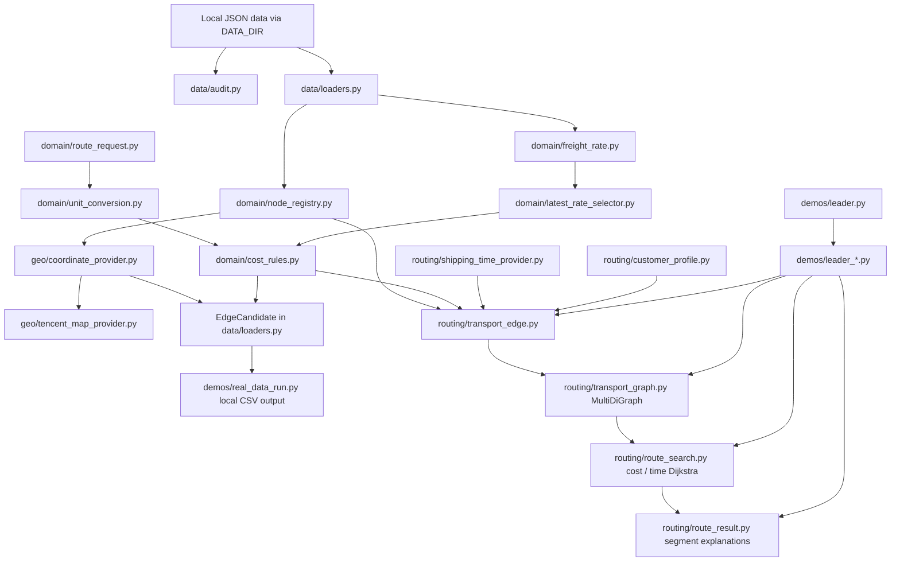
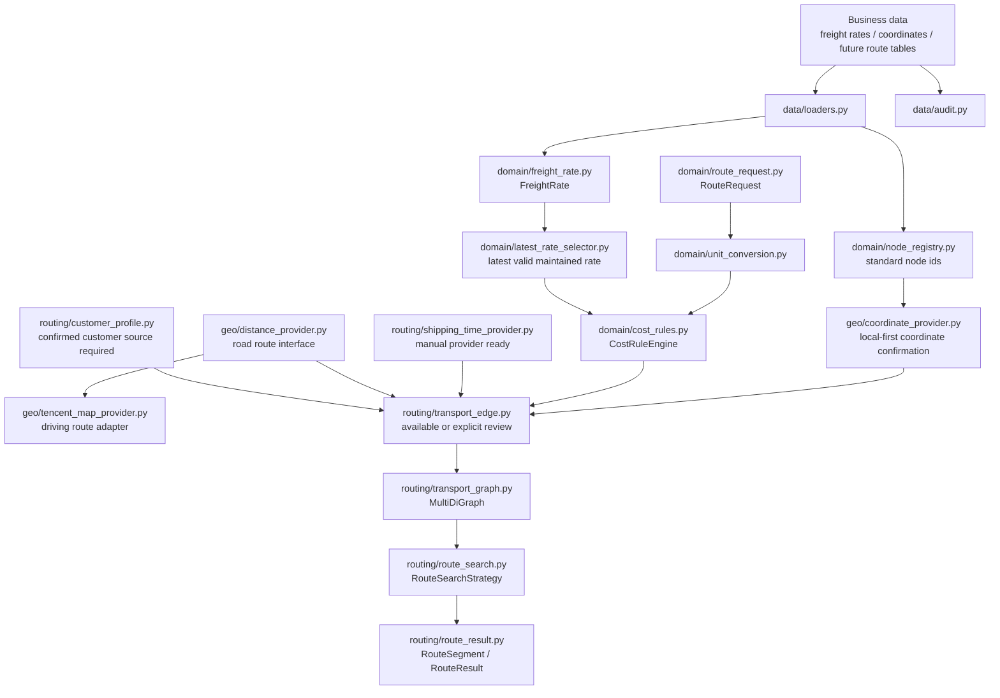

# ARCHITECTURE.md

Updated: 2026-07-17

This document describes the current architecture and the next real-data integration boundary of the route inference prototype.

## Current Core Architecture

The formal model/search chain is implemented and verified with sanitized demo objects. The current real-data `EdgeCandidate` output is not yet connected to it.

## Next Real-Data Integration Architecture

## Layer Responsibilities

### Data Layer

Files:

- `src/data/audit.py`
- `src/data/loaders.py`

Responsibilities:

- load local JSON Lines files;
- validate required fields;
- produce sanitized reports;
- preserve source file and source row where available;
- keep full audit separate from route-candidate filtering.

Rules:

- data audit reads all records;
- route construction may later filter to latest effective rates;
- raw business data stays local.

### Node Layer

File:

- `src/domain/node_registry.py`
- `src/geo/coordinate_provider.py`
- `src/geo/tencent_map_provider.py`

Responsibilities:

- create stable standard node ids;
- preserve aliases;
- detect coordinate conflicts;
- report unmatched freight-rate endpoints.
- confirm coordinates globally through a local-first provider.
- use Tencent Maps place search only as a fallback provider.

Rule:

- the same physical location must not become multiple graph nodes.
- coordinate lookup must check the standard node registry and known coordinate tables before any external map API.
- if Tencent Maps is not configured or returns ambiguous results, return manual review rather than guessing.
- Tencent Maps API keys are read only from `TENCENT_MAP_API_KEY`.

### Request And Unit Layer

Files:

- `src/domain/route_request.py`
- `src/domain/unit_conversion.py`

Responsibilities:

- represent order quantity, unit, packaging, commodity, and optional time;
- validate packaging as an auxiliary billing check;
- convert matched unit prices to current-order segment total cost.

Rule:

- `吨`, `箱`, and `柜` must match their own price units exactly.

### Freight And Cost Layer

Files:

- `src/domain/freight_rate.py`
- `src/domain/latest_rate_selector.py`
- `src/domain/cost_rules.py`

Responsibilities:

- represent maintained freight rates;
- preserve raw price, unit, source, maintenance date, and endpoint ids;
- select the latest unambiguous record for each business route before billing;
- preserve raw missing dates while using `1970-01-01` only as the internal comparison baseline;
- expose whether the effective maintenance date was defaulted for downstream explanation;
- preserve same-effective-date conflict records as manual-review evidence;
- calculate traceable cost results;
- return `valid`, `not_applicable`, or `manual_review`.

Current enabled rule groups:

- maintained freight-rate unit price;
- maintained freight-rate total price;
- bulk-shipping index calculation;
- bulk-shipping manual unit price;
- bulk-shipping manual total price.

Current disabled rule groups:

- unknown truck-route bulk formula;
- unknown truck-route container formula.

### Time And Distance Layer

Current files:

- `src/routing/shipping_time_provider.py`
- `src/geo/distance_provider.py`
- `src/geo/tencent_map_provider.py`

Responsibilities:

- supply time in hours;
- supply road distance and estimated driving time when required;
- hide external API details behind providers.

Current state:

- `routing/shipping_time_provider.py` defines shipping-time request/result structures, `ManualShippingTimeProvider`, and unconfigured JSON/database/API placeholders;
- manual shipping time accepts positive values and normalizes hours, days, and minutes to internal hours;
- missing, non-positive, non-numeric, unsupported-unit, or unconfigured-provider cases return `manual_review` without a usable time;
- `geo/distance_provider.py` defines road route request/result interfaces and internal conversion to kilometers/hours;
- `geo/tencent_map_provider.py` implements Tencent place search and normal driving-route adapters;
- truck-route adapter exists as an optional future enhancement, not the current dependency;
- `build_transport_edge()` combines resolved shipping time with freight-rate and cost results;
- the real-data `EdgeCandidate` flow still does not supply shipping time to `TransportEdge`;
- Tencent Maps must not be called directly from cost rules.

### Customer Rule Layer

File:

- `src/routing/customer_profile.py`

Responsibilities:

- preserve customer ID, factory node, private-terminal flag/node, allowed packaging/commodities, and their sources;
- resolve private-terminal and transfer-terminal branches as mutually exclusive;
- return manual review for unknown, missing-source, or contradictory profile data;
- pre-filter confirmed transfer-port candidates by distance while requiring later cost/time comparison.

Current boundary:

- the model and filters are implemented;
- the formal customer data source is still unknown, so production-like route generation must not guess the branch.

### Edge And Graph Layer

Current files:

- `src/routing/transport_edge.py`
- `src/routing/transport_graph.py`
- `src/routing/route_search.py`
- `src/routing/route_result.py`

Responsibilities:

- build formal transport edges after cost and time are available;
- preserve parallel edges using `nx.MultiDiGraph`;
- search cost-minimum and time-minimum paths independently;
- return edge keys and segment explanations.

Current state:

- `TransportEdge` requires positive order-segment cost and time plus trace fields before an edge is `available`;
- `routing/transport_graph.py` requires a `NodeRegistry` by default, builds `nx.MultiDiGraph`, uses edge IDs as keys, and records exclusions on the graph;
- sanitized demos and unit tests may bypass registry validation only through the explicit `allow_unregistered_nodes=True` flag;
- any graph-build exclusion prevents a route from being reported as resolved because the omitted edge may change reachability or optimality;
- `routing/route_search.py` searches cost and time independently, returns the chosen edge key per segment, and binds each result to a deterministic objective-weight graph signature;
- `routing/route_result.py` rehydrates complete segments, rejects stale search results, verifies source fields, checks route totals against segment sums, and exports explicit rows for no-path/manual-review outcomes;
- the old `graph_builder.py`, `route_planner.py`, `models.py`, and duplicate standalone cost-rule demo have been removed from `src`;
- the formal chain is not yet populated from real `EdgeCandidate` records.

## Important Boundaries

- Do not merge `cost` and `time` into a combined weight.
- Do not write candidates into graph form before cost and time are explainable.
- Do not silently ignore parallel route options.
- Do not treat missing time as zero.
- Do not treat disabled cost rules as usable.
