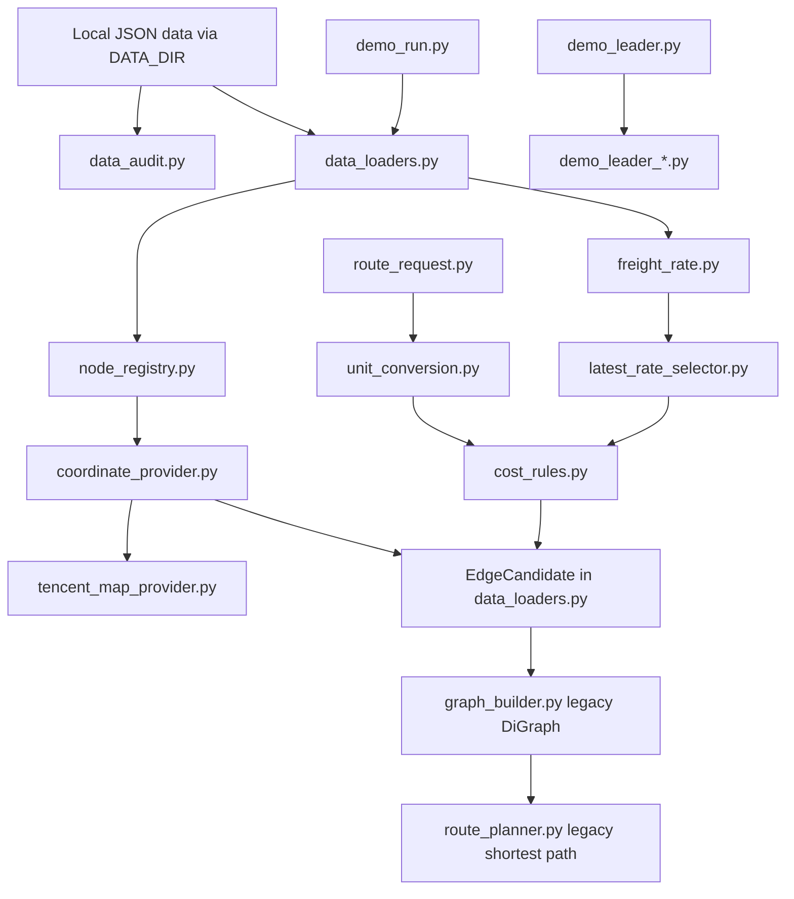
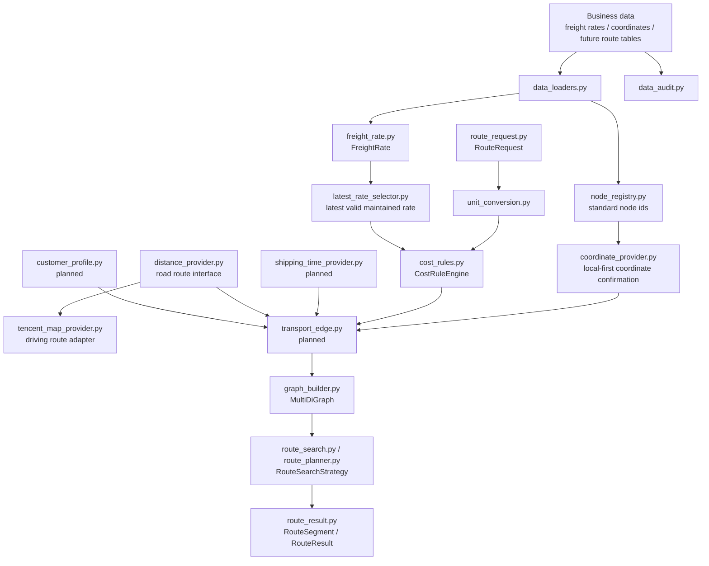

# ARCHITECTURE.md

Updated: 2026-07-16

This document describes the current and target architecture of the route inference prototype.

## Current Core Architecture

## Target Core Architecture

## Layer Responsibilities

### Data Layer

Files:

- `src/data_audit.py`
- `src/data_loaders.py`

Responsibilities:

- load local JSON Lines files;
- validate required fields;
- produce sanitized reports;
- preserve source file and source row where available;
- keep full audit separate from route-candidate filtering.

Rules:

- data audit reads all records;
- route construction may later filter to latest effective rates;
- raw business data stays local.

### Node Layer

File:

- `src/node_registry.py`
- `src/coordinate_provider.py`
- `src/tencent_map_provider.py`

Responsibilities:

- create stable standard node ids;
- preserve aliases;
- detect coordinate conflicts;
- report unmatched freight-rate endpoints.
- confirm coordinates globally through a local-first provider.
- use Tencent Maps place search only as a fallback provider.

Rule:

- the same physical location must not become multiple graph nodes.
- coordinate lookup must check the standard node registry and known coordinate tables before any external map API.
- if Tencent Maps is not configured or returns ambiguous results, return manual review rather than guessing.
- Tencent Maps API keys are read only from `TENCENT_MAP_API_KEY`.

### Request And Unit Layer

Files:

- `src/route_request.py`
- `src/unit_conversion.py`

Responsibilities:

- represent order quantity, unit, packaging, commodity, and optional time;
- validate packaging as an auxiliary billing check;
- convert matched unit prices to current-order segment total cost.

Rule:

- `吨`, `箱`, and `柜` must match their own price units exactly.

### Freight And Cost Layer

Files:

- `src/freight_rate.py`
- `src/latest_rate_selector.py`
- `src/cost_rules.py`

Responsibilities:

- represent maintained freight rates;
- preserve raw price, unit, source, maintenance date, and endpoint ids;
- select the latest unambiguous record for each business route before billing;
- preserve raw missing dates while using `1970-01-01` only as the internal comparison baseline;
- expose whether the effective maintenance date was defaulted for downstream explanation;
- preserve same-effective-date conflict records as manual-review evidence;
- calculate traceable cost results;
- return `valid`, `not_applicable`, or `manual_review`.

Current enabled rule groups:

- maintained freight-rate unit price;
- maintained freight-rate total price;
- bulk-shipping index calculation;
- bulk-shipping manual unit price;
- bulk-shipping manual total price.

Current disabled rule groups:

- unknown truck-route bulk formula;
- unknown truck-route container formula.

### Time And Distance Layer

Current and planned files:

- `src/shipping_time_provider.py`
- `src/distance_provider.py`
- `src/tencent_map_provider.py`

Responsibilities:

- supply time in hours;
- supply road distance and estimated driving time when required;
- hide external API details behind providers.

Current state:

- `distance_provider.py` defines road route request/result interfaces and internal conversion to kilometers/hours;
- `tencent_map_provider.py` implements Tencent place search and normal driving-route adapters;
- truck-route adapter exists as an optional future enhancement, not the current dependency;
- manual shipping time is planned first;
- Tencent Maps must not be called directly from cost rules.

### Edge And Graph Layer

Current files:

- `src/graph_builder.py`
- `src/route_planner.py`
- `src/models.py`

Target files:

- `src/transport_edge.py`
- upgraded `src/graph_builder.py`
- `src/route_search.py` or upgraded `src/route_planner.py`
- `src/route_result.py` or upgraded `src/models.py`

Responsibilities:

- build formal transport edges after cost and time are available;
- preserve parallel edges using `nx.MultiDiGraph`;
- search cost-minimum and time-minimum paths independently;
- return edge keys and segment explanations.

Current state:

- graph and route planner are still legacy `DiGraph` baseline code.

## Important Boundaries

- Do not merge `cost` and `time` into a combined weight.
- Do not write candidates into graph form before cost and time are explainable.
- Do not silently ignore parallel route options.
- Do not treat missing time as zero.
- Do not treat disabled cost rules as usable.
