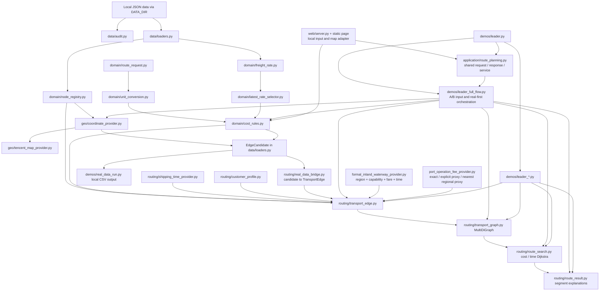
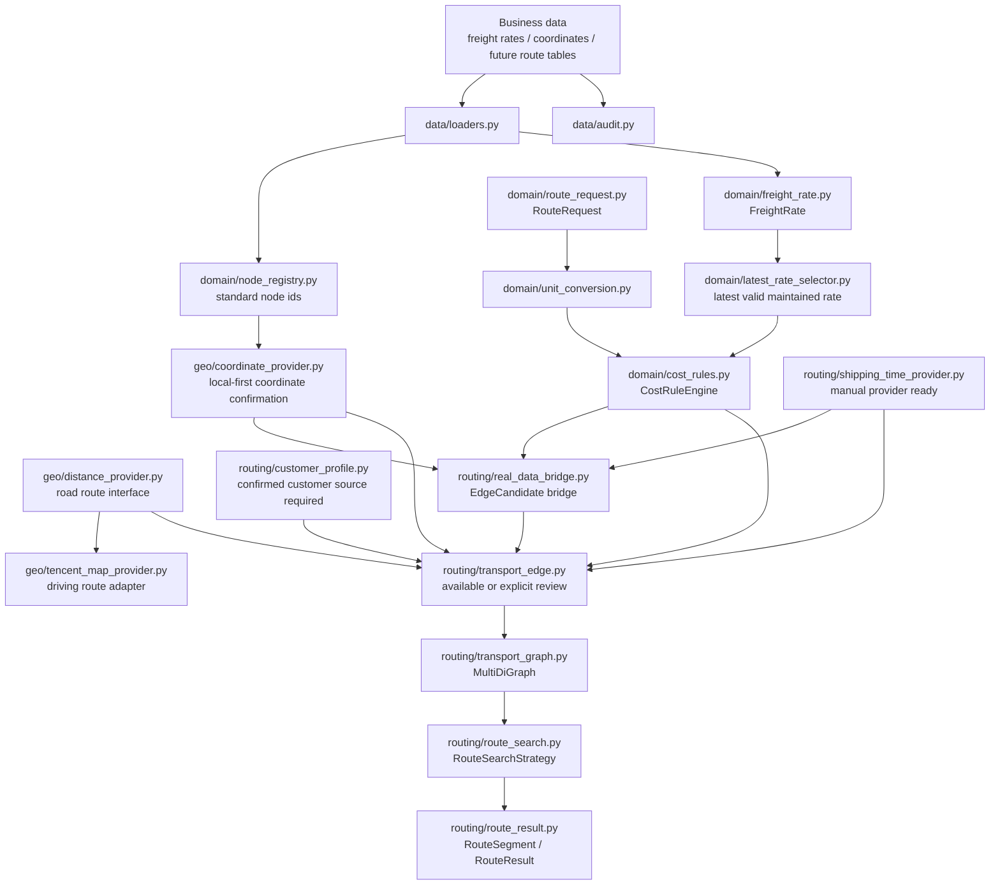

# ARCHITECTURE.md

Updated: 2026-07-31

This document describes the current architecture and the next real-data integration boundary of the route inference prototype.

## Business-Stage And Edge Semantics

The route has exactly two business transport stages:

1. `north_to_south`: north port to the selected south port;
2. `south_to_customer`: the selected south port to the customer delivery node.

A business stage is not a graph edge. Either stage may contain one or more `TransportEdge` objects and may combine several transport modes. `transport_mode` records the physical/business mode such as bulk vessel, container vessel, barge, truck, or rail. `TransportEdgeRole` independently records whether an edge is a `trunk`, `transfer`, or `delivery` edge.

The current Military Port–Nanping Port path is one data-supported `south_to_customer` example: barge transfer followed by truck delivery. It is not a third business stage and does not constrain the long-term graph to one inland transfer port or two fixed second-stage templates.

## Product IO And Presentation Boundary

The input/output behavior already demonstrated by `leader_full_flow.py` and the local Web page is a product-facing acceptance contract derived from leadership requirements. It includes north port, customer, optional south port, order dimensions, dual-objective recommendations, segment and cost explanations, warnings/errors, and map-ready route information. Refactoring must preserve these capabilities in a UI-independent request/response contract.

Leadership requirements govern what the system accepts and communicates, plus business meanings that require confirmation. They do not prescribe candidate-generation algorithms, Provider composition, graph topology, search implementation, internal module boundaries, or a fixed route shape unless explicitly confirmed as a business rule.

The intended dependency direction is:

```text
data / domain / geo / routing
-> UI-independent route-planning application service
-> leader CLI Demo and local Web adapters
```

The first application-boundary slice now exists in
`src/application/route_planning.py`: `RoutePlanningRequest` owns the shared
transport-condition input, `RoutePlanningResponse` owns the structured result,
and `RoutePlanningService` is the common entry point used by the CLI and Web
adapters. The existing full-flow orchestration still resides in
`leader_full_flow.py` behind `plan_full_flow`; moving that orchestration inward
remains incremental follow-up work rather than a completed layer migration.
`RoutePlanningResponse.candidate_decisions` is the shared explanation contract
for south-port identity screening, ranking and graph admission; adapters may
format it but may not recompute or reinterpret candidate eligibility.
`src/application/south_port_selection.py` now owns automatic and explicit
south-port selection, bulk freight-origin evidence, candidate ranking and its
identity/ranking decision records. The remaining Provider composition and graph
assembly still reside in `leader_full_flow.py` and should migrate only in
similarly bounded steps.

The Demo is an observation and acceptance surface over current capabilities. It must not own a parallel pricing rule, fixed transfer-node list, candidate strategy, or search algorithm. Any `demo_placeholder` behavior must be explicitly injected and disclosed rather than becoming a production-like default. The current `leader_full_flow.py` still combines application orchestration and presentation formatting; separating those responsibilities is an architectural cleanup direction, not permission for an immediate broad refactor or for changing the confirmed IO contract.

## Exact-OD Inland-Waterway Data Path

The 2026-07-31 inland-waterway path keeps storage adapters separate from routing:

```text
节点信息维护0731.xlsx
-> node_master_maintenance.py
-> typed node-maintenance entries
-> loaders.py / NodeRegistry

运费数据.xlsx/运价表 (preferred) or 运价表.json (compatibility fallback)
    -> freight_workbook.py / loaders.py
-> typed FreightRate records with workbook row trace
+ maintained region/time records
-> node_master_capabilities.py
-> package/commodity-scoped endpoint capabilities and traceable region assignments
-> ExactOdInlandWaterwayBargeProvider
-> TransportEdge(south_to_customer, barge, transfer|delivery)
-> MultiDiGraph
```

The maintained workbook is authoritative when present. JSON is read only when the workbook is absent; a malformed present workbook fails closed. An exact OD record is business evidence for the package/commodity scope carried by that record. It does not turn a customer into a port, turn an inland port into a south port, or make a sea-only port an inland transfer port. Exact latest OD freight is preferred; the regional freight table is a fallback only when no exact OD exists. Same-day exact-rate conflicts stay in `manual_review`.

`src/application/south_port_selection.py` preserves direct candidates while reserving a bounded number of candidates for south ports with usable exact-OD barge options. `leader_full_flow.py` then expands only the transfer ports nearest to the customer for online search. These limits control current computation and presentation width; they are not domain connectivity constraints, and the exhaustive offline OD audit remains the coverage check.

## Current Core Architecture



The formal model/search chain is implemented and verified with sanitized demo objects. Real-data `EdgeCandidate` rows now have a conservative bridge into `TransportEdge`: they only become searchable when node IDs and explicit manual shipping time are present.

The railway-container slice now has the same dependency direction in a
separate application service:

```text
platform/local data adapter
-> typed RailContainerRateTimeRecord + terminal delivery records + NodeRegistry
-> RailContainerPlanningService
-> TransportEdge (trunk / delivery)
-> nx.MultiDiGraph
-> independent cost/time Dijkstra
-> CLI demo or future Web adapter
```

The present `rail_container_platform_demo` reads only a sanitized fixture to
verify that contract. `data/rail_test_workbook.py` is now a separate read-only
adapter for the first local railway test workbook: it converts its confirmed
open-top railway-only price from yuan per two-container group to yuan per box,
adds separately confirmed station-handling/tarpaulin components, and emits
only standard station-to-station `real_data` records. Compound station-to-
dedicated-siding endpoints remain outside that normal-station adapter. Neither
adapter is wired into the existing full-flow or Web route API yet.

## Next Real-Data Integration Architecture



## Layer Responsibilities

### Data Layer

Files:

- `src/data/audit.py`
- `src/data/loaders.py`
- `src/data/data_foundation_audit.py`
- `src/data/port_reference.py`
- `src/data/port_label_rules.py`
- `src/data/inland_waterway_freight.py`
- `src/data/inland_waterway_time.py`
- `src/data/node_master_maintenance.py`
- `src/data/node_master_capabilities.py`

Responsibilities:

- load local JSON Lines files;
- validate required fields;
- produce sanitized reports;
- preserve source file and source row where available;
- keep full audit separate from route-candidate filtering;
- load optional W3 `港口能力表.csv` and `区域映射表.csv` as explicit source interfaces;
- load maintained W5 operation-fee region assignments only from explicit standard-node IDs in `区域映射表.csv`; the later nearest-region demo fallback may resolve a business region from traceable mapping keywords, but it does not write or pretend to create a maintained fee assignment;
- convert leader-provided `部分码头标签.json` into read-only candidate W5 audit rows without writing formal data;
- audit missing W3/W5 interface files and unresolved node bindings without guessing defaults.
- load inland-waterway freight and complete-segment time as separate typed records, so a future database adapter can return the same contracts without changing route construction.
- adapt the latest maintained node workbook into typed, deduplicated records without treating the workbook layout as a routing-domain contract;
- derive package/commodity-scoped barge capability evidence and traceable region assignments for exact OD endpoints without writing formal W3 data.

Rules:

- data audit reads all records;
- route construction may later filter to latest effective rates;
- missing port capability or regional mapping records do not imply a negative or positive capability; they remain audit gaps;
- port capability booleans are tri-state: blank is unknown, while false means confirmed non-support; the formal capability table is not an active full-flow filter yet;
- `部分码头标签.json` is a candidate source only: aliases are resolved through name dictionary, Tencent candidate lookup, and manual confirmation before formal CSV maintenance;
- raw business data stays local.
- exact OD records never authorize a different package, commodity, node role, or waterway role than their maintained evidence supports.

### Node Layer

File:

- `src/domain/node_registry.py`
- `src/domain/node_role.py`
- `src/geo/coordinate_provider.py`
- `src/geo/tencent_map_provider.py`

Responsibilities:

- create stable standard node ids;
- preserve aliases;
- detect coordinate conflicts;
- report unmatched freight-rate endpoints.
- classify conservative railway/customer/port names and maintain confirmed
  waterway-role precedence for south-port admission.
- confirm coordinates globally through a local-first provider.
- use Tencent Maps place search only as a fallback provider.

Rule:

- the same physical location must not become multiple graph nodes.
- coordinate lookup must check the standard node registry and known coordinate tables before any external map API.
- if Tencent Maps is not configured, fails, or returns no candidates, return manual review rather than guessing; for multiple candidates, follow D-028: use traceable top1 with `source_confidence` and retained candidates.
- Tencent Maps API keys are read only from `TENCENT_MAP_API_KEY`.
- for the implemented bulk-grain trunk, an unclassified registered port/wharf
  may use an applicable `散粮` freight-origin record as south-port identity
  evidence. The record may be truck or barge; confirmed inland ports and
  explicit capability exclusions override it.
- container-only freight origins do not become bulk south ports. They are
  reported as potential transfer ports pending a future explicit node
  functional-role field; this status creates no graph edge.
- node functional role, waterway role, business stage and graph-edge role are
  separate dimensions and must not be inferred from one another.

### Request And Unit Layer

Files:

- `src/domain/route_request.py`
- `src/domain/unit_conversion.py`

Responsibilities:

- represent order quantity, unit, packaging, commodity, and optional time;
- validate packaging as an auxiliary billing check;
- convert matched unit prices to current-order segment total cost.

Rule:

- `吨`, `箱`, and `柜` must match their own price units exactly.

### Freight And Cost Layer

Files:

- `src/domain/freight_rate.py`
- `src/domain/latest_rate_selector.py`
- `src/domain/cost_rules.py`
- `src/routing/bulk_shipping_provider.py`
- `src/routing/port_operation_fee_provider.py`

Responsibilities:

- represent maintained freight rates;
- preserve raw price, unit, source, maintenance date, and endpoint ids;
- select the latest unambiguous record for each business route before billing;
- preserve raw missing dates while using `1970-01-01` only as the internal comparison baseline;
- expose whether the effective maintenance date was defaulted for downstream explanation;
- preserve same-effective-date conflict records as manual-review evidence;
- calculate traceable cost results;
- return `valid`, `not_applicable`, or `manual_review`;
- calculate north-port to south-port bulk-shipping trunk freight from the real workbook latest row;
- model south-port `码头作业费` as a separate future cost component through an explicit Provider.

Current enabled rule groups:

- maintained freight-rate unit price;
- maintained freight-rate total price;
- bulk-shipping index calculation;
- bulk-shipping manual unit price;
- bulk-shipping manual total price.
- known truck maintained-rate calculation;
- unknown bulk truck distance-tier calculation when `distance_km` and `distance_source` are supplied;
- unknown container truck yuan-per-box calculation when `distance_km` and `distance_source` are supplied.
- real bulk-shipping workbook rate calculation for in-scope south-port destination labels;
- W5 south-port operation-fee Provider contract for one aggregate `码头作业费` component, matched by south port, package type, trade type, commodity scope, and exact fee unit (`元/吨` for bulk-grain ton orders; `元/箱` reserved for containerized orders).
- W5 operation-fee priority is an applicable exact standard-node rule, then one confirmed `operation_fee_region_code` reference rate, then the geographically nearest applicable formal rate in the same traceably resolved business region, then manual review. Exact rules may be positive `chargeable` rates or source-backed `not_applicable` rules for confirmed customer-owned terminals. Regional results use `regional_proxy` and preserve reference-port, distance, region, and mapping-rule trace.

Current disabled rule groups:

- none for currently documented cost-rule prototypes; unsupported inputs still return `manual_review`.

### Time And Distance Layer

Current files:

- `src/routing/shipping_time_provider.py`
- `src/routing/inland_waterway_provider.py`
- `src/routing/inland_waterway_freight_provider.py`
- `src/routing/formal_inland_waterway_provider.py`
- `src/routing/port_region_resolver.py`
- `src/routing/bulk_shipping_time_mapper.py`
- `src/geo/distance_provider.py`
- `src/geo/tencent_map_provider.py`

Responsibilities:

- supply time in hours;
- supply road distance and estimated driving time when required;
- hide external API details behind providers.

Current state:

- `routing/shipping_time_provider.py` defines shipping-time request/result structures, `ManualShippingTimeProvider`, and unconfigured JSON/database/API placeholders;
- manual shipping time accepts positive values and normalizes hours, days, and minutes to internal hours;
- missing, non-positive, non-numeric, unsupported-unit, or unconfigured-provider cases return `manual_review` without a usable time;
- `geo/distance_provider.py` defines road route request/result interfaces and internal conversion to kilometers/hours;
- `geo/tencent_map_provider.py` implements Tencent place search and normal driving-route adapters;
- Tencent driving results preserve and decode `routes[0].polyline` from the same response that supplies distance and duration. Geometry is retained in a full-flow edge-ID side table rather than `TransportEdge`, so map rendering cannot change graph weights or Dijkstra results.
- truck-route adapter exists as an optional future enhancement, not the current dependency;
- unknown bulk and container truck costs consume confirmed road distance from the geo layer, and currently accept Tencent normal driving distance as the prototype distance source;
- `build_transport_edge()` combines resolved shipping time with freight-rate and cost results;
- the real-data `EdgeCandidate` bridge accepts explicit manual time for legacy integration validation; the current `leader_full_flow` bulk-shipping trunk uses real workbook rates and confirmed complete-segment regional shipping time;
- Tencent Maps must not be called directly from cost rules.
- `routing/inland_waterway_provider.py` retains the port-capability, regional-mapping, time-record, and explicitly labeled demo-capability contracts.
- Inland-waterway Providers expose capability-backed destination candidates. The full-flow orchestration resolves these candidates through `NodeRegistry`; it does not own a fixed Nanping or other transfer-port list.
- `data/inland_waterway_freight.py` and `routing/inland_waterway_freight_provider.py` load and quote source-backed barge fares using exact region, package, commodity, trade-type, and unit dimensions.
- `routing/formal_inland_waterway_provider.py` combines endpoint region/capability, fare, and complete-segment time into a `south_to_customer` transfer `TransportEdge`; missing any prerequisite returns review/non-applicability rather than a zero value.
- The confirmed Fujian Min River rule is 15 hours each direction and 50 yuan per ton for bulk grain of any maintained commodity. Real fare/time may coexist with a disclosed `demo_placeholder` endpoint capability until W3 capability rows are confirmed.
- `routing/port_region_resolver.py` resolves a traceable business region from formal mappings first and confirmed bulk-shipping mappings second.
- `routing/bulk_shipping_time_mapper.py` can borrow the nearest same-region reference time only after a unique formal capability record confirms that the target can receive north-port bulk shipping; it never supplies rate groups or connectivity.
- `data/port_reference.py` is the CSV-backed W3 loader for port capabilities and regional mappings and the W5 loader for explicit node-to-operation-fee-region assignments; missing or unconfirmed inputs are audited rather than inferred.
- `routing/port_operation_fee_provider.py` is the W5 cost interface for south-port operation fees. It distinguishes positive `resolved`, source-backed customer-owned-terminal `not_applicable`, and unsafe or missing `manual_review` results. A `not_applicable` result permits the route with an explicit 0 and reason but creates no artificial zero-valued cost component; missing, duplicated, conflicting, trade-type-mismatched, commodity-mismatched, unit-mismatched, or order-mismatched records are not interpreted as zero.
- `data/port_label_rules.py` reads `部分码头标签.json` as a candidate rule source: `serviceFees.入库` may become a candidate operation-fee rate, but only formal CSV records can enter normal route costing.
- `leader_full_flow.py` may optionally load the W5 operation-fee Provider; if the fee table is absent, the demo explicitly reports that operation fees are not counted. If the table is present, positive or traceable regional-proxy fees are included, confirmed `not_applicable` candidates remain searchable with their reason, and candidates with missing or unsafe data are excluded instead of being treated as zero-cost.
- Bulk-shipping and inland-waterway barge Provider outputs use `time_scope=complete_segment`: the maintained business “航行时效” is the whole shipping-segment time in this simplified model and is not decomposed into waiting, loading, physical sailing, or unloading.
- Inland-waterway regional time is loaded independently from freight. A resolved time record alone cannot create a searchable barge edge; formal positive freight, compatible endpoint capabilities, packaging/commodity support, and traceable mappings are all still required.
- `leader_full_flow.py` now lets direct truck delivery and capability-backed barge-transfer paths coexist inside the second business-stage subgraph, and accepts an optional registered south port without changing graph/search semantics. These are current implementations, not an exhaustive list of second-stage route shapes.
- `web/route_geometry.py` generates an explicitly schematic, manually overridable China-offshore control-point line for bulk shipping and an explicitly schematic barge fallback. `web/server.py` serializes geometry per selected segment: actual Tencent road points for truck, dashed schematic points for bulk shipping/barge, or `unavailable` when no defensible geometry exists. The frontend never substitutes a straight truck line when Tencent geometry is missing.

### Customer Rule Layer

File:

- `src/routing/customer_profile.py`

Responsibilities:

- preserve customer ID, factory node, private-terminal flag/node, allowed packaging/commodities/transport modes, confirmation status, maintenance date, and their sources;
- represent the customer-to-private-terminal relation with stable IDs and its own confirmation/source trace;
- resolve private-terminal and transfer-terminal branches as mutually exclusive;
- return manual review for unknown, missing-source, or contradictory profile data;
- pre-filter confirmed transfer-port candidates by distance while requiring later cost/time comparison.

Current boundary:

- the model and filters are implemented;
- the formal customer data source is still unknown, so production-like route generation must not guess the branch.

### Edge And Graph Layer

Current files:

- `src/routing/transport_edge.py`
- `src/routing/transport_graph.py`
- `src/routing/route_search.py`
- `src/routing/route_result.py`

Responsibilities:

- build formal transport edges after cost and time are available;
- preserve business stage, transport mode, and edge role as separate trace dimensions;
- preserve parallel edges using `nx.MultiDiGraph`;
- search cost-minimum and time-minimum paths independently;
- return edge keys and segment explanations.

Current state:

- `TransportEdge` requires positive order-segment cost and time plus trace fields before an edge is `available`;
- `routing/transport_graph.py` requires a `NodeRegistry` by default, builds `nx.MultiDiGraph`, uses edge IDs as keys, and records exclusions on the graph;
- sanitized demos and unit tests may bypass registry validation only through the explicit `allow_unregistered_nodes=True` flag;
- any graph-build exclusion prevents a route from being reported as resolved because the omitted edge may change reachability or optimality;
- `routing/route_search.py` searches cost and time independently, returns the chosen edge key per segment, and binds each result to a deterministic objective-weight graph signature;
- `routing/route_result.py` rehydrates complete segments, rejects stale search results, verifies source fields, checks route totals against segment sums, and exports explicit rows for no-path/manual-review outcomes;
- the old `graph_builder.py`, `route_planner.py`, `models.py`, and duplicate standalone cost-rule demo have been removed from `src`;
- real `EdgeCandidate` records can enter the formal chain through `routing/real_data_bridge.py` when node IDs and explicit time are present;
- `demos/leader_full_flow.py` composes the same formal model for a complete A-to-B leader demo, prioritizes real nodes and maintained rates, and preserves every remaining placeholder or proxy in segment trace.
- south-port candidate decisions are retained as an edge-ID-independent side
  contract. They explain identity, ranking and admission without becoming graph
  weights or altering `MultiDiGraph` search.
- Current full-flow trunk edges use `north_to_south/trunk`; inland-waterway transfer edges use `south_to_customer/transfer`; customer-delivery road edges use `south_to_customer/delivery`. Future modes reuse the same two-stage contract instead of adding mode-shaped stage names.

### Local Presentation Adapter

Files:

- `src/web/server.py`
- `src/web/static/index.html`
- `src/web/static/styles.css`
- `src/web/static/app.js`

Responsibilities:

- parse transport and order inputs into the shared `RoutePlanningRequest` application contract;
- expose local health/config/route JSON endpoints without introducing a second pricing or graph implementation;
- display lowest-cost and fastest-time results, cost components, candidates, warnings, and errors;
- display the application-provided candidate inclusion/exclusion decisions
  without running a separate frontend candidate algorithm;
- load the Tencent JavaScript map key from ignored runtime configuration and draw route nodes.

Boundary:

- the service binds to loopback by default and is not a production API;
- bulk and barge overlays remain explicitly schematic where authoritative waterway geometry is unavailable, while truck geometry uses the Tencent road response;
- the frontend uses the segment's explicit business-stage field rather than assuming that segment number one is always the only north-to-south edge;
- database, authentication, deployment, concurrency guarantees, and monitoring remain outside the current milestone.

## Important Boundaries

- Do not merge `cost` and `time` into a combined weight.
- Do not write candidates into graph form before cost and time are explainable.
- Do not silently ignore parallel route options.
- Do not treat missing time as zero.
- Do not treat disabled cost rules as usable.
- Do not let a nearest fee or time proxy create port capability or physical connectivity.
- Do not present schematic map lines as actual road or waterway geometry.
