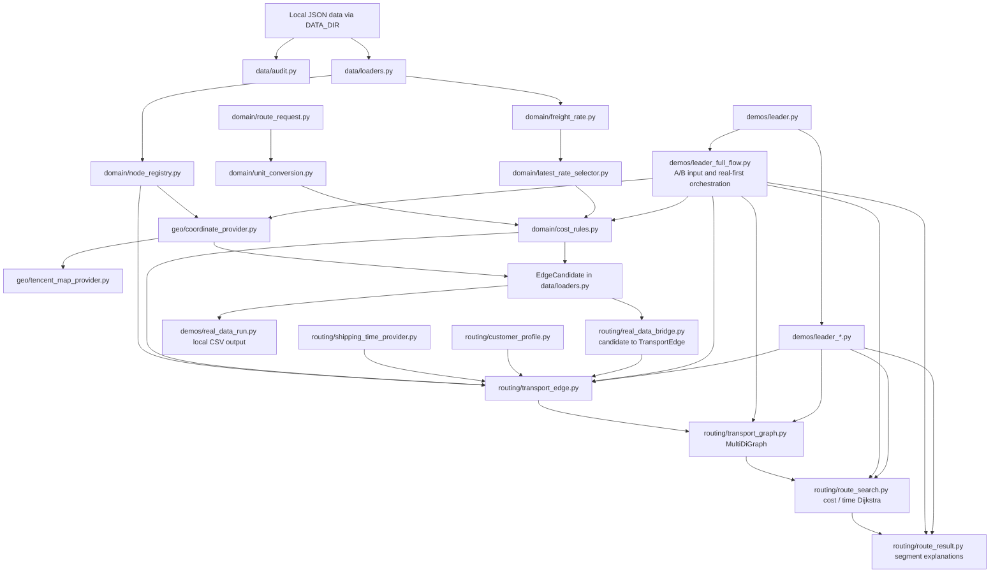
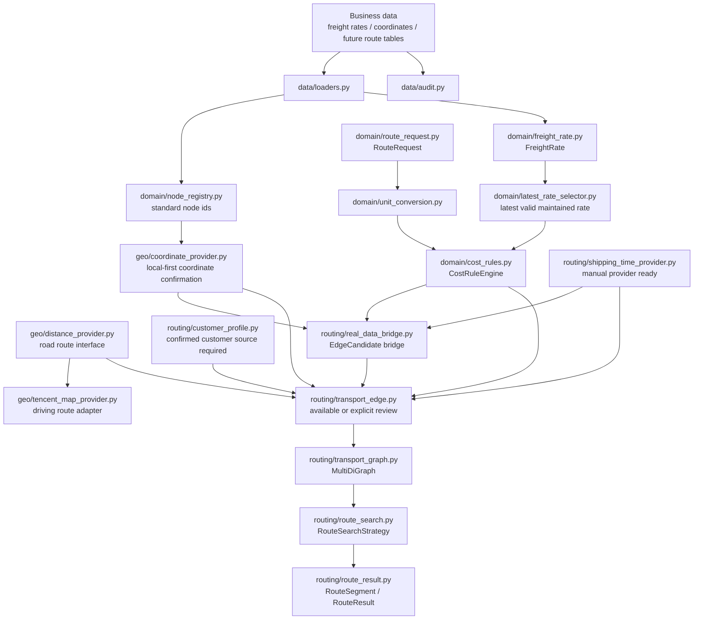

# ARCHITECTURE.md

Updated: 2026-07-24

This document describes the current architecture and the next real-data integration boundary of the route inference prototype.

## Current Core Architecture

The formal model/search chain is implemented and verified with sanitized demo objects. Real-data `EdgeCandidate` rows now have a conservative bridge into `TransportEdge`: they only become searchable when node IDs and explicit manual shipping time are present.

## Next Real-Data Integration Architecture

## Layer Responsibilities

### Data Layer

Files:

- `src/data/audit.py`
- `src/data/loaders.py`
- `src/data/data_foundation_audit.py`
- `src/data/port_reference.py`
- `src/data/port_label_rules.py`

Responsibilities:

- load local JSON Lines files;
- validate required fields;
- produce sanitized reports;
- preserve source file and source row where available;
- keep full audit separate from route-candidate filtering;
- load optional W3 `港口能力表.csv` and `区域映射表.csv` as explicit source interfaces;
- load W5 operation-fee region assignments only from explicit standard-node IDs in `区域映射表.csv`; keyword and coordinate matching do not create fee assignments;
- convert leader-provided `部分码头标签.json` into read-only candidate W5 audit rows without writing formal data;
- audit missing W3/W5 interface files and unresolved node bindings without guessing defaults.

Rules:

- data audit reads all records;
- route construction may later filter to latest effective rates;
- missing port capability or regional mapping records do not imply a negative or positive capability; they remain audit gaps;
- port capability booleans are tri-state: blank is unknown, while false means confirmed non-support; the formal capability table is not an active full-flow filter yet;
- `部分码头标签.json` is a candidate source only: aliases are resolved through name dictionary, Tencent candidate lookup, and manual confirmation before formal CSV maintenance;
- raw business data stays local.

### Node Layer

File:

- `src/domain/node_registry.py`
- `src/geo/coordinate_provider.py`
- `src/geo/tencent_map_provider.py`

Responsibilities:

- create stable standard node ids;
- preserve aliases;
- detect coordinate conflicts;
- report unmatched freight-rate endpoints.
- confirm coordinates globally through a local-first provider.
- use Tencent Maps place search only as a fallback provider.

Rule:

- the same physical location must not become multiple graph nodes.
- coordinate lookup must check the standard node registry and known coordinate tables before any external map API.
- if Tencent Maps is not configured, fails, or returns no candidates, return manual review rather than guessing; for multiple candidates, follow D-028: use traceable top1 with `source_confidence` and retained candidates.
- Tencent Maps API keys are read only from `TENCENT_MAP_API_KEY`.

### Request And Unit Layer

Files:

- `src/domain/route_request.py`
- `src/domain/unit_conversion.py`

Responsibilities:

- represent order quantity, unit, packaging, commodity, and optional time;
- validate packaging as an auxiliary billing check;
- convert matched unit prices to current-order segment total cost.

Rule:

- `吨`, `箱`, and `柜` must match their own price units exactly.

### Freight And Cost Layer

Files:

- `src/domain/freight_rate.py`
- `src/domain/latest_rate_selector.py`
- `src/domain/cost_rules.py`
- `src/routing/bulk_shipping_provider.py`
- `src/routing/port_operation_fee_provider.py`

Responsibilities:

- represent maintained freight rates;
- preserve raw price, unit, source, maintenance date, and endpoint ids;
- select the latest unambiguous record for each business route before billing;
- preserve raw missing dates while using `1970-01-01` only as the internal comparison baseline;
- expose whether the effective maintenance date was defaulted for downstream explanation;
- preserve same-effective-date conflict records as manual-review evidence;
- calculate traceable cost results;
- return `valid`, `not_applicable`, or `manual_review`;
- calculate north-port to south-port bulk-shipping trunk freight from the real workbook latest row;
- model south-port `码头作业费` as a separate future cost component through an explicit Provider.

Current enabled rule groups:

- maintained freight-rate unit price;
- maintained freight-rate total price;
- bulk-shipping index calculation;
- bulk-shipping manual unit price;
- bulk-shipping manual total price.
- known truck maintained-rate calculation;
- unknown bulk truck distance-tier calculation when `distance_km` and `distance_source` are supplied;
- unknown container truck yuan-per-box calculation when `distance_km` and `distance_source` are supplied.
- real bulk-shipping workbook rate calculation for in-scope south-port destination labels;
- W5 south-port operation-fee Provider contract for one aggregate `码头作业费` component, matched by south port, package type, trade type, commodity scope, and exact fee unit (`元/吨` for bulk-grain ton orders; `元/箱` reserved for containerized orders).
- W5 operation-fee priority is an applicable exact standard-node rule, then one confirmed `operation_fee_region_code` reference rate, then manual review. Exact rules may be positive `chargeable` rates or source-backed `not_applicable` rules for confirmed customer-owned terminals. Regional results use `regional_proxy` and preserve reference-port and mapping-rule trace.

Current disabled rule groups:

- none for currently documented cost-rule prototypes; unsupported inputs still return `manual_review`.

### Time And Distance Layer

Current files:

- `src/routing/shipping_time_provider.py`
- `src/routing/inland_waterway_provider.py`
- `src/geo/distance_provider.py`
- `src/geo/tencent_map_provider.py`

Responsibilities:

- supply time in hours;
- supply road distance and estimated driving time when required;
- hide external API details behind providers.

Current state:

- `routing/shipping_time_provider.py` defines shipping-time request/result structures, `ManualShippingTimeProvider`, and unconfigured JSON/database/API placeholders;
- manual shipping time accepts positive values and normalizes hours, days, and minutes to internal hours;
- missing, non-positive, non-numeric, unsupported-unit, or unconfigured-provider cases return `manual_review` without a usable time;
- `geo/distance_provider.py` defines road route request/result interfaces and internal conversion to kilometers/hours;
- `geo/tencent_map_provider.py` implements Tencent place search and normal driving-route adapters;
- truck-route adapter exists as an optional future enhancement, not the current dependency;
- unknown bulk and container truck costs consume confirmed road distance from the geo layer, and currently accept Tencent normal driving distance as the prototype distance source;
- `build_transport_edge()` combines resolved shipping time with freight-rate and cost results;
- the real-data `EdgeCandidate` bridge accepts explicit manual time for legacy integration validation; the current `leader_full_flow` bulk-shipping trunk uses real workbook rates and confirmed complete-segment regional shipping time;
- Tencent Maps must not be called directly from cost rules.
- `routing/inland_waterway_provider.py` defines the next data interfaces for port capabilities, regional mappings, and inland-waterway barge fee/time records; its first Provider is demo-only and generates explicit `demo_placeholder` barge edges only for same-region Fujian/Minjiang or Pearl Delta bulk-grain scenarios.
- `data/port_reference.py` is the CSV-backed W3 loader for port capabilities and regional mappings and the W5 loader for explicit node-to-operation-fee-region assignments; missing or unconfirmed inputs are audited rather than inferred.
- `routing/port_operation_fee_provider.py` is the W5 cost interface for south-port operation fees. It distinguishes positive `resolved`, source-backed customer-owned-terminal `not_applicable`, and unsafe or missing `manual_review` results. A `not_applicable` result permits the route with an explicit 0 and reason but creates no artificial zero-valued cost component; missing, duplicated, conflicting, trade-type-mismatched, commodity-mismatched, unit-mismatched, or order-mismatched records are not interpreted as zero.
- `data/port_label_rules.py` reads `部分码头标签.json` as a candidate rule source: `serviceFees.入库` may become a candidate operation-fee rate, but only formal CSV records can enter normal route costing.
- `leader_full_flow.py` may optionally load the W5 operation-fee Provider; if the fee table is absent, the demo explicitly reports that operation fees are not counted. If the table is present, positive fees are included, confirmed `not_applicable` candidates remain searchable with their reason, and candidates with missing or unsafe data are excluded instead of being treated as zero-cost.
- Bulk-shipping and inland-waterway barge Provider outputs use `time_scope=complete_segment`: the maintained business “航行时效” is the whole shipping-segment time in this simplified model and is not decomposed into waiting, loading, physical sailing, or unloading.
- Inland-waterway regional time is loaded independently from freight. A resolved time record alone cannot create a searchable barge edge; formal positive freight, compatible endpoint capabilities, packaging/commodity support, and traceable mappings are all still required.

### Customer Rule Layer

File:

- `src/routing/customer_profile.py`

Responsibilities:

- preserve customer ID, factory node, private-terminal flag/node, allowed packaging/commodities/transport modes, confirmation status, maintenance date, and their sources;
- represent the customer-to-private-terminal relation with stable IDs and its own confirmation/source trace;
- resolve private-terminal and transfer-terminal branches as mutually exclusive;
- return manual review for unknown, missing-source, or contradictory profile data;
- pre-filter confirmed transfer-port candidates by distance while requiring later cost/time comparison.

Current boundary:

- the model and filters are implemented;
- the formal customer data source is still unknown, so production-like route generation must not guess the branch.

### Edge And Graph Layer

Current files:

- `src/routing/transport_edge.py`
- `src/routing/transport_graph.py`
- `src/routing/route_search.py`
- `src/routing/route_result.py`

Responsibilities:

- build formal transport edges after cost and time are available;
- preserve parallel edges using `nx.MultiDiGraph`;
- search cost-minimum and time-minimum paths independently;
- return edge keys and segment explanations.

Current state:

- `TransportEdge` requires positive order-segment cost and time plus trace fields before an edge is `available`;
- `routing/transport_graph.py` requires a `NodeRegistry` by default, builds `nx.MultiDiGraph`, uses edge IDs as keys, and records exclusions on the graph;
- sanitized demos and unit tests may bypass registry validation only through the explicit `allow_unregistered_nodes=True` flag;
- any graph-build exclusion prevents a route from being reported as resolved because the omitted edge may change reachability or optimality;
- `routing/route_search.py` searches cost and time independently, returns the chosen edge key per segment, and binds each result to a deterministic objective-weight graph signature;
- `routing/route_result.py` rehydrates complete segments, rejects stale search results, verifies source fields, checks route totals against segment sums, and exports explicit rows for no-path/manual-review outcomes;
- the old `graph_builder.py`, `route_planner.py`, `models.py`, and duplicate standalone cost-rule demo have been removed from `src`;
- real `EdgeCandidate` records can enter the formal chain through `routing/real_data_bridge.py` when node IDs and explicit time are present;
- `demos/leader_full_flow.py` composes the same formal model for a complete A-to-B leader demo, prioritizes real nodes and maintained rates, and confines missing north-to-south shipping values to an explicit demo-only placeholder layer.

## Important Boundaries

- Do not merge `cost` and `time` into a combined weight.
- Do not write candidates into graph form before cost and time are explainable.
- Do not silently ignore parallel route options.
- Do not treat missing time as zero.
- Do not treat disabled cost rules as usable.
