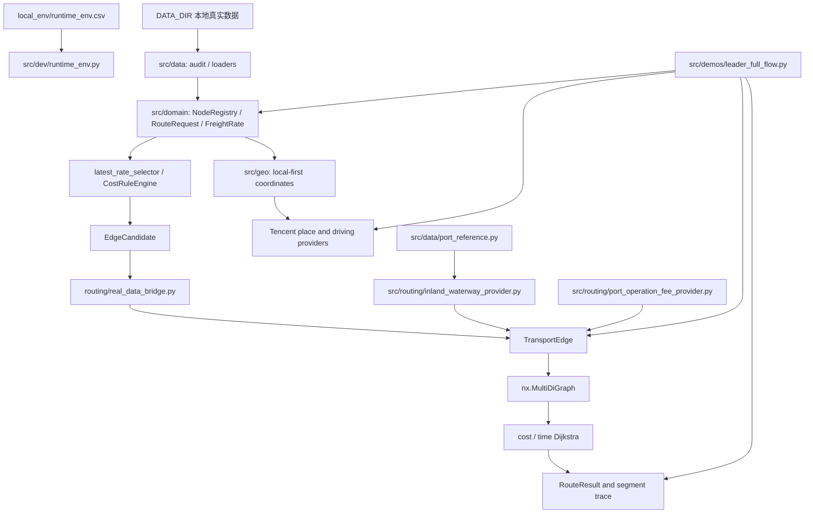

# PROJECT_STATE.md

Updated: 2026-07-24

本文件是新线程接手项目时的首要工程状态。内容依据当前代码、Git 工作树、最近提交、2026-07-23 全量 pytest、2026-07-24 W3/W5 专项测试、只读数据夯实审计、`部分码头标签.json` 只读审计，以及用户 PyCharm 最新 full-flow 验收和 B1 业务口径确认整理，不以聊天记录或领导汇报代替工程事实。

## 1. 项目目标

项目名称：北港至客户工厂全链路运输路径推断原型。

目标是读取本地运输业务数据，统一节点、订单、计费单位、费用和时间结构，构造保留平行运输方案的有向图，并分别输出费用最低和时间最短路径及其分段依据。当前属于 Python 原型验证，不是生产调度系统、正式报价系统、数据库服务、前端产品或高并发 API。

## 2. 当前架构



代码按职责分为：

- `src/data`：真实数据审计、类型化加载和本地输出；
- `src/domain`：订单、单位、节点、运价、最新运价和费用规则；
- `src/geo`：坐标与道路距离 Provider，隔离 Tencent API；
- `src/routing`：客户画像、时间、运输边、图、搜索、结果解释和内河航运 Provider；
- `src/demos`：领导展示、真实数据开发运行和 Tencent 探针；
- `src/dev`：本地环境加载、功能总览和开发者 smoke；
- `tests`：单元与集成测试。

旧 `models.py`、`graph_builder.py`、`route_planner.py` 和重复费用 Demo 已从 `src` 剥离。真实业务主链不再依赖旧 CSV/`DiGraph` 原型。

## 3. 已完成功能

- JSON/JSONL 数据审计、质量统计及脱敏输出分离；
- 从 `DATA_DIR` 加载运价、地点坐标和 AdditionalFee；
- NodeRegistry、稳定节点 ID、别名和坐标冲突检查；
- 本地优先坐标解析，Tencent 地点搜索和普通驾车距离/时间；
- Tencent 多候选默认选择 top1，并保留置信等级和最多 top 5 候选追溯；
- RouteRequest、包装、`trade_type` 和 `吨/箱/柜` 精确单位校验；
- FreightRate、最新有效运价选择和空日期 `1970-01-01` 比较基线；
- CostRuleEngine：维护运价、散船模式、陌生散粮汽运和陌生集装箱汽运；
- ShippingTimeProvider 接口及人工时间实现；
- CustomerProfile、自有码头/候选中转港互斥分支；
- EdgeCandidate 到 TransportEdge 的保守真实数据桥接；
- `nx.MultiDiGraph` 正式图、cost/time 独立 Dijkstra 和 RouteResult 解释输出；
- 既有节点但无可用路线时返回 `no_path`，不补 0、不猜路线；
- 本地 `runtime_env.csv` 和 `python -B -m src.dev.smoke_test` 开发测试入口；
- 第一版全流程领导 Demo：输入北港 A 和客户工厂 B，输出费用最低和时间最短路线。

## 4. 当前正在处理的问题

阶段 17 第一版全流程领导 Demo 的 PyCharm 真实 A/B 预演与展示收束已经完成。用户在本地 Tencent Key 环境运行最新版 `leader full-flow` 成功，输出包含候选南港、正式搜索图边数、费用最低/时间最短路线、总费用组成、AdditionalFee 未计入声明和测试版数据边界说明，符合阶段 17 验收口径。

2026-07-21 已完成一次真实 A/B 本地预演：正式图构建、费用最低和时间最短双路径、分段来源和最小伪造声明均已输出。地点搜索可能把宽泛地名解析为非货运实体；展示前必须使用精确港口名称或由业务确认该解析实体可用。全流程输出现展示 `source_confidence`，用于现场核对 Tencent top1 的可靠性。

2026-07-23 已完成 B1 业务口径签认：散船运价表为元/吨单位报价，费用为报价乘以订单吨数；报价表示从本项目任一北港出发至南港的散装粮食散船运价，不含港口作业费；税务问题当前不考虑；不属于广东、广西、福建、海南的目的地列不读取、不修改。2026-07-24 已补充 W5 口径：南港作业费第一版简化为汇总“码头作业费”，业务上先只考虑“入库费”；散粮入库费为 `元/吨`，集装箱预留 `元/箱`；同一码头可按品种、贸易类型和包装方式维护不同费率，当前 Demo 默认 `内贸`，但数据结构保留 `外贸`。

2026-07-23 已完成 W2/W4 最小工程闭环：新增真实散船运价 Provider，`leader_full_flow` 已从固定 `demo_placeholder` 干线费用/时间切换为读取本地 `散船运价表.xlsx` 最新行、按订单吨数选船并计算干线费用。2026-07-27 根据用户澄清统一时效口径：业务所称“航行时效”在本模型中就是完整航运段总时间，不拆分等待、装卸和实际航行组成；已确认分区天数直接换算为小时，时间范围为 `complete_segment`。当前自动模式会排除无法匹配真实散船目的组或时效分区的候选南港，并保留提示；这用于防止内河港、铁路站、工厂或仓库被误当作海运散船干线目的地。

内河航运当前只考虑福建闽江和已确认的珠三角—西江沿线区域；港口连通性必须由运输阶段、包装/品种和港口作业能力共同决定；内河驳船航费/航时使用独立数据接口，未具备完整正式边条件前只能显式 `demo_placeholder`；北港至南港散船费用和完整航运段时效继续通过可追溯区域映射匹配；当前模型中客户工厂等价于客户码头。此前讨论过的 300 公里汽运规则已被用户取消，不进入长期决策或筛选逻辑。

2026-07-23 已新增 `src/routing/inland_waterway_provider.py`：定义港口能力表、区域映射表、内河航运航费/航时表的 Python 接口，并提供最小 `DemoInlandWaterwayBargeProvider`。该 Provider 只在福建闽江或珠三角同区域、散粮/吨订单、起终点能力匹配时生成 `transport_stage=barge_last_mile` 的明确 `demo_placeholder` 驳船边；其他区域、跨区域、能力不明或包装不支持时不生成边。该 Provider 尚未自动接入 `leader_full_flow` 默认主链。

2026-07-24 已推进 W3/W5 数据基础：`秀屿` 已按用户确认提升为福建项目范围内散船目的标签，`秀屿港` 可映射到散船目的组 `秀屿` 和航运段时效分区 `福建`；新增 `src/data/port_reference.py`，支持从 `港口能力表.csv` 和 `区域映射表.csv` 读取 W3 表，缺失表只进入审计提示，不猜测能力或映射；新增 `src/routing/port_operation_fee_provider.py`，支持南港“码头作业费”汇总 Provider、CSV 读取和显式 `demo_placeholder` Provider。W5 现在按南港、包装方式、贸易类型、品种范围和费用单位精确匹配：散粮使用 `元/吨`，集装箱预留 `元/箱`，不做吨/箱/柜换算。真实作业费缺失、重复、贸易类型不匹配、品种不匹配、单位不匹配或订单不匹配时返回 `manual_review`，不计入费用且不解释为 0。`data_foundation_audit` 已扩展 W3/W5 表路径、记录数、节点绑定缺口、接口提示和行级 CSV 输出。`docs/data_templates/` 已提供 W3/W5 样表和字段说明；`leader_full_flow` 已可选加载正式南港码头作业费表，已匹配作业费作为散船干线独立费用组成计入，接入表后缺失或不安全的候选不入图，避免按 0 参与费用最优。

2026-07-24 已完成 W5 地域代理和路线标签契约：费用匹配优先级固定为“目标港标准 `node_id` 精确适用费率 → 唯一已确认 `operation_fee_region_code` 下的唯一参考码头费率 → `manual_review`”。作业费区域只接受 `区域映射表.csv` 中标准 `node_id` 的人工维护映射，不使用城市关键词、名称包含关系或坐标最近距离自动生成。代理费用显式使用 `regional_proxy` 来源类型，并保留参考码头 node ID、映射依据、映射规则编号/版本，计算说明明确其不是目标码头精确真实费率。港口能力接口已改为三态：空值表示未知，`False` 只表示明确确认“不支持”；正式能力表仍未启用 full-flow 过滤。`NodeProfile`/`CustomerProfile` 已补充影响路线可行性的包装、品种、运输方式、区域、确认状态和维护日期字段，并新增客户—自有码头稳定节点关系契约；未确认客户画像不得生成可执行路线分支。

2026-07-24 已新增 `src/data/port_label_rules.py` 和 `src/demos/port_label_rules_audit.py`：对领导提供的 `部分码头标签.json` 做只读审计，将 `serviceFees.入库` 映射为候选“码头作业费”单位费率，保留 `tradeType` 和品种范围；该工具不写入 `港口能力表.csv`、`南港码头作业费.csv` 或 `地点经纬度.json`。别名治理顺序明确为“名称字典 -> 腾讯地图 API -> 人工确认”。名称字典优先阶段现已采用保守的港口后缀唯一匹配，只在去掉 `港/码头/港区/作业区` 后名称完全一致、且字典候选全部指向同一已注册节点时绑定审计候选；该过程不向节点注册表写入新别名。人工确认和明确候选回写后，本地共新增 10 个标准坐标和 14 组明确别名关系；`汇东/百达/红东` 明确忽略。刷新后的只读审计为 76 条展开候选费率、2 条人工复核规则行、60 条直接节点命中、9 条名称字典唯一后缀匹配、9 条节点未命中，对应 7 个去重名称：其中 3 个明确忽略，`炮台港/金港` 待确认，另 2 个客户工厂标签的源费率为 0、不能转为可用作业费。`肇庆福加德码头` 绑定 `广东加福加德食品有限公司`，按长期规则归类为客户自有码头。实际 Tencent 候选仅在显式传入 `--query-tencent` 时写入独立的 `output/port_label_tencent_review.jsonl`，普通审计不会覆盖已有 API 复核结果。

2026-07-27 已新增 W5 正式数据准入人工复核清单，只读输出把当前候选分为 69 条“可申请准入”、7 条“节点待确认”和 2 条“费用含义待确认”；“可申请准入”仍需人工填写确认结果，工具不自动写正式 W5 表。已新增 `内河驳船运输时效.csv` 的类型化读取、双向区域匹配、天/小时换算和审计输出；当前本地表可加载 7 条珠三角—西江沿线区域规则，统一解释为完整航运段总时间。该时效 Provider 尚未接入 `leader_full_flow` 主图，且正式驳船航费和港口能力不齐时不得据此单独生成驳船边。

2026-07-27 用户随后正式批准当前 W5 正数候选和两条客户自有码头 0 元记录进入测算，并要求忽略其他未绑定节点。本地 `南港码头作业费.csv` 已显式生成：69 条正数 `chargeable` 费率全部绑定标准节点，2 条客户自有码头规则为 `not_applicable`。其中佛山顺德利宝已绑定既有客户节点；广州番禺灵川暂按业务原名匹配不适用规则，不计入未绑定正数费率缺口。Provider 对不适用规则返回明确 0 元和业务原因、不生成零值 `CostComponent`；缺失、冲突或维度不匹配仍返回 `manual_review`。

2026-07-27 本轮开发者 smoke 通过：`344 passed in 1.65s`，real-data smoke 通过，312 条已计费候选均可进入正式图且缺节点 ID 为 0。Tencent probe 因当前运行环境连接失败而返回 `manual_review`，不能视为真实 API 调用成功证据。

2026-07-23 下班前验证：全量 pytest 通过 `300 passed in 1.78s`。只读数据夯实审计可运行，不调用 Tencent、不写回真实数据；当前摘要为 492 条运价、293 个坐标节点、18 条 AdditionalFee 原始记录、295 个运价地点均已注册、AdditionalFee 仍有 2 个站点类节点未注册、散船运价表 18 列。

## 5. 已知缺陷

- 北港至候选南港的散船干线费用和完整航运段时间已在当前 Demo 中替换为真实散船运价表和已确认分区时效；本地正式南港作业费表已加载 69 条正数费率和 2 条客户自有码头不适用规则，`operation_fee_region_code` 地域映射仍未填充，正式客户画像和人工指定南港模式尚未完成；
- 船运时效按简化口径处理：已配置的业务“航行时效”就是该段航运总时间，不再另行拆分或叠加等待、装卸、实际航行等组成；没有区域时效记录的航运段仍缺失，铁路时间亦未接入，均不得补零；
- 内河驳船已有最小 Demo Provider，以及独立的区域时效 CSV 读取、双向匹配和审计接口；珠三角—西江沿线真实时效保存在本地业务表中。时效数据本身不能生成边，正式驳船航费和端点港口能力未齐备前，主图仍不生成对应真实驳船边；
- Demo 当前固定 500 吨、散粮、玉米和客户无自有码头画像，尚不是通用订单输入界面；
- 已确认“与客户工厂绑定的码头属于客户自有码头”，并完成 `肇庆福加德码头 -> 广东加福加德食品有限公司` 的本地节点别名绑定；客户画像字段、能力记录和 full-flow 正式分支数据源仍未接入；
- AdditionalFee 已加载但尚未完成面向路线段的适配、去重和归属校验；W5 正数费率已正式接入，客户自有码头不适用规则与缺失费用明确区分；只读审计显示当前仍有 2 个站点类 AdditionalFee 节点未注册，按用户确认列入后续集装箱/铁路节点治理，不阻塞当前散粮散船阶段；
- `部分码头标签.json` 已可只读审计；人工确认和明确候选回写后有 60 条直接命中、9 条名称字典唯一后缀命中，仍有 9 条展开规则未绑定标准节点，对应 7 个去重名称；`汇东/百达/红东` 已明确忽略，`炮台港/金港` 仍待确认，另有 2 条费率为 0 的客户工厂规则行不能转成可用费用；这些输出只说明可辅助建表，不能直接作为正式费用上线；
- 当前运价表中的 295 个不同地点名称已全部匹配标准节点，312 条已计费候选均具备两端节点 ID；
- 已提供本地去重和候选坐标复核工具；运价地点治理后去重缺失地点已由 32 个降至 0 个，本轮码头标签治理继续把本地标准坐标扩展到 303 个；名称字典只接纳明确全称/简称对；
- 北港至南港完整航运段时效已在散船干线 Provider 中按分区天数乘以 24 转为小时；`REAL_DATA_DEMO_MANUAL_TIME_HOURS` 仍仅用于旧真实数据 smoke/开发验证，不再作为 `leader_full_flow` 干线时效来源；
- 南港至客户工厂主链当前仍只接入汽运道路时间；驳船虽已有区域总时效接口，但必须同时具备正式航费、能力和区域映射后才可进入主图；铁路或未配置水运段继续进入人工复核；
- Tencent 多候选默认信任 top1，低置信结果存在误选风险；抽检、缓存和正式回写机制未实现；
- Tencent 网络实测依赖用户本地 PyCharm 环境，Codex 沙箱网络失败不代表 Provider 代码失败；
- 当前没有数据库、Web/GUI、权限体系、任务调度、监控或生产部署能力。

## 6. 关键文件及作用

| 文件 | 作用 |
|---|---|
| `AGENTS.md` | 长期开发规范、隐私、Git SOP 和不可违反的业务约束 |
| `PLAN.md` | 当前里程碑及已完成/进行中/未开始状态 |
| `docs/DECISIONS.md` | 已确认技术和业务决策及理由 |
| `docs/ARCHITECTURE.md` | 模块边界和正式模型结构 |
| `src/data/loaders.py` | 真实数据类型化加载、候选和复核项构建 |
| `src/data/name_dictionary.py` | 本地名称字典的显式全称/简称对加载 |
| `src/data/node_coordinate_backfill.py` | 缺失端点去重、Tencent 候选查询和人工复核行输出 |
| `src/data/port_reference.py` | W3 港口能力表、区域映射表及基于标准 node ID 的 W5 作业费区域映射读取；缺失或未确认记录进入审计 |
| `src/data/port_label_rules.py` | 部分码头标签 JSON 解析、W5 审计行及显式批准后的正式 `chargeable`/`not_applicable` 行生成 |
| `src/data/data_foundation_audit.py` | W3/W5 数据基础只读审计、未注册节点输出和接口接入状态报告 |
| `docs/data_templates/w3_w5_data_tables.md` | W3/W5 表字段说明和维护规则；样表使用虚构数据，不含真实业务明细 |
| `src/domain/cost_rules.py` | 费用规则；只消费距离，不调用地图 API |
| `src/routing/bulk_shipping_provider.py` | 真实散船运价表读取、目的组/船型匹配、干线费用和完整航运段时效结果生成 |
| `src/routing/inland_waterway_provider.py` | 港口能力、区域映射、内河驳船航费/航时接口及福建/珠三角最小 `demo_placeholder` 驳船 Provider |
| `src/data/inland_waterway_time.py` | 内河驳船区域总时效 CSV 的保守读取、单位换算和双向规则加载 |
| `src/routing/port_operation_fee_provider.py` | W5 南港作业费正数费率、客户自有码头不适用、`regional_proxy` 和人工复核状态、CSV 读取及显式 `demo_placeholder` Provider |
| `src/domain/latest_rate_selector.py` | 最新有效运价、空日期和冲突处理 |
| `src/geo/coordinate_provider.py` | 本地优先坐标解析契约 |
| `src/geo/tencent_map_provider.py` | Tencent 地点、多候选和道路路线适配 |
| `src/routing/real_data_bridge.py` | EdgeCandidate 到 TransportEdge 的保守桥接 |
| `src/routing/transport_graph.py` | 正式 `nx.MultiDiGraph` 构建 |
| `src/routing/route_search.py` | cost/time 独立路径搜索 |
| `src/routing/route_result.py` | 分段结果、追溯和总值校验 |
| `src/demos/leader.py` | 领导 Demo 统一入口 |
| `src/demos/leader_full_flow.py` | 第一版 A/B 全流程领导 Demo |
| `src/demos/port_label_rules_audit.py` | `部分码头标签.json` 只读审计入口；输出 ignored 的人工复核 CSV/JSON |
| `src/demos/real_data_run.py` | 真实数据 smoke、CSV 和正式链本地验证 |
| `src/demos/tencent_map_probe.py` | 用户本地 Tencent API 诊断入口 |
| `src/dev/runtime_env.py` | 从本地 CSV 安全注入运行环境 |
| `src/dev/smoke_test.py` | 开发者测试和真实数据 smoke 总入口 |
| `tests/test_leader_full_flow.py` | 全流程 Demo 正式图和最小占位边界测试 |
| `tests/test_bulk_shipping.py` | 散船真实费率读取、选船、时效和人工复核边界测试 |

## 7. 环境配置

- Python：3.12；依赖见 `requirements.txt`；
- 本地真实配置：`local_env/runtime_env.csv`，必须被 Git 忽略；
- 可提交模板：`config/runtime_env.example.csv`；
- `DATA_DIR`：真实业务数据目录；
- `TENCENT_MAP_API_KEY`：Tencent Key，只允许本地注入，不打印、不提交；
- `REAL_DATA_DEMO_MANUAL_TIME_HOURS` / `REAL_DATA_DEMO_MANUAL_TIME_UNIT`：真实候选正式链验证用人工时效，不代表业务真实值；
- `PYTHONPATH`：可指向项目本地 `.python_packages`；
- `data_REAL/`、`local_env/`、`output/`、`.python_packages/`、`.pytest_tmp/` 均已配置为忽略。

## 8. 启动、测试和验证命令

```powershell
# 开发者全量 smoke：pytest、真实数据链和可选 Tencent 诊断
python -B -m src.dev.smoke_test

# 纯全量 pytest；项目内 basetemp 避免 Windows 默认临时目录权限问题
python -B -m pytest -q --basetemp=.pytest_tmp

# 第一版全流程领导 Demo
python -B -m src.demos.leader full-flow

# 直接传入展示地点（名称必须替换为腾讯地图可检索的真实业务地点）
python -B -m src.demos.leader full-flow --origin "北港实际名称" --destination "客户工厂实际名称" --region "全国"

# Tencent 地点和道路路线本地探针
python -B -m src.demos.tencent_map_probe

# 真实数据链
python -B -m src.demos.real_data_run

# Git 和文本完整性
git status --short --branch
git diff --check
```

2026-07-27 W5 最终准入改动后的全量开发 smoke 为 `350 passed in 1.70s`；真实数据 smoke 通过，312 条候选均可进入图、缺节点 ID 为 0。最终受影响 W5、full-flow、审计和模板专项测试为 `41 passed in 0.78s`。本地正式 `南港码头作业费.csv` 已加载 69 条正数 `chargeable` 费率和 2 条 `not_applicable` 规则；正数费率未绑定节点数为 0，其中 1 条不适用规则暂按业务名称匹配。内河驳船时效表加载 7 条区域规则。Tencent 探针仅验证网络失败可安全返回 `manual_review`，不构成真实 API 成功证据。上述真实业务表和审计输出均为 ignored 本地文件，不进入 Git。

## 9. 最近修改内容

2026-07-22 阶段 18 W1 已完成并纳入提交 `b79db3e`：

- 新增 `src/domain/node_profile.py`，为标准节点提供基础设施类型、标准所在地、航运段时效分区、作业能力和来源契约；
- 新增 `src/routing/transport_contracts.py`，定义运输阶段、时间范围、费用组成和统一人工复核结果；
- 扩展 `ShippingTimeRequest`/`ShippingTimeResult`，显式保留 `time_scope`，缺失时不默认解释为完整分段；
- 扩展 `TransportEdge`，保留运输阶段、时间范围、费用组成和人工复核结果；费用组成必须等于运输段总费用；
- 新增运输语义进入 `edge_id`，避免同节点、同金额但阶段、时间口径或费用来源不同的平行边发生键冲突；
- 新增节点画像和运输契约专项测试，并补充时效、运输边、正式图、搜索、RouteResult 和 full-flow 回归覆盖；
- 本地形成阶段 17 交付报告与阶段 18 计划；公开 GitHub Issue #1 仅使用脱敏摘要，内部计划不纳入公开提交。

2026-07-23 阶段 17 最新 PyCharm 验收和阶段 18 B1 业务确认：

- 用户使用 `python -B -m src.demos.leader full-flow --origin "北良港" --destination "宾阳通威饲料有限公司" --region "全国"` 完成最新版全流程实跑，退出正常；
- 输出已展示地点来源、候选南港、搜索图运输边、费用最低/时间最短路线、总费用组成、AdditionalFee 未计入项和测试版数据边界；
- 确认散船运价表为元/吨单位报价，散船费用为报价乘以订单吨数；
- 确认散船运价表只表示北港至南港散装粮食运价，不含南港码头作业费，税务当前不处理；
- 确认散船运价表适用于本项目全部北港，其他北港与北良港具有一致适用性；
- 确认本阶段只读取广东、广西、福建、海南相关南港目的地，不读取、不修改其他目的地列；
- 确认南港作业费第一版采用“码头作业费”汇总类型、元/吨单位，并预留 Provider/CSV 以便未来细分卸船费、堆存费、短倒费等。

2026-07-23 阶段 18 内河航运接口起步：

- 新增并记录内河航运五条规则：福建闽江/珠三角限定、港口能力决定连通性、内河航费/航时未来正式接入、散船区域映射继续可追溯、客户工厂等价客户码头；
- 明确不实施 300 公里强制汽运预筛；
- 新增港口能力表、区域映射表、内河航运航费/航时表的代码接口；
- 新增最小 `DemoInlandWaterwayBargeProvider`，只在福建闽江或珠三角同区域场景生成 `demo_placeholder` 驳船边；
- 该能力尚未改变最新 `leader_full_flow` 默认路径结构，默认 Demo 仍锚定“北港散船干线 + 南港至客户汽运”主链。

2026-07-23 GitHub 提交 `bc75809 feat(routing): add phase 18 shipping data contracts` 已完成并推送：

- 新增 `src/routing/bulk_shipping_provider.py`，读取真实散船运价表最新行、保留同一区域多船型列、按订单吨数向上选择船型，并生成真实散船干线费用和已确认完整航运段时效；
- `leader_full_flow` 已替换北港至南港干线费用/时效占位，候选若缺少真实散船目的组或完整航运段时效分区则不形成干线边；
- 新增 `src/data/data_foundation_audit.py` 和 `src/demos/data_foundation_audit.py`，用于只读审计订单口径覆盖、散船运价表列和未注册节点；
- 新增 `src/routing/inland_waterway_provider.py` 和测试，定义港口能力、区域映射、内河驳船航费/航时接口，并提供福建闽江/珠三角最小 `demo_placeholder` 驳船 Provider；
- 同步更新长期规范、决策、架构、计划、项目状态和变更日志。

2026-07-24 W3/W5 数据基础：

- `秀屿港` 已按用户确认坐标和地址纳入福建散船目的映射，`秀屿` 不再是待确认目的标签；
- 新增 `港口能力表.csv`、`区域映射表.csv` 的最小 CSV 读取逻辑，表缺失时审计提示，不阻塞、不猜测；
- `data_foundation_audit` 新增 W3/W5 表路径、记录数、节点绑定缺口、接口提示和行级 CSV 输出；
- 新增南港“码头作业费”元/吨汇总 Provider 和 CSV 读取，缺失、重复、单位不匹配或订单不匹配统一返回人工复核，不计入费用、不解释为 0；
- 新增显式 `demo_placeholder` 南港码头作业费 Provider，仅供演示占位使用，不默认启用；
- 新增 W3/W5 数据模板和说明文档，模板文件使用虚构数据并由测试保证可被当前 Loader 读取；
- `leader_full_flow` 已可选接入正式南港码头作业费表：未接入表时沿用当前 Demo 并明示未计入；接入表后，已匹配作业费作为独立 `CostComponent` 计入散船干线边，缺失或不安全的候选南港被排除并输出运行提示；
- `RouteSegment` 已保留费用组成，使领导输出能在分段费用下展示散船运费、码头作业费等子项。
- 订单和 W5 作业费已加入 `trade_type`/`tradeType` 维度；当前 Demo 默认 `内贸`，接口保留 `外贸`，同一码头可按品种、贸易类型和包装方式维护不同费率；
- 新增 `部分码头标签.json` 只读审计工具，将 `serviceFees.入库` 映射为候选“码头作业费”单位费率；当前审计为 76 条候选费率、2 条人工复核规则行、13 条直接节点命中、65 条节点未命中，对应 27 个去重未命中名称，尚不自动写入正式表。
- 新增 W5 `regional_proxy` 地域代理规则和显式 node ID 区域映射读取；精确费率优先，地域代理保留参考码头和映射规则追溯，任何不唯一或未确认输入返回人工复核。
- 港口能力布尔值改为可审计三态，未知不再等同“不支持”；补齐节点/客户路线标签与客户自有码头关系契约，但未启用正式能力过滤。

2026-07-22 验证结果：相关专项与受影响链路测试 `78 passed in 0.42s`；统一开发者 smoke 为 `284 passed in 1.39s`，real-data smoke 通过。Tencent probe 命令按诊断口径完成，但当前 Codex 网络请求返回 `ConnectionError` 并转为 `manual_review`，不应解释为真实 Tencent API 调用成功。

提交 `882c828` 完成的阶段 17 工程改动包括：

- 将 Tencent 多候选策略从阻塞式人工复核调整为默认 top1，并记录名称匹配、近邻聚类或低置信未聚类等级；
- 为 Tencent probe 增加中文输出、候选追溯和本地环境诊断；
- 完善 `runtime_env.csv` 模板、开发者 smoke 和功能展示入口；
- 增强真实数据运行输出和正式搜索链验证；
- 新增 `leader_full_flow.py`，用真实数据优先和最小显式占位贯通 A/B 双目标推荐；
- 新增全流程 Demo、Tencent Provider 和 probe 回归测试；
- 同步 README、架构、变更日志、计划、决策和验收记录。

## 10. Git 与本地未提交材料

当前分支为 `feat/bulk-shipping-contracts...origin/feat/bulk-shipping-contracts`，本地与远端分支计数为 `0 / 0`。阶段 17 展示收束、坐标治理、阶段 18 W1、散船真实 Provider、数据夯实审计和内河航运接口最小 Provider 已提交并推送。最近提交：

```text
bc75809  2026-07-23  feat(routing): add phase 18 shipping data contracts
b79db3e  2026-07-22  feat(routing): strengthen full-flow traceability
882c828  2026-07-22  feat(demo): complete leader full-flow rehearsal
aac16a5  2026-07-20  feat(geo): review Tencent coordinate candidates conservatively
5ef0beb  2026-07-17  chore(dev): add developer demo and map probe diagnostics
2a1ded6  2026-07-17  fix(dev): support local env csv encodings
a4847c3  2026-07-17  chore(dev): add local smoke test entry
22c4441  2026-07-17  feat(cost-rules): enable unknown container truck pricing
```

阶段 17 主流程工程文件已纳入 `882c828`；坐标复核、展示费用组成、阶段 18 W1 契约及测试已纳入 `b79db3e`；阶段 18 散船真实 Provider、数据夯实审计和内河航运接口最小 Provider 已纳入 `bc75809`。完整内部计划、每日开发日志和领导报告继续保留在本地，不纳入公开仓库。

2026-07-24 W3/W5 工程改动已按独立白名单纳入 `feat(routing): add port data foundation and operation fees`：包括港口/客户路线标签契约、W3/W5 表读取与审计、南港码头作业费 Provider、作业费地域代理、full-flow 可选接入及对应测试和长期文档。用户原有的 `src/domain/cost_rules.py` 修改和 `src/demos/tencent_map_probe.py` 默认探针地点修改继续留在工作区；另有两份已跟踪 DOCX/PDF 处于删除状态。Codex 未恢复、暂存或提交这些任务外材料。

工作树还存在多份未跟踪的 DOCX、PDF、PPTX、PNG、每日计划/报告，以及 ignored 的 `output/data_foundation_audit.*`。它们是用户办公材料或本地输出，不应被 `git add .` 一并提交；未来提交必须使用文件白名单并先做敏感信息检查。

## 11. 下一步建议

1. `炮台港`、`金港` 及其他未绑定正数费率记录按用户确认暂时忽略；`汇东/百达/红东` 继续不查询、不注册、不进入测算；
2. 两条客户自有码头 0 元记录已按用户确认作为 `not_applicable` 进入测算：佛山顺德利宝绑定既有标准节点，广州番禺灵川暂按业务名称匹配；后者取得标准节点后再升级为 node ID 匹配；
3. 填充真实 `港口能力表.csv` 和 `区域映射表.csv`：节点身份确认不能替代“可接散船、可走驳船、支持包装/品种”等能力确认；
4. 按已确认模板维护正式 `operation_fee_region_code` 节点映射和区域参考码头费率；未覆盖、未确认或冲突记录继续人工复核。当前只完成规则和接口，不凭现有部分标签自动生成正式表；
5. 将内河航运航费/航时表从当前 Python 契约推进为可加载的数据源；未接入前继续只允许显式 `demo_placeholder`；
6. 设计人工指定南港模式，再由用户 PyCharm 执行真实 Tencent 全流程验收；
7. 判断何时把 `DemoInlandWaterwayBargeProvider` 接入 full-flow 的客户自有码头/客户码头分支；接入前必须确认展示口径，避免把默认汽运 Demo 悄悄改成水运 Demo；
8. 未来提交必须使用工程文件白名单并执行敏感信息扫描；未经用户明确授权不提交或推送。

### 已落实的缺节点治理起步工具

运行 `python -B -m src.demos.node_coordinate_backfill` 可针对当前订单生成去重清单；加 `--query-tencent` 才会在用户本地查询候选坐标。每个地点先查询原始业务名称，若名称字典存在明确全称/简称对，再把字典全称作为并列查询词；JSONL 的 `query_names` 和 `coordinate_resolutions` 保留全部结果供人工比较。工具不修改 `地点经纬度.json`，也不自动认定别名；若两边已有不同节点 ID，则继续保留人工复核。

## 12. 明确禁止重新实施或推翻的已确认事项

- 不恢复旧 CSV/`DiGraph` 主链；正式图继续使用 `nx.MultiDiGraph` 和 edge key；
- cost 与 time 是两套独立权重，没有业务系数前不得合成综合权重；
- 搜索费用必须是当前订单当前运输段总费用，缺费用或时间不得默认 0；
- `吨`、`箱`、`柜` 及对应价格单位不得自动互换；
- 运输方式来自运价记录，不能由包装方式推断；
- 空维护日期保留原始空值，仅在最新运价比较时使用 `1970-01-01`；
- 已维护熟悉汽运路线优先；陌生路线费用由 `domain/cost_rules.py` 消费 geo 层提供的 `distance_km`；
- Tencent 普通驾车距离是当前原型最后一公里正式计费距离，未来货车距离通过已预留 Provider 接入；
- 陌生集装箱汽运保持元/箱：20 公里内 500 元/箱，超过 20 公里为 `500 + (X - 20) * 30 * 0.55` 元/箱；
- 客户自有码头与候选中转港加短途汽运是互斥分支，未知字段不得猜测；
- 多候选地点在当前原型默认选择 Tencent top1，但必须保留 `source_confidence` 和候选追溯；
- 第一版领导 Demo 只能对北港至南港费用/时间和明确展示的无自有码头画像使用占位，且必须标注；
- 阶段 18 B1 已确认散船运价表单位为元/吨，费用为报价乘以订单吨数；报价适用于本项目全部北港，只表示北港至南港散装粮食运价，不含港口作业费，税务当前不处理；
- 阶段 18 B1 已确认不属于广东、广西、福建、海南的散船目的地列不读取、不修改；南港作业费首版以“码头作业费”汇总类型接入，业务上先只考虑“入库费”；散粮为元/吨，集装箱预留元/箱，并保留 `tradeType` 作为内外贸匹配字段；
- 同一码头作业费可能因品种、贸易类型和包装方式不同而不同，未精确匹配当前订单前不得计入；
- 内河航运只在福建闽江和已确认珠三角—西江沿线场景生成候选；其他区域不得自动生成驳船边；
- 港口连通性由图边表达，边是否存在必须基于运输阶段、包装/品种和节点作业能力，不能只看地理邻近；
- 当前模型中客户工厂等价于客户码头；如未来拆分客户自有码头节点，必须由正式客户节点表提供；
- 300 公里汽运规则已取消，不得作为硬筛选条件；
- AdditionalFee 归属未确认前不得任意计入，也不得解释为 0；
- API Key、真实业务数据、本地配置和可还原业务明细不得进入 Git；
- 领导汇报必须基于工程事实，不能把原型、占位数据或未开始能力描述成生产功能。
