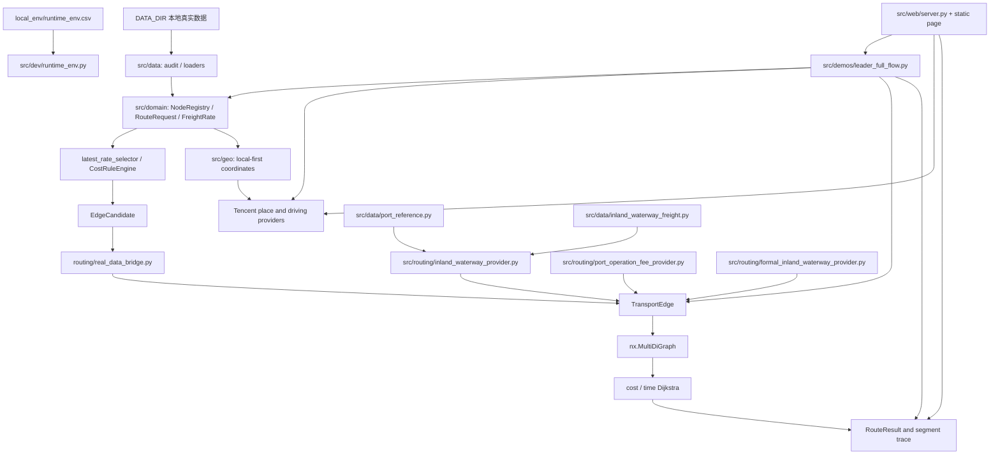

# PROJECT_STATE.md

Updated: 2026-08-25

本文件是新线程接手项目时的首要工程状态。内容依据当前代码、Git 工作树、最近提交、2026-07-30 全量开发 smoke、真实数据 smoke、既有 Tencent API 实测、本地 full-flow/Web API 实测、W3/W5 审计和用户确认业务口径整理，不以聊天记录或领导汇报代替工程事实。

## 1. 项目目标

项目名称：北港至客户工厂全链路运输路径推断原型。

2026-08-20 已启动铁路—集装箱首轮基础契约。新增的铁路 Provider 仅由测试中的
`demo_placeholder` 记录驱动，可将北站—南站的铁路运费执行价、上站费、下站费、
敞顶箱篷布费和完整运输段时效组合为 `north_to_south/trunk` 的正式结构化
`TransportEdge`，但不接入 CLI、Web 或真实数据链。当前确认东北至福建、广东、
广西的完整铁路时效分别为 168、192、192 小时；铁路运价、站点费率、客户专用线和
第三方专用线的费用/时效仍缺，缺失即 `manual_review`，不得使用占位数据进入真实图。

2026-08-26 已确认 `data_REAL/fee_switch/运输线路控制点_2026-08-26 完全补充版.csv`
为与散船航线控制点图同级的最新铁路 Web 展示基础数据源（679 个控制点、31 个
线路实例）。该 CSV 用于北站—南站的
线路示意、展示路径选择、控制点连通性审计和地图渲染；控制点的
`route_id + route_name` 是线路实例键，`point_order` 决定线路顺序。它不进入费用、
时效、候选、`TransportEdge`、正式搜索图或业务准入，也不替代实际班列可用性。
当前展示侧审计确认 11 个北站、50 个南站均可按名称命中该源；目标是让任意北站—
南站 OD 尽可能沿已维护线路连通。若线路图存在缺口，必须显式标为展示补线待确认，
不得将其描述为真实铁路业务边。

2026-08-31 已完成铁路—集装箱南站至客户工厂的隔离式末端方案契约。
`src/routing/rail_customer_delivery_provider.py` 可从完整维护记录构建三类方案：
南站直达客户的汽运交付边、南站至客户专用线的铁路交付边，以及“南站至第三方
专用线铁路中转边 + 第三方至客户交付边”的两边方案。直达拖车仅使用确认的铁路
末端专属距离规则，且不改写既有通用集装箱汽运规则。当前均只由测试
`demo_placeholder` 记录验证，尚未读取真实数据或接入 CLI、Web、`leader_full_flow.py`
及正式搜索图；缺少费用、时效、来源或唯一匹配时一律 `manual_review`。

为便于有限 OD 的算法核验，另有 `src.demos.rail_container_interactive_demo`。该工具
只消费终端人工输入，所有生成记录和边均为 `demo_placeholder`；不读取真实台账、不
调用地图、不挂入 `leader.py` 菜单、不接入 Web/`leader_full_flow.py`/正式图。运行命令为
`python -B -m src.demos.rail_container_interactive_demo`。它仅验证干线和末端方案的
费用、时效、单位与边结构，不能作为报价、运力承诺或正式路线推荐。

目标是读取本地运输业务数据，统一节点、订单、计费单位、费用和时间结构，构造保留平行运输方案的有向图，并分别输出费用最低和时间最短路径及其分段依据。当前属于 Python 原型验证，不是生产调度系统、正式报价系统、数据库服务、前端产品或高并发 API。

长期业务模型只有两个运输段：`北港 -> 南港` 和 `南港 -> 客户工厂`。业务运输段与图边不是一一对应关系；任一业务段都可以由一条或多条、同种或不同运输方式的边组成。散船只是第一段当前率先实现的方式，第二段则是可以包含汽运、驳船、铁路和其他中转组合的子路径搜索问题。当前闽江军航码头—南平港实例仅验证一种可行组合，不定义长期路线模板。

领导已经确认当前 `leader_full_flow.py` 和本地 Web 页面的输入/输出形式反映项目产品需求：北港、客户工厂、可选南港和订单维度是输入契约，双目标路线、费用组成、分段依据、运行警告/错误和地图信息是输出契约。该 IO 口径需要在后续重构中保留；领导不指定模型的具体运算和推断实现，候选生成、Provider、图结构、搜索算法及模块划分由工程侧在已确认业务规则下独立设计。Demo 负责观察和展示正式能力，不得反向定义主代码。

## 2. 当前架构



代码按职责分为：

- `src/data`：真实数据审计、类型化加载和本地输出；
- `src/domain`：订单、单位、节点、运价、最新运价和费用规则；
- `src/geo`：坐标与道路距离 Provider，隔离 Tencent API；
- `src/routing`：客户画像、时间、运输边、图、搜索、结果解释和内河航运 Provider；
- `src/application`：界面无关的路线规划输入/输出契约和应用服务入口；
- `src/demos`：领导展示、真实数据开发运行和 Tencent 探针；
- `src/dev`：本地环境加载、功能总览和开发者 smoke；
- `tests`：单元与集成测试。

旧 `models.py`、`graph_builder.py`、`route_planner.py` 和重复费用 Demo 已从 `src` 剥离。真实业务主链不再依赖旧 CSV/`DiGraph` 原型。

## 3. 已完成功能

- JSON/JSONL 数据审计、质量统计及脱敏输出分离；
- 从 `DATA_DIR` 加载运价、地点坐标和 AdditionalFee；
- NodeRegistry、稳定节点 ID、别名和坐标冲突检查；
- 本地优先坐标解析，Tencent 地点搜索和普通驾车距离/时间；
- Tencent 多候选默认选择 top1，并保留置信等级和最多 top 5 候选追溯；
- RouteRequest、包装、`trade_type` 和 `吨/箱/柜` 精确单位校验；
- FreightRate、最新有效运价选择和空日期 `1970-01-01` 比较基线；
- CostRuleEngine：维护运价、散船模式、陌生散粮汽运和陌生集装箱汽运；
- ShippingTimeProvider 接口及人工时间实现；
- CustomerProfile、自有码头/候选中转港互斥分支；
- EdgeCandidate 到 TransportEdge 的保守真实数据桥接；
- `nx.MultiDiGraph` 正式图、cost/time 独立 Dijkstra 和 RouteResult 解释输出；
- 既有节点但无可用路线时返回 `no_path`，不补 0、不猜路线；
- 本地 `runtime_env.csv` 和 `python -B -m src.dev.smoke_test` 开发测试入口；
- 第一版全流程领导 Demo：输入北港 A 和客户工厂 B，输出费用最低和时间最短路线。
- 南港码头作业费按“精确费率 → 显式区域代理 → 同业务区域最近适用费率 → 人工复核”匹配；代理值保留参考码头和距离且不冒充目标港精确费率；
- 福建闽江驳船正式费率/时效读取与构边：散粮不限品种 50 元/吨、往返完整运输段 15 小时；端点能力不足时不静默构边；
- `leader_full_flow` 可让南港至客户业务段中的汽运边与驳船中转边共同进入 `MultiDiGraph`，并支持 `--south-port` 固定一个已注册南港；当前组合只是已实现实例，不是第二业务段的穷举；
- 正式运输语义已拆分为业务运输段、运输方式和图边角色：`TransportStage` 只表示 `north_to_south` / `south_to_customer`，`transport_mode` 表示散船、驳船、汽运等方式，`TransportEdgeRole` 表示干线、转运或交付；
- 本地展示页第一版：运输条件、订单信息、双目标结果、费用组成、运行提示和腾讯地图分段几何均复用 full-flow 主链；散船和驳船已可从实际端点接入最近的本地维护航线控制点，汽运为同次腾讯驾车响应的道路折线。
- 已建立第一版界面无关应用契约：`RoutePlanningRequest` 统一承载北港、客户、可选南港、区域和订单，`RoutePlanningResponse` 统一承载候选节点、双目标结果、分段追溯、地图几何和运行警告；CLI 与 Web 均通过 `RoutePlanningService` 调用同一 full-flow 引擎。
- 已确认 Demo/Web 与主代码的依赖边界：现有 IO 行为是需要保留的产品验收契约，模型计算和推断逻辑不以 Demo 便利为目标；当前 `leader_full_flow.py` 仍保留具体编排和文本展示，后续应继续把编排逐步迁入应用层，不将第一版契约误述为层次迁移已经完成。

## 4. 当前正在处理的问题

阶段 17 第一版全流程领导 Demo 的 PyCharm 真实 A/B 预演与展示收束已经完成。用户在本地 Tencent Key 环境运行最新版 `leader full-flow` 成功，输出包含候选南港、正式搜索图边数、费用最低/时间最短路线、总费用组成、AdditionalFee 未计入声明和测试版数据边界说明，符合阶段 17 验收口径。

2026-07-21 已完成一次真实 A/B 本地预演：正式图构建、费用最低和时间最短双路径、分段来源和最小伪造声明均已输出。地点搜索可能把宽泛地名解析为非货运实体；展示前必须使用精确港口名称或由业务确认该解析实体可用。全流程输出现展示 `source_confidence`，用于现场核对 Tencent top1 的可靠性。

2026-07-23 已完成 B1 业务口径签认：散船运价表为元/吨单位报价，费用为报价乘以订单吨数；报价表示从本项目任一北港出发至南港的散装粮食散船运价，不含港口作业费；税务问题当前不考虑；不属于广东、广西、福建、海南的目的地列不读取、不修改。2026-07-24 已补充 W5 口径：南港作业费第一版简化为汇总“码头作业费”，业务上先只考虑“入库费”；散粮入库费为 `元/吨`，集装箱预留 `元/箱`；同一码头可按品种、贸易类型和包装方式维护不同费率，当前 Demo 默认 `内贸`，但数据结构保留 `外贸`。

2026-07-23 已完成 W2/W4 最小工程闭环：新增真实散船运价 Provider，`leader_full_flow` 已从固定 `demo_placeholder` 干线费用/时间切换为读取本地 `散船运价表.xlsx` 最新行、按订单吨数选船并计算干线费用。2026-07-27 根据用户澄清统一时效口径：业务所称“航行时效”在本模型中就是完整航运段总时间，不拆分等待、装卸和实际航行组成；已确认分区天数直接换算为小时，时间范围为 `complete_segment`。当前自动模式会排除无法匹配真实散船目的组或时效分区的候选南港，并保留提示；这用于防止内河港、铁路站、工厂或仓库被误当作海运散船干线目的地。

内河航运当前只考虑福建闽江和已确认的珠三角—西江沿线区域；港口连通性必须由业务运输段、运输方式、包装/品种和港口作业能力共同决定；内河驳船航费/航时使用独立数据接口，未具备完整正式边条件前只能显式 `demo_placeholder`；北港至南港散船费用和完整航运段时效继续通过可追溯区域映射匹配。当前客户工厂统一按无自有码头处理；只有未来正式客户—码头关系数据才能引入客户码头节点。此前讨论过的 300 公里汽运规则已被用户取消，不进入长期决策或筛选逻辑。

2026-07-28 已将内河驳船推进到正式数据接口和 full-flow 构图：新增驳船费率 CSV Loader、独立费率 Provider 和正式构边 Provider；福建闽江已维护往返 15 小时完整运输段时效和散粮 50 元/吨费率。当前系统可同时比较南港直达客户汽运，以及南港经驳船至内河中转港后再到客户的路线。该实现是第二业务段的首个多边实例，不限制后续铁路、其他中转港或更多方式；港口驳船能力主数据尚不完整时仍必须披露 `demo_placeholder`。

2026-07-28 已按领导展示流畅性要求启用可追溯数据补全：作业费在精确费率和显式人工区域代理均未命中时，可采用同一业务区域内最近且适用订单的正式费率；当前基线因此补齐揭阳港、漳州港、茂名水东港、铁山东岸码头和阳江港的作业费代理。散船航时也提供同区域最近参考港解析器，但只有港口能力表唯一确认目标港可接北港散船后才能使用，且不代理运价目的组或物理连通性。

2026-07-28 已新增 `src/web/server.py` 和本地静态页面。页面接受北港、客户、可选南港、区域、品种、包装、重量、计费单位和贸易类型，返回费用最低/时间最短路线、费用分项、运行警告和地图节点。服务默认只监听 `127.0.0.1`；地图 Key 只从 ignored 本地环境读取。随后已升级分段几何：`RoadRouteResult` 保留腾讯压缩折线，full-flow 以 edge ID 侧表保留同次响应几何，Web 只为实际推荐段序列化；汽运使用同次腾讯驾车道路折线。2026-07-31 又接入本地 `航线控制点_全点版.json`，散船和驳船均将实际端点接到最近适用控制点后沿维护走廊绘制；控制点文件当前为 5 条走廊、298 个 GCJ-02 点。地图几何不写入搜索图，也不参与费用、时效、候选或双目标搜索。

2026-07-30 根据 Web 目视反馈修正散船示意线：通用沿海走廊控制点由远海向大陆沿海收近；目的地属于广西海港时，控制点从雷州半岛与海南岛之间的琼州海峡穿过，再进入北部湾，不再绕行海南岛南部。几何来源版本更新为 `china_coastal_waters_schematic/1.1`，输出仍明确标记 `is_schematic`，不声称为权威航道，也不影响模型计算。Web 几何及序列化专项回归通过 `12 passed in 0.42s`。

2026-07-24 已推进 W3/W5 数据基础：`秀屿` 已按用户确认提升为福建项目范围内散船目的标签，`秀屿港` 可映射到散船目的组 `秀屿` 和航运段时效分区 `福建`；新增 `src/data/port_reference.py`，支持从 `港口能力表.csv` 和 `区域映射表.csv` 读取 W3 表，缺失表只进入审计提示，不猜测能力或映射；新增 `src/routing/port_operation_fee_provider.py`，支持南港“码头作业费”汇总 Provider、CSV 读取和显式 `demo_placeholder` Provider。W5 现在按南港、包装方式、贸易类型、品种范围和费用单位精确匹配：散粮使用 `元/吨`，集装箱预留 `元/箱`，不做吨/箱/柜换算。真实作业费缺失、重复、贸易类型不匹配、品种不匹配、单位不匹配或订单不匹配时返回 `manual_review`，不计入费用且不解释为 0。`data_foundation_audit` 已扩展 W3/W5 表路径、记录数、节点绑定缺口、接口提示和行级 CSV 输出。`docs/data_templates/` 已提供 W3/W5 样表和字段说明；`leader_full_flow` 已可选加载正式南港码头作业费表，已匹配作业费作为散船干线独立费用组成计入，接入表后缺失或不安全的候选不入图，避免按 0 参与费用最优。

2026-07-24 已完成 W5 地域代理和路线标签契约：费用匹配优先级固定为“目标港标准 `node_id` 精确适用费率 → 唯一已确认 `operation_fee_region_code` 下的唯一参考码头费率 → `manual_review`”。作业费区域只接受 `区域映射表.csv` 中标准 `node_id` 的人工维护映射，不使用城市关键词、名称包含关系或坐标最近距离自动生成。代理费用显式使用 `regional_proxy` 来源类型，并保留参考码头 node ID、映射依据、映射规则编号/版本，计算说明明确其不是目标码头精确真实费率。港口能力接口已改为三态：空值表示未知，`False` 只表示明确确认“不支持”；正式能力表仍未启用 full-flow 过滤。`NodeProfile`/`CustomerProfile` 已补充影响路线可行性的包装、品种、运输方式、区域、确认状态和维护日期字段，并新增客户—自有码头稳定节点关系契约；未确认客户画像不得生成可执行路线分支。

2026-07-24 已新增 `src/data/port_label_rules.py` 和 `src/demos/port_label_rules_audit.py`：对领导提供的 `部分码头标签.json` 做只读审计，将 `serviceFees.入库` 映射为候选“码头作业费”单位费率，保留 `tradeType` 和品种范围；该工具不写入 `港口能力表.csv`、`南港码头作业费.csv` 或 `地点经纬度.json`。别名治理顺序明确为“名称字典 -> 腾讯地图 API -> 人工确认”。名称字典优先阶段现已采用保守的港口后缀唯一匹配，只在去掉 `港/码头/港区/作业区` 后名称完全一致、且字典候选全部指向同一已注册节点时绑定审计候选；该过程不向节点注册表写入新别名。人工确认和明确候选回写后，本地共新增 10 个标准坐标和 14 组明确别名关系；`汇东/百达/红东` 明确忽略。刷新后的只读审计为 76 条展开候选费率、2 条人工复核规则行、60 条直接节点命中、9 条名称字典唯一后缀匹配、9 条节点未命中，对应 7 个去重名称：其中 3 个明确忽略，`炮台港/金港` 待确认，另 2 个客户工厂标签的源费率为 0、不能转为可用作业费。`肇庆福加德码头` 绑定 `广东加福加德食品有限公司`，按长期规则归类为客户自有码头。实际 Tencent 候选仅在显式传入 `--query-tencent` 时写入独立的 `output/port_label_tencent_review.jsonl`，普通审计不会覆盖已有 API 复核结果。

2026-07-27 已新增 W5 正式数据准入人工复核清单，只读输出把当前候选分为 69 条“可申请准入”、7 条“节点待确认”和 2 条“费用含义待确认”；“可申请准入”仍需人工填写确认结果，工具不自动写正式 W5 表。已新增 `内河驳船运输时效.csv` 的类型化读取、双向区域匹配、天/小时换算和审计输出；当前本地表可加载 7 条珠三角—西江沿线区域规则，统一解释为完整航运段总时间。该时效 Provider 尚未接入 `leader_full_flow` 主图，且正式驳船航费和港口能力不齐时不得据此单独生成驳船边。

2026-07-27 用户随后正式批准当前 W5 正数候选和两条客户自有码头 0 元记录进入测算，并要求忽略其他未绑定节点。本地 `南港码头作业费.csv` 已显式生成：69 条正数 `chargeable` 费率全部绑定标准节点，2 条客户自有码头规则为 `not_applicable`。其中佛山顺德利宝已绑定既有客户节点；广州番禺灵川暂按业务原名匹配不适用规则，不计入未绑定正数费率缺口。Provider 对不适用规则返回明确 0 元和业务原因、不生成零值 `CostComponent`；缺失、冲突或维度不匹配仍返回 `manual_review`。

2026-07-27 本轮开发者 smoke 通过：`344 passed in 1.65s`，real-data smoke 通过，312 条已计费候选均可进入正式图且缺节点 ID 为 0。Tencent probe 因当前运行环境连接失败而返回 `manual_review`，不能视为真实 API 调用成功证据。

2026-07-23 下班前验证：全量 pytest 通过 `300 passed in 1.78s`。只读数据夯实审计可运行，不调用 Tencent、不写回真实数据；当前摘要为 492 条运价、293 个坐标节点、18 条 AdditionalFee 原始记录、295 个运价地点均已注册、AdditionalFee 仍有 2 个站点类节点未注册、散船运价表 18 列。

## 5. 已知缺陷

- 北港至候选南港的散船干线费用和完整航运段时间已使用真实散船运价表和已确认分区时效；本地正式南港作业费表已加载 69 条正数费率和 2 条客户自有码头不适用规则，空缺作业费可按同业务区域最近正式费率生成可追溯代理；正式客户画像仍未接入，人工指定南港已完成但只接受已注册标准节点；
- 船运时效按简化口径处理：已配置的业务“航行时效”就是该段航运总时间，不再另行拆分或叠加等待、装卸、实际航行等组成；没有区域时效记录的航运段仍缺失，铁路时间亦未接入，均不得补零；
- 内河驳船已有正式航费/时效 Loader 和构边 Provider；福建闽江正式费率/时效已维护，珠三角—西江沿线已有时效但航费仍不完整。端点港口能力未齐时只能以明确 `demo_placeholder` 能力参与演示，不能作为正式能力数据；
- 命令行 Demo 默认订单为 2450 吨、散粮、玉米、内贸和“客户无自有码头”画像；本地页面可输入订单，但正式客户画像数据源仍缺失；
- 已确认“与客户工厂绑定的码头属于客户自有码头”，并完成 `肇庆福加德码头 -> 广东加福加德食品有限公司` 的本地节点别名绑定；客户画像字段、能力记录和 full-flow 正式分支数据源仍未接入；
- AdditionalFee 已加载但尚未完成面向路线段的适配、去重和归属校验；W5 正数费率已正式接入，客户自有码头不适用规则与缺失费用明确区分；只读审计显示当前仍有 2 个站点类 AdditionalFee 节点未注册，按用户确认列入后续集装箱/铁路节点治理，不阻塞当前散粮散船阶段；
- `部分码头标签.json` 已可只读审计；人工确认和明确候选回写后有 60 条直接命中、9 条名称字典唯一后缀命中，仍有 9 条展开规则未绑定标准节点，对应 7 个去重名称；`汇东/百达/红东` 已明确忽略，`炮台港/金港` 仍待确认，另有 2 条费率为 0 的客户工厂规则行不能转成可用费用；这些输出只说明可辅助建表，不能直接作为正式费用上线；
- 当前运价表中的 295 个不同地点名称已全部匹配标准节点，312 条已计费候选均具备两端节点 ID；
- 已提供本地去重和候选坐标复核工具；运价地点治理后去重缺失地点已由 32 个降至 0 个，本轮码头标签治理继续把本地标准坐标扩展到 303 个；名称字典只接纳明确全称/简称对；
- 北港至南港完整航运段时效已在散船干线 Provider 中按分区天数乘以 24 转为小时；`REAL_DATA_DEMO_MANUAL_TIME_HOURS` 仍仅用于旧真实数据 smoke/开发验证，不再作为 `leader_full_flow` 干线时效来源；
- 南港至客户工厂业务段已允许由一条或多条图边组成；当前已验证直接汽运和驳船至中转港后汽运的实例，实际是否产生驳船边仍取决于区域、正式航费/时效和端点能力。铁路及其他组合尚未完整接入；
- Tencent 多候选默认信任 top1，低置信结果存在误选风险；抽检、缓存和正式回写机制未实现；
- Tencent REST 地点和驾车接口、本地浏览器 JavaScript API GL 已于 2026-07-28 使用同一个 ignored 本地 Key 实测成功；地图底图、节点、近海散船虚线和腾讯道路折线均正常。默认实测路线的汽运段在 Web 响应中保留 531 个腾讯道路点；
- 当前已有本地 Web 展示原型，但没有数据库、生产 API、鉴权、任务调度、监控或部署能力。
- 2026-08-06 集装箱运输进入首轮“接口与只读审计”开发：新增 `集装箱船运价时效.csv` 契约和 `src.demos.container_trunk_admission_audit`。首轮订单仅允许 `集装箱/箱`，`柜` 不换算；北港—南港集装箱船必须同时具备已确认精确 OD 报价与完整航运段时效才可在后续构边。当前真实数据目录未接入该源文件，审计到 28 个具有海港/海河一体和集装箱能力的南港候选，全部为 `eligible_pending_rate_time`，没有集装箱船图边，也未改动现有散粮 full-flow。
- 本轮专项回归为 `24 passed in 0.47s`；随后完整开发 smoke 为 `468 passed in 4.37s`，真实数据 smoke 通过（492 条运价、972 个标准节点、302 条示例散粮订单可入图候选、0 条缺节点 ID）。本进程 Tencent 探针仍因连接失败返回可追溯 `manual_review`，不构成 API 成功证据。

## 6. 关键文件及作用

| 文件 | 作用 |
|---|---|
| `AGENTS.md` | 长期开发规范、隐私、Git SOP 和不可违反的业务约束 |
| `PLAN.md` | 当前里程碑及已完成/进行中/未开始状态 |
| `docs/DECISIONS.md` | 已确认技术和业务决策及理由 |
| `docs/ARCHITECTURE.md` | 模块边界和正式模型结构 |
| `src/data/loaders.py` | 真实数据类型化加载、候选和复核项构建 |
| `src/data/name_dictionary.py` | 本地名称字典的显式全称/简称对加载 |
| `src/data/port_node_maintenance.py` | 0729 码头信息维护工作簿的严格表头、港口节点性质、名称、别名、行政区和坐标读取；用于节点身份补充，不单独推断海港属性或运输能力 |
| `src/data/node_master_maintenance.py` | `节点信息维护0731.xlsx` 的严格读取、别名占位清理、坐标校验及保守同名合并 |
| `src/data/node_master_capabilities.py` | 从节点主数据、精确驳船 OD 和区域表构造包装/品种范围内的运行时能力及可追溯区域代理 |
| `src/data/node_coordinate_backfill.py` | 缺失端点去重、Tencent 候选查询和人工复核行输出 |
| `src/data/order_graph_admission_audit.py` | 跨订单参数的港口候选来源、散船干线、作业费及节点角色只读准入审计 |
| `src/data/port_reference.py` | W3 港口能力表、区域映射表及基于标准 node ID 的 W5 作业费区域映射读取；缺失或未确认记录进入审计 |
| `src/data/port_label_rules.py` | 部分码头标签 JSON 解析、W5 审计行及显式批准后的正式 `chargeable`/`not_applicable` 行生成 |
| `src/data/data_foundation_audit.py` | W3/W5 数据基础只读审计、未注册节点输出和接口接入状态报告 |
| `docs/data_templates/w3_w5_data_tables.md` | W3/W5 表字段说明和维护规则；样表使用虚构数据，不含真实业务明细 |
| `src/domain/cost_rules.py` | 费用规则；只消费距离，不调用地图 API |
| `src/domain/node_role.py` | 已确认铁路、客户设施、海港、内河港和海河双用港的保守兼容分类及散船准入边界 |
| `src/routing/bulk_shipping_provider.py` | 真实散船运价表读取、目的组/船型匹配、干线费用和完整航运段时效结果生成 |
| `src/routing/container_shipping_provider.py` | 北港—南港集装箱船运价/时效契约、严格 `箱` 单位校验、最新记录选择和后续正式 `TransportEdge` 构建入口；无真实数据时不构边 |
| `src/data/container_trunk_admission_audit.py` | 以节点维护标签审计集装箱船南港候选、纯内河港/客户排除和正式运价时效源缺口；只读输出 |
| `src/routing/inland_waterway_provider.py` | 港口能力、区域映射、内河驳船航费/航时接口及福建/珠三角最小 `demo_placeholder` 驳船 Provider |
| `src/data/inland_waterway_freight.py` | 内河驳船正式费率 CSV 查找与保守加载 |
| `src/data/inland_waterway_time.py` | 内河驳船区域总时效 CSV 的保守读取、单位换算和双向规则加载 |
| `src/routing/inland_waterway_freight_provider.py` | 驳船费率按区域、包装、品种、贸易类型和单位精确匹配并计算费用 |
| `src/routing/formal_inland_waterway_provider.py` | 合并区域、能力、航费和时效并生成可搜索驳船 `TransportEdge`；精确 OD 优先、区域费率仅在无精确 OD 时后备 |
| `src/routing/port_region_resolver.py` | 将正式区域表或已确认散船分区解析为可追溯业务区域 |
| `src/routing/bulk_shipping_time_mapper.py` | 仅对已确认可接散船港口执行同区域最近航时代理 |
| `src/routing/port_operation_fee_provider.py` | W5 南港作业费正数费率、客户自有码头不适用、`regional_proxy` 和人工复核状态、CSV 读取及显式 `demo_placeholder` Provider |
| `src/routing/transport_contracts.py` | 分离两个业务运输段、运输方式之外的图边角色、时间范围、费用组成和人工复核契约 |
| `src/routing/transport_edge.py` | 正式运输边；保留业务运输段、运输方式、图边角色、费用、时效和来源追溯 |
| `src/domain/latest_rate_selector.py` | 最新有效运价、空日期和冲突处理 |
| `src/geo/coordinate_provider.py` | 本地优先坐标解析契约 |
| `src/geo/tencent_map_provider.py` | Tencent 地点、多候选和道路路线适配 |
| `src/routing/real_data_bridge.py` | EdgeCandidate 到 TransportEdge 的保守桥接 |
| `src/routing/transport_graph.py` | 正式 `nx.MultiDiGraph` 构建 |
| `src/routing/route_search.py` | cost/time 独立路径搜索 |
| `src/routing/route_result.py` | 分段结果、追溯和总值校验 |
| `src/demos/leader.py` | 领导 Demo 统一入口 |
| `src/demos/leader_full_flow.py` | 第一版 A/B 全流程领导 Demo |
| `src/web/server.py` | 复用 full-flow 的本地 HTTP/JSON 适配器，默认仅回环监听 |
| `src/web/static/` | 本地运输条件、订单、双目标结果和腾讯地图展示页面 |
| `src/demos/port_label_rules_audit.py` | `部分码头标签.json` 只读审计入口；输出 ignored 的人工复核 CSV/JSON |
| `src/demos/real_data_run.py` | 真实数据 smoke、CSV 和正式链本地验证 |
| `src/demos/tencent_map_probe.py` | 用户本地 Tencent API 诊断入口 |
| `src/dev/runtime_env.py` | 从本地 CSV 安全注入运行环境 |
| `src/dev/smoke_test.py` | 开发者测试和真实数据 smoke 总入口 |
| `tests/test_leader_full_flow.py` | 全流程 Demo 正式图和最小占位边界测试 |
| `tests/test_bulk_shipping.py` | 散船真实费率读取、选船、时效和人工复核边界测试 |

## 7. 环境配置

- Python：3.12；依赖见 `requirements.txt`；
- 本地真实配置：`local_env/runtime_env.csv`，必须被 Git 忽略；
- 可提交模板：`config/runtime_env.example.csv`；
- `DATA_DIR`：真实业务数据目录；
- `TENCENT_MAP_API_KEY`：Tencent Key，只允许本地注入，不打印、不提交；
- `TENCENT_MAP_JS_KEY`：可选的腾讯 JavaScript API GL 专用 Key；当前用户已确认 `TENCENT_MAP_API_KEY` 同时具备 JavaScript API 与 WebService API 权限，并已实测可共享；未来如需凭据隔离可再配置专用 Key；
- `REAL_DATA_DEMO_MANUAL_TIME_HOURS` / `REAL_DATA_DEMO_MANUAL_TIME_UNIT`：真实候选正式链验证用人工时效，不代表业务真实值；
- `PYTHONPATH`：可指向项目本地 `.python_packages`；
- `data_REAL/`、`local_env/`、`output/`、`.python_packages/`、`.pytest_tmp/` 均已配置为忽略。

## 8. 启动、测试和验证命令

```powershell
# 开发者全量 smoke：pytest、真实数据链和可选 Tencent 诊断
python -B -m src.dev.smoke_test

# 纯全量 pytest；项目内 basetemp 避免 Windows 默认临时目录权限问题
python -B -m pytest -q --basetemp=.pytest_tmp

# 第一版全流程领导 Demo
python -B -m src.demos.leader full-flow

# 直接传入展示地点（名称必须替换为腾讯地图可检索的真实业务地点）
python -B -m src.demos.leader full-flow --origin "北港实际名称" --destination "客户工厂实际名称" --region "全国"

# 固定一个已注册南港；不填时仍由模型自动筛选
python -B -m src.demos.leader full-flow --origin "北港实际名称" --destination "客户工厂实际名称" --south-port "南港标准名称" --region "全国"

# 本地展示页；浏览器访问 http://127.0.0.1:8765
python -X utf8 -B -m src.web.server --host 127.0.0.1 --port 8765

# Tencent 地点和道路路线本地探针
python -B -m src.demos.tencent_map_probe

# 真实数据链
python -B -m src.demos.real_data_run

# Git 和文本完整性
git status --short --branch
git diff --check
```

2026-07-27 W5 最终准入改动后的全量开发 smoke 为 `350 passed in 1.70s`；真实数据 smoke 通过，312 条候选均可进入图、缺节点 ID 为 0。最终受影响 W5、full-flow、审计和模板专项测试为 `41 passed in 0.78s`。本地正式 `南港码头作业费.csv` 已加载 69 条正数 `chargeable` 费率和 2 条 `not_applicable` 规则；正数费率未绑定节点数为 0，其中 1 条不适用规则暂按业务名称匹配。内河驳船时效表加载 7 条区域规则。Tencent 探针仅验证网络失败可安全返回 `manual_review`，不构成真实 API 成功证据。上述真实业务表和审计输出均为 ignored 本地文件，不进入 Git。

2026-07-28 地图分段几何改动后，统一开发 smoke 通过：`372 passed in 1.95s`，真实数据链仍为 492 条运价、303 个节点、18 条 AdditionalFee、312 条候选可入图且缺节点 ID 为 0。smoke 内部受限网络探针按 `manual_review` 安全完成；另在获准网络环境下，本地 Web API/浏览器实测成功取得同次腾讯道路折线并返回 resolved。

2026-07-28 新增 `src/data/order_graph_admission_audit.py` 和 `src/demos/order_graph_admission_audit.py`，用于订单参数与港口准入的只读覆盖审计。当前真实数据自动形成 108 个场景：品种为玉米/小麦/大豆，合法包装与单位为散粮/吨、集装箱/箱、集装箱/柜，贸易类型为内贸/外贸；散粮重量覆盖 500、2450 吨以及 5000/10000/15000/16000/30000/60000 吨船型边界和各边界后一吨。根据用户确认，名称含“站”或为“地名+方位”的节点按铁路站排除，名称含“库/仓/公司”的节点按客户工厂/仓库排除，客户自有码头必须维护为独立港口/码头节点。刷新后审计检查 64 个与当前链路有关的节点，其中 46 个为港口名称启发式节点、18 个来自其他运价始发端；在后者中，10 个铁路站和 6 个客户设施已确认排除，仅东莞深粮、平和县储备粮仍为未分类条件节点。工具不调用 Tencent、不写回真实数据；`ready_pending_tencent` 只表示候选来源、散船干线和作业费已通过离线前置检查，不代表某一具体客户的第二业务段汽运或驳船边已实际入图。

在 500 吨玉米/小麦、散粮、内贸场景下，46 个港口样式审计节点中有 17 个具备匹配本订单的南港至客户汽运来源、可进入自动候选池；11 个通过离线前置检查，6 个因散船目的组/完整航运段时效分区未确认而阻塞：军航码头、洋浦港、清远清新码头、苏湾港、贵港白沙码头、韶关北江国际港（白土码头）。当前散粮大豆没有符合 full-flow“汽运运价始发端”候选来源的自动南港，因此不能自动构建该订单的全流程图；这与原始运价中可计算的驳船记录不同，需确认候选池规则或补充第二业务段候选来源。集装箱北港至南港干线仍是预留接口、尚未实现，审计将其标为 `implementation_scope`，不伪装成单个码头数据错误。名称角色刷新后的人工确认项由 249 条降至 146 条；因主清单当时被 Excel 占用，新结果先写入 ignored 的 `output/node_role_recheck/`，不覆盖用户正在查看的文件。

2026-07-29 已按业务确认完成首批水域角色收束：东莞深粮、平和县储备粮仅作为客户工厂；清远清新码头、苏湾港、贵港白沙码头、韶关北江国际港（白土码头）确认为内河码头并退出北港散船干线候选；军航码头确认为福建闽江海河双用港，显式映射到马尾费率目的组和福建航时区；洋浦港确认为海港，显式映射到马村/海口费率目的组和海南航时区。刷新后的审计仍覆盖 108 个场景和 64 个相关节点，其中 42 个属于北港散船候选样式，22 个为非自动或已确认排除节点，人工确认去重项为 126。500 吨玉米/小麦的内贸、外贸四个代表场景均为 13 个自动候选、13 个离线前置通过、0 个散船干线阻塞；大豆仍无符合当前末段候选来源的自动南港，集装箱北港干线仍处于接口预留范围。上述港口角色与映射来自人工业务确认；尚未以正式 `港口能力表.csv` 取代代码内确认项。

散粮船型边界审计显示：玉米/小麦内贸自动候选在 10000 吨及以下为 11 个离线就绪，10001—16000 吨为 10 个，16001—30000 吨为 2 个，30001—60000 吨为 1 个，60001 吨为 0 个；当前模型不自动拆单。500 吨外贸比内贸多 1 个作业费阻塞节点（马村港）。集装箱“箱/柜”场景均因北港至南港集装箱干线尚未实现而不能形成完整图；“柜”还明确标记为当前作业费接口未支持，且不得与“箱”互换。最终全量开发 smoke 为 `377 passed in 1.77s`，real-data smoke 通过，312 条已计费候选全部具备节点 ID 并可进入真实数据验证图；本进程 Tencent 探针因网络连接失败安全返回 `manual_review`，不是 API 成功证据。

2026-07-28 下班验证：节点角色规则收束后的统一开发 smoke 为 `391 passed in 1.98s`；real-data smoke 继续通过，492 条运价、303 个标准节点、312 条已计费候选全部具备节点 ID 并可进入真实数据验证图。当前进程 Tencent 探针因连接失败返回 `manual_review`，不构成实时 API 成功证据。

2026-07-29 已接入本地最新版 `data_REAL/fee_switch/码头信息维护0729版.xlsx`。该表共 99 条码头记录，当前仅作为节点主数据覆盖层：全称/简称用于标准节点与别名解析，工作簿坐标优先于旧坐标 JSON；已存在的物理节点继续保留原规范名和稳定 node ID，新名称无法唯一绑定时才创建新节点或停止人工复核。真实注册表由 303 个节点增至 367 个；当前保留 15 组新旧坐标来源冲突用于审计，不静默丢弃旧证据。真实数据 smoke 仍为 492 条运价、312 条已计费且可入图候选、0 条缺节点 ID。

福建关键节点已按最新工作簿和业务确认收束：`南平港` 新增为标准节点；`福建军航码头/军航码头`、`福州马尾港`、`福建松下码头/松下码头` 均解析到原有稳定节点并采用最新版坐标。军航码头为闽江海河双用港，支持散粮玉米/小麦；南平港支持散粮、集装箱、驳船和铁路，支持玉米/小麦，但属于纯内河港，不得作为北港散船干线的南港终点。当前闽江只维护 `南平港↔军航码头`，散粮往返均为 50 元/吨、完整运输段 15 小时。马尾港虽为海河一体港且支持集装箱玉米/小麦，但已退出当前维护的闽江航线；松下码头保留海港身份，但散粮能力未确认且不属于闽江驳船走廊。

2026-07-29 的首版南港准入曾要求必须具有明确海港或海河双用标识。该口径已由 2026-07-30 最新业务确认部分替代：纯内河港仍不得通过自动候选或人工指定进入北港散船干线；水域角色尚未分类的标准港口/码头，只要在正式运价源中存在适用当前品种的散粮始发运价，也可作为南港身份依据，驳船与汽运记录均可提供该证据。仅集装箱始发端不作为南港，只标记为潜在中转港待确认。水域角色会同时检查同一标准节点的规范名和明确别名；别名角色冲突时仍保持未知。

2026-07-29 已完成闽江第二业务段中转实例的第一版正式构图接入。对军航码头南港候选，系统同时生成“军航码头→客户汽运”和“军航码头→南平港驳船→客户汽运”方案；这些是三条或两条图边的不同组合，不代表项目有三个业务运输段。客户工厂不再直接作为驳船端点；中转港至客户道路未解析时，驳船边也不作为孤立分支加入本次图。随后已将 full-flow 的中转端点来源改为驳船 Provider 的能力候选，南平港继续作为当前闽江实例，但不再是编排层硬编码常量。此次架构收束前的最后统一开发 smoke 为 `413 passed in 1.75s`，real-data smoke 通过；架构收束后的最新验证见本节测试记录。

2026-07-29 两业务运输段架构收束后，`RouteSegment` 已继续保留 `time_scope`，full-flow 在构图前会按 `edge_id` 合并多个南港共享的后续运输边，避免同一“中转港至客户”段重复入图；Provider 声明但未解析到标准节点的中转端点会进入运行警告，不再静默跳过。最终受影响契约、正式图、RouteResult、驳船 Provider、full-flow 和 Web 专项测试通过 `60 passed in 0.45s`。统一开发 smoke 通过 `418 passed in 1.57s`，real-data smoke 继续通过：492 条运价、367 个标准节点、312 条已计费候选全部可进入真实数据验证图且缺节点 ID 为 0。受限进程 Tencent 探针仍因 `ConnectionError` 安全返回 `manual_review`，不是实时 API 成功证据。

2026-07-30 散粮始发证据准入改动已由节点角色、full-flow 自动/人工南港选择和全订单只读审计共同实现。专项测试通过 `54 passed in 0.59s`。最新无 Tencent 审计覆盖 108 个订单场景和 120 个相关/注册节点：17 个自动散粮南港，5 个确认纯内河港排除，4 个显式散粮能力排除，10 个仅集装箱始发的潜在中转港，以及 65 个无运价角色证据的注册港口人工范围。17 个自动南港为东莞新沙港、广州港黄埔新港港区、广州南沙港、揭阳港、军航码头、麻涌港、马村港、茂名水东港、钦州港、深圳蛇口港、铁山东岸码头、阳江港、阳江源强码头、洋浦港、湛江宝盛码头、湛江港、漳州港。

2026-07-30 W3 港口能力接口已加入独立三态中转港功能角色：CSV 使用 `is_transfer_port`/`是否中转港`，数据基础审计和模板同步输出；`True` 表示来源已明确允许该节点作为运输子路径中转港，`False` 表示明确不是，空值表示未知。该字段不等同于海港/内河港水域角色，也不等同于图边 `transfer`。第二业务段驳船 `transfer` 候选终点现在必须明确为中转港；未确认时不枚举候选且显式构边返回人工复核。W3/驳船/full-flow/准入相关专项测试通过 `79 passed in 0.73s`。

2026-07-30 E2 候选解释输出已从自由文本警告提升为应用响应契约：`SouthPortCandidateDecision` 按节点保留 `included`、`excluded`、`not_selected` 或构边中的 `shortlisted` 状态，以及身份、排序、北港散船、作业费、南港后运输和最终图准入阶段。自动候选会记录节点角色、水域角色、散粮始发证据和已维护汽运优先/陌生汽运回退证据；被纯内河、客户/铁路角色、显式能力、费率/时效、作业费或后续无边阻断时保留具体原因。CLI 和 Web 只格式化同一应用结果，不重新计算候选。应用/full-flow/Web 专项测试通过 `42 passed in 0.51s`。

2026-07-30 应用层边界继续小步迁移：新增 `src/application/south_port_selection.py`，统一自动南港、人工指定南港、散粮始发证据、候选排序和球面直线距离计算。`leader_full_flow.py` 不再拥有这套选择算法，只将 `SouthPortSelectionError` 转为现有 Demo 错误，并在后续 Provider/构图阶段更新同一候选决策。新增应用层直接测试覆盖驳船散粮证据、纯内河港、客户公司和仅集装箱始发港；与 full-flow、应用契约和 Web 回归合计 `41 passed in 0.98s`。

2026-07-30 本轮统一开发 smoke 通过：`434 passed in 2.61s`；真实数据 smoke 通过，仍为 492 条运价、367 个标准节点、312 条已计费且可进入真实数据验证图的候选、缺节点 ID 为 0。受限进程 Tencent 探针在 `ConnectionError` 时返回可追溯 `manual_review`，不构成实时 API 成功证据。随后仅修复数据审计空表表头并运行受影响专项回归 `37 passed in 0.47s`，未再次重复全量。

同日刷新只读数据基础审计：运价地点未注册为 0，AdditionalFee 仍有 2 个铁路站点类节点未注册；正式港口能力源文件尚未接入、有效记录为 0 条，区域映射 8 条、南港作业费正数费率 69 条、明确不适用 2 条、内河驳船时效 8 条。空港口能力审计 CSV 现仍保留完整表头和 `is_transfer_port` 列；这只证明接口可交付，不代表正式港口能力数据已填充或启用。可选 W3 源文件若存在但只有表头，Loader 也会明确警告而不会把它解释为已接入。

2026-07-31 已完成 `节点信息维护0731.xlsx` 与真实精确 OD 驳船数据的运行时接入。最新节点工作表经严格表头、坐标和同名去重校验后形成 885 个唯一维护项；与既有主数据合并后，最终 smoke 注册表为 972 个标准节点。精确 OD 驳船记录经别名归并后涉及 35 个规范端点，全部已绑定标准节点并获得内河时效区域；区域代理不冒充精确映射。

真实运价主源已切换为 `运费数据.xlsx/运价表`，仅在工作簿不存在时兼容回退 `运价表.json`；工作簿存在但结构错误时失败关闭。第二业务段优先消费该正式源的精确 OD 驳船报价，区域级 `内河驳船运输费率.csv` 只作为“没有精确 OD”时的后备。新版工作簿通过品种字段区分小麦与玉米/大豆费率，原 10 组同日同 OD 报价冲突归零。临时全量精确 OD 验证中，玉米适用 163 条、全部构边；小麦适用 133 条、全部构边。

南港身份筛选已从“名称启发式为主”收束为“维护标签为主、名称规则补充”。当前同时读取 `节点信息维护0731.xlsx` 和 `码头信息维护0729版.xlsx`：0731 新版节点主表优先，0729 只在新版标签缺失时补充港口节点性质。`节点性质=港口码头` 可以使“东莞新沙”“广西铁山东岸码头有限公司”等节点不再因简称或“公司”字样被误排除；但“租赁库”等非港口性质不能仅凭码头属性升级为南港。码头属性继续判断海港、内河港或河海一体，包装方式继续约束散粮/集装箱准入，纯内河港及明确业务排除仍具有更高阻断优先级。

`东莞粤储粮港务有限公司/东莞粤储粮` 与 `南宁港牛湾作业区` 尚未出现在节点能力主表。当前根据已确认地域/功能角色和新版精确 OD 记录，分别采用珠三角海河一体始发端与南宁内河中转端的窄范围能力覆盖；包装与品种能力只取实际 OD 证据，不推广到其他节点，来源保留工作簿行号。未来正式港口能力表或数据平台记录接入后，应替换该独立开发期覆盖。

自动搜索同时保留直接汽运方案和驳船方案：南港候选按既有真实汽运优先级和客户距离排序，并为具有精确 OD 驳船证据的南港保留最多 3 个多式联运名额；每个已选南港再按到客户的距离展开最多 3 个中转港。该限制用于控制阶段 18 在线搜索宽度，不改变“所有合法平行边均可进入 `MultiDiGraph`”的长期架构。代表性离线 `北良港 -> 广西富丰集团有限公司` 编排形成 24 条运输边，其中驳船 9 条、汽运 9 条；是否选择驳船仍由 cost/time 两次独立 Dijkstra 决定。

本轮代码审查又收束了六类候选与准入边界：禁止仅凭坐标近邻把不同名称节点认作别名；客户设施判定统一使用节点角色分类器；直接运输优先候选不能挤占全部多式联运名额；按客户距离检查中转港时跳过不可用近端候选并继续寻找更远完整路径；精确 OD 起点只有在订单、能力、区域、费用和时效均能构边时才参与候选；直达客户的精确 OD 驳船边已纳入全流程测试和驳船边统计。

本轮最终独立全量测试为 `459 passed in 2.02s`；真实数据 smoke 通过：492 条运价、972 个标准节点、302 条已计费/图端点完整候选、0 条缺节点 ID。授权联网后的 Tencent 探针及 `北良港 -> 广西富丰集团有限公司` full-flow 均成功。真实案例中 `东莞新沙`、`广西铁山东岸码头有限公司` 已形成正式图边，`东莞市深粮物流有限公司` 按“租赁库”标签继续排除。统一 smoke 包装器的固定 pytest 临时目录发生 Windows `WinError 5`，其 pytest 子步骤已由独立唯一临时目录的全量测试替代；未清理锁定目录。本轮尚未提交或推送 Git。

2026-07-30 已完成界面无关应用边界第一步：新增统一 `RoutePlanningRequest`、`RoutePlanningResponse` 和 `RoutePlanningService`；CLI 与 Web 使用同一请求/响应入口，`region` 由应用入口传入坐标 Provider 工厂，Web 继续保留原有 camelCase JSON 口径。应用契约、CLI、full-flow 和 Web 专项测试通过 `38 passed in 0.95s`，CLI `full-flow --help` 可正常加载。该中间步骤当时没有修改费用、航时、候选港、构图或双目标搜索算法，因此未单独重复全量；本日后续业务主链改动完成后的最终统一验证以本节 `434 passed in 2.61s` 为准。

客户边界同步收紧：现阶段所有客户工厂均按“无客户自有码头”处理，只有未来正式客户—码头关系数据才能启用客户自有码头分支。此前 W5 中两条 `not_applicable` 原始规则可以保留费用语义证据，但不得据此把客户公司节点提升为港口、码头或生成水运边。

## 9. 最近修改内容

2026-07-28 阶段 18 数据补全、驳船与本地展示页：

- W5 空缺作业费可在同一可追溯业务区域内选取地理距离最近的适用正式费率，输出保留参考码头、距离、区域、来源和 `regional_proxy` 声明；
- 新增散船航时最近区域代理接口，但以港口能力表确认可接北港散船为前置条件，不由地理接近创造海运连通性；
- 新增内河驳船正式费率 CSV Loader、费率 Provider 和正式构边 Provider；福建闽江往返 15 小时、散粮 50 元/吨已作为本地真实规则接入；
- `leader_full_flow` 支持第二业务段中的直接汽运和驳船中转实例、可选 `--south-port` 以及可注入订单；该 Demo 实例不限制通用第二段路径结构；
- 新增本地 Web 服务和腾讯地图展示页，Key 仅从 ignored 本地配置加载；散船和驳船使用实际端点到最近维护控制点的水运示意线，汽运使用腾讯真实驾车折线；
- 2026-07-29 已收束此前 6 个散船干线阻塞节点：军航码头、洋浦港按已确认海运资格和费率/航时区域进入候选；清远清新码头、苏湾港、贵港白沙码头、韶关北江国际港（白土码头）按已确认内河角色退出北港散船干线候选。500 吨玉米/小麦的内外贸代表场景当前无散船干线前置阻塞。

2026-07-22 阶段 18 W1 已完成并纳入提交 `b79db3e`：

- 新增 `src/domain/node_profile.py`，为标准节点提供基础设施类型、标准所在地、航运段时效分区、作业能力和来源契约；
- 新增 `src/routing/transport_contracts.py`；其最初按运输方式命名阶段，2026-07-29 已收束为两个业务运输段，并新增独立图边角色；
- 扩展 `ShippingTimeRequest`/`ShippingTimeResult`，显式保留 `time_scope`，缺失时不默认解释为完整分段；
- 扩展 `TransportEdge`，保留业务运输段、图边角色、时间范围、费用组成和人工复核结果；费用组成必须等于运输段总费用；
- 新增运输语义进入 `edge_id`，避免同节点、同金额但阶段、时间口径或费用来源不同的平行边发生键冲突；
- 新增节点画像和运输契约专项测试，并补充时效、运输边、正式图、搜索、RouteResult 和 full-flow 回归覆盖；
- 本地形成阶段 17 交付报告与阶段 18 计划；公开 GitHub Issue #1 仅使用脱敏摘要，内部计划不纳入公开提交。

2026-07-23 阶段 17 最新 PyCharm 验收和阶段 18 B1 业务确认：

- 用户使用 `python -B -m src.demos.leader full-flow --origin "北良港" --destination "宾阳通威饲料有限公司" --region "全国"` 完成最新版全流程实跑，退出正常；
- 输出已展示地点来源、候选南港、搜索图运输边、费用最低/时间最短路线、总费用组成、AdditionalFee 未计入项和测试版数据边界；
- 确认散船运价表为元/吨单位报价，散船费用为报价乘以订单吨数；
- 确认散船运价表只表示北港至南港散装粮食运价，不含南港码头作业费，税务当前不处理；
- 确认散船运价表适用于本项目全部北港，其他北港与北良港具有一致适用性；
- 确认本阶段只读取广东、广西、福建、海南相关南港目的地，不读取、不修改其他目的地列；
- 确认南港作业费第一版采用“码头作业费”汇总类型、元/吨单位，并预留 Provider/CSV 以便未来细分卸船费、堆存费、短倒费等。

2026-07-23 阶段 18 内河航运接口起步：

- 新增并记录内河航运规则：福建闽江/珠三角限定、港口能力决定连通性、内河航费/航时未来正式接入、散船区域映射继续可追溯；早期“客户工厂等价客户码头”表述已被当前“客户均无自有码头、未来维护独立关系”口径取代；
- 明确不实施 300 公里强制汽运预筛；
- 新增港口能力表、区域映射表、内河航运航费/航时表的代码接口；
- 新增最小 `DemoInlandWaterwayBargeProvider`，只在福建闽江或珠三角同区域场景生成 `demo_placeholder` 驳船边；
- 该能力尚未改变最新 `leader_full_flow` 默认路径结构，默认 Demo 仍锚定“北港散船干线 + 南港至客户汽运”主链。

2026-07-23 GitHub 提交 `bc75809 feat(routing): add phase 18 shipping data contracts` 已完成并推送：

- 新增 `src/routing/bulk_shipping_provider.py`，读取真实散船运价表最新行、保留同一区域多船型列、按订单吨数向上选择船型，并生成真实散船干线费用和已确认完整航运段时效；
- `leader_full_flow` 已替换北港至南港干线费用/时效占位，候选若缺少真实散船目的组或完整航运段时效分区则不形成干线边；
- 新增 `src/data/data_foundation_audit.py` 和 `src/demos/data_foundation_audit.py`，用于只读审计订单口径覆盖、散船运价表列和未注册节点；
- 新增 `src/routing/inland_waterway_provider.py` 和测试，定义港口能力、区域映射、内河驳船航费/航时接口，并提供福建闽江/珠三角最小 `demo_placeholder` 驳船 Provider；
- 同步更新长期规范、决策、架构、计划、项目状态和变更日志。

2026-07-24 W3/W5 数据基础：

- `秀屿港` 已按用户确认坐标和地址纳入福建散船目的映射，`秀屿` 不再是待确认目的标签；
- 新增 `港口能力表.csv`、`区域映射表.csv` 的最小 CSV 读取逻辑，表缺失时审计提示，不阻塞、不猜测；
- `data_foundation_audit` 新增 W3/W5 表路径、记录数、节点绑定缺口、接口提示和行级 CSV 输出；
- 新增南港“码头作业费”元/吨汇总 Provider 和 CSV 读取，缺失、重复、单位不匹配或订单不匹配统一返回人工复核，不计入费用、不解释为 0；
- 新增显式 `demo_placeholder` 南港码头作业费 Provider，仅供演示占位使用，不默认启用；
- 新增 W3/W5 数据模板和说明文档，模板文件使用虚构数据并由测试保证可被当前 Loader 读取；
- `leader_full_flow` 已可选接入正式南港码头作业费表：未接入表时沿用当前 Demo 并明示未计入；接入表后，已匹配作业费作为独立 `CostComponent` 计入散船干线边，缺失或不安全的候选南港被排除并输出运行提示；
- `RouteSegment` 已保留费用组成，使领导输出能在分段费用下展示散船运费、码头作业费等子项。
- 订单和 W5 作业费已加入 `trade_type`/`tradeType` 维度；当前 Demo 默认 `内贸`，接口保留 `外贸`，同一码头可按品种、贸易类型和包装方式维护不同费率；
- 新增 `部分码头标签.json` 只读审计工具，将 `serviceFees.入库` 映射为候选“码头作业费”单位费率；当前审计为 76 条候选费率、2 条人工复核规则行、13 条直接节点命中、65 条节点未命中，对应 27 个去重未命中名称，尚不自动写入正式表。
- 新增 W5 `regional_proxy` 地域代理规则和显式 node ID 区域映射读取；精确费率优先，地域代理保留参考码头和映射规则追溯，任何不唯一或未确认输入返回人工复核。
- 港口能力布尔值改为可审计三态，未知不再等同“不支持”；补齐节点/客户路线标签与客户自有码头关系契约，但未启用正式能力过滤。

2026-07-22 验证结果：相关专项与受影响链路测试 `78 passed in 0.42s`；统一开发者 smoke 为 `284 passed in 1.39s`，real-data smoke 通过。Tencent probe 命令按诊断口径完成，但当前 Codex 网络请求返回 `ConnectionError` 并转为 `manual_review`，不应解释为真实 Tencent API 调用成功。

提交 `882c828` 完成的阶段 17 工程改动包括：

- 将 Tencent 多候选策略从阻塞式人工复核调整为默认 top1，并记录名称匹配、近邻聚类或低置信未聚类等级；
- 为 Tencent probe 增加中文输出、候选追溯和本地环境诊断；
- 完善 `runtime_env.csv` 模板、开发者 smoke 和功能展示入口；
- 增强真实数据运行输出和正式搜索链验证；
- 新增 `leader_full_flow.py`，用真实数据优先和最小显式占位贯通 A/B 双目标推荐；
- 新增全流程 Demo、Tencent Provider 和 probe 回归测试；
- 同步 README、架构、变更日志、计划、决策和验收记录。

## 10. Git 与本地未提交材料

当前分支为 `feat/bulk-shipping-contracts...origin/feat/bulk-shipping-contracts`，本地与远端分支计数为 `0 / 0`。阶段 17 展示收束、坐标治理、阶段 18 W1、散船真实 Provider、数据夯实审计和内河航运接口最小 Provider 已提交并推送。最近提交：

```text
b4761a7  2026-07-27  feat(routing): formalize port data governance
fb41bff  2026-07-24  feat(routing): add port data foundation and operation fees
bc75809  2026-07-23  feat(routing): add phase 18 shipping data contracts
b79db3e  2026-07-22  feat(routing): strengthen full-flow traceability
882c828  2026-07-22  feat(demo): complete leader full-flow rehearsal
```

阶段 17 主流程工程文件已纳入 `882c828`；坐标复核、展示费用组成、阶段 18 W1 契约及测试已纳入 `b79db3e`；阶段 18 散船真实 Provider、数据夯实审计和内河航运接口最小 Provider 已纳入 `bc75809`。完整内部计划、每日开发日志和领导报告继续保留在本地，不纳入公开仓库。

2026-07-24 W3/W5 工程改动已按独立白名单纳入 `feat(routing): add port data foundation and operation fees`：包括港口/客户路线标签契约、W3/W5 表读取与审计、南港码头作业费 Provider、作业费地域代理、full-flow 可选接入及对应测试和长期文档。用户原有的 `src/domain/cost_rules.py` 修改和 `src/demos/tencent_map_probe.py` 默认探针地点修改继续留在工作区；另有两份已跟踪 DOCX/PDF 处于删除状态。Codex 未恢复、暂存或提交这些任务外材料。

2026-07-28 最近区域代理、福建闽江正式驳船规则、full-flow 平行驳船边/指定南港和本地 Web 展示页仍在工作区，尚未提交。真实业务 CSV、`runtime_env.csv` 和腾讯 Key 继续被 Git 忽略；本次没有暂存或改动用户的办公材料。

工作树还存在多份未跟踪的 DOCX、PDF、PPTX、PNG、每日计划/报告，以及 ignored 的 `output/data_foundation_audit.*`。它们是用户办公材料或本地输出，不应被 `git add .` 一并提交；未来提交必须使用文件白名单并先做敏感信息检查。

## 11. 下一步建议

2026-08-31 新增铁路报价试算 Web 工具（`/rail_calculator.html`），专供业务人员按整车装载吨数、总运费、电气化里程、下浮率及人工维护分项复核报价。它与正式铁路 OD 费率、`TableRailContainerProvider`、`TransportEdge` 和路线搜索严格隔离：结果不自动写入运价、不自动构边。地方运费2已按用户确认使用 `1 - 下浮率`；源 Excel 的固定 60 吨单吨价仅保留为对照，页面另显示按实际输入吨数的单吨价。

1. `炮台港`、`金港` 及其他未绑定正数费率记录按用户确认暂时忽略；`汇东/百达/红东` 继续不查询、不注册、不进入测算；
2. 两条客户自有码头 0 元记录已按用户确认作为 `not_applicable` 进入测算：佛山顺德利宝绑定既有标准节点，广州番禺灵川暂按业务名称匹配；后者取得标准节点后再升级为 node ID 匹配；
3. 将 2026-07-29 已确认的客户/港口水域角色迁移进未来正式节点主数据和 `港口能力表.csv`；在正式表接入前保留代码内显式确认项，不通过坐标或名称重新猜测；
4. 填充真实 `港口能力表.csv`：重点确认哪些福建港口和客户节点可以在闽江驳船段装卸/到达；节点身份、名称或地理位置不能代替能力确认；
5. 珠三角—西江沿线驳船时效已存在，但仍需正式航费规则后才能全面生成真实驳船边；
6. 按已落地的三态 `is_transfer_port` 契约填充正式港口能力主数据，并继续校验其与水域角色、支持包装/品种、可用运输方式的组合；当前 10 个仅集装箱始发港口只保留待确认状态，不自动生成中转边；
7. 汽运已使用腾讯道路几何；散船/驳船已接入本地维护的基础航线控制点网络，但仍属于展示示意而非权威航道。新增港口组合仍须目视抽检，必要时调整控制点数据，不得把示意虚线描述为真实航道；
8. 未来提交必须使用工程文件白名单并执行敏感信息扫描；未经用户明确授权不提交或推送。

### 已落实的缺节点治理起步工具

运行 `python -B -m src.demos.node_coordinate_backfill` 可针对当前订单生成去重清单；加 `--query-tencent` 才会在用户本地查询候选坐标。每个地点先查询原始业务名称，若名称字典存在明确全称/简称对，再把字典全称作为并列查询词；JSONL 的 `query_names` 和 `coordinate_resolutions` 保留全部结果供人工比较。工具不修改 `地点经纬度.json`，也不自动认定别名；若两边已有不同节点 ID，则继续保留人工复核。

## 12. 明确禁止重新实施或推翻的已确认事项

- 不恢复旧 CSV/`DiGraph` 主链；正式图继续使用 `nx.MultiDiGraph` 和 edge key；
- cost 与 time 是两套独立权重，没有业务系数前不得合成综合权重；
- 搜索费用必须是当前订单当前运输段总费用，缺费用或时间不得默认 0；
- `吨`、`箱`、`柜` 及对应价格单位不得自动互换；
- 运输方式来自运价记录，不能由包装方式推断；
- 空维护日期保留原始空值，仅在最新运价比较时使用 `1970-01-01`；
- 已维护熟悉汽运路线优先；陌生路线费用由 `domain/cost_rules.py` 消费 geo 层提供的 `distance_km`；
- Tencent 普通驾车距离是当前原型最后一公里正式计费距离，未来货车距离通过已预留 Provider 接入；
- 陌生集装箱汽运保持元/箱：20 公里内 500 元/箱，超过 20 公里为 `500 + (X - 20) * 30 * 0.55` 元/箱；
- 客户自有码头与候选中转港加短途汽运是互斥分支，未知字段不得猜测；
- 多候选地点在当前原型默认选择 Tencent top1，但必须保留 `source_confidence` 和候选追溯；
- 北港至南港散船费用和时效必须使用正式数据或可追溯代理，不再回退旧干线占位；当前仍允许的占位仅包括明确展示的客户画像，以及正式端点能力未齐时单独披露的驳船能力 `demo_placeholder`；
- 阶段 18 B1 已确认散船运价表单位为元/吨，费用为报价乘以订单吨数；报价适用于本项目全部北港，只表示北港至南港散装粮食运价，不含港口作业费，税务当前不处理；
- 阶段 18 B1 已确认不属于广东、广西、福建、海南的散船目的地列不读取、不修改；南港作业费首版以“码头作业费”汇总类型接入，业务上先只考虑“入库费”；散粮为元/吨，集装箱预留元/箱，并保留 `tradeType` 作为内外贸匹配字段；
- 同一码头作业费可能因品种、贸易类型和包装方式不同而不同，未精确匹配当前订单前不得计入；
- 内河航运只在福建闽江和已确认珠三角—西江沿线场景生成候选；其他区域不得自动生成驳船边；
- 港口连通性由图边表达，边是否存在必须基于业务运输段、运输方式、包装/品种和节点作业能力，不能只看地理邻近；
- 当前客户工厂统一按无自有码头处理；未来客户自有码头必须由正式客户—码头关系表提供独立节点，不能把客户公司节点直接等价为码头；
- 300 公里汽运规则已取消，不得作为硬筛选条件；
- AdditionalFee 归属未确认前不得任意计入，也不得解释为 0；
- API Key、真实业务数据、本地配置和可还原业务明细不得进入 Git；
- 领导汇报必须基于工程事实，不能把原型、占位数据或未开始能力描述成生产功能。
