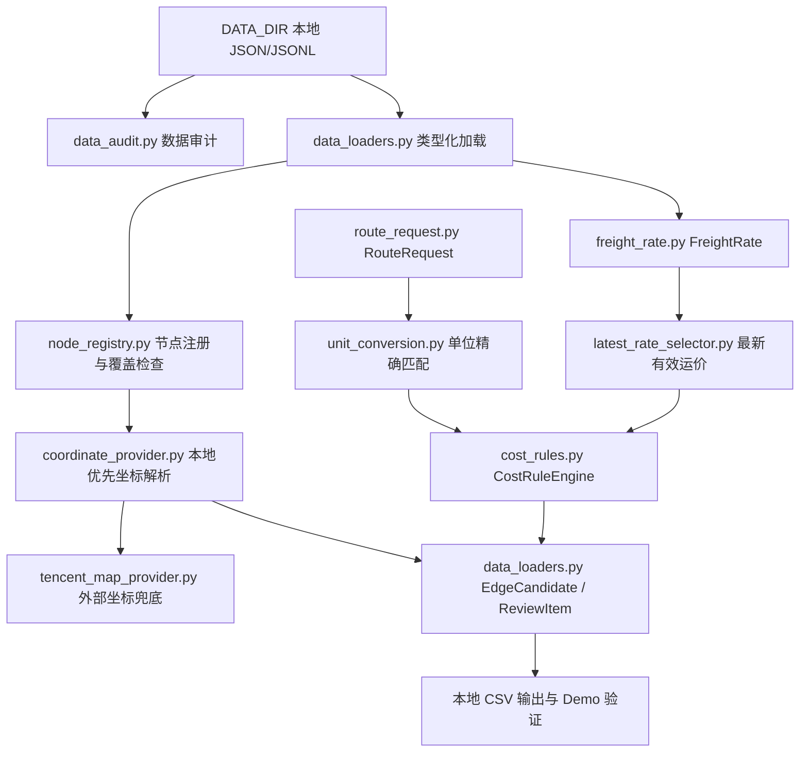

# PROJECT_STATE.md

Updated: 2026-07-16

本文件是新线程接手项目时的首要状态说明。内容已依据当前代码、Git 状态、全量测试和本地集成验证重新核对，不以聊天记录或领导汇报作为完成依据。

## 1. 项目目标

项目名称：北港至客户工厂全链路运输路径推断原型。

目标是构建一个可解释的 Python 原型：读取本地运输业务数据，统一节点、订单、计费单位、费用和时间结构，构造保留平行运输方案的有向图，并分别输出成本最低路径和时效最优路径及其分段依据。

当前项目用于规则和数据可行性验证，不承担生产调度、正式报价、数据库服务、前端应用或高并发 API 职责。

## 2. 当前架构

### 2.1 已投入真实数据流程的前置链条



`demo_run.py` 的真实数据链目前仍停在 `EdgeCandidate` 和本地 CSV 输出；该旧候选只有费用，没有接入运输时间、客户分支和正式 `TransportEdge`。正式模型链已经实现，但尚未与这条真实数据候选链连接。

### 2.2 外部地图边界

- `coordinate_provider.py` 负责本地坐标优先和外部 Provider 兜底。
- `distance_provider.py` 定义道路路线请求、结果、公里与小时单位及禁用 Provider。
- `tencent_map_provider.py` 实现腾讯地点搜索、普通驾车路线和可选货车路线适配器。
- API Key 只从 `TENCENT_MAP_API_KEY` 读取。
- 当前数据加载主流程只绑定本地节点表，不会自动调用腾讯地图并回写坐标。

### 2.3 仍为旧原型的图搜索链条

```text
sample_data CSV
-> io_utils.py
-> graph_builder.py: nx.DiGraph
-> route_planner.py: nx.shortest_path
-> models.py: legacy RouteResult
```

这条链只用于早期基线参考，未接入当前真实数据候选，不是正式业务架构。它会覆盖同端点平行边，并把缺失费用或时间默认为 0，不满足当前约束。

### 2.4 已实现的正式模型与搜索链条

```text
ShippingTimeProvider
-> CustomerProfile 与路线分支
-> TransportEdge
-> transport_graph.py: nx.MultiDiGraph
-> route_search.py: RouteSearchStrategy
-> 分别搜索 cost / time
-> route_result.py: RouteSegment / RouteResult 解释输出
```

该链已通过虚构节点和脱敏字段完成单元与集成演示。只有 `available` 边可以进入正式图，平行边使用 `edge_id` 作为 key，搜索结果返回每段 edge key。真实客户画像、北港至南港数据和当前 `EdgeCandidate` 尚未接入。

## 3. 已完成功能

### 3.1 数据审计

- 扫描 JSON、JSON 数组和 JSON Lines。
- 统计结构类型、记录数、字段、类型、缺失率、运输方式、费用单位、包装方式和适用品种。
- 检查空值、明显别名、重复记录、费用异常和维护日期格式。
- 费用异常按费用单位分组，避免混合单位互相判定异常。
- 脱敏 Markdown 与本地详细输出分离；敏感明细默认只能写入 `output/`。

### 3.2 真实数据加载

- 通过 `DATA_DIR` 查找 `运价表.json`、`地点经纬度.json`、`其他费用表.json`。
- 提供文件缺失、多文件冲突、非法 JSON、字段缺失、字段类型错误、非法数值和非法日期异常。
- 将运价、节点和其他费用加载为类型化对象。
- 保留运价来源文件和来源行号。

### 3.3 节点与坐标

- 生成稳定节点 ID。
- 支持保守别名识别、强制物理节点合并和坐标冲突报告。
- 分析运价始发/到达是否能匹配标准节点。
- 已实现本地优先坐标 Provider。
- 已实现腾讯地点搜索 Provider；唯一或唯一精确结果可解析，歧义结果转人工确认。

### 3.4 订单、单位与费用

- `RouteRequest` 支持数量、数量单位、包装、品种、节点标识、散船计价模式和可选人工时间字段。
- `吨`、`箱`、`柜` 分别精确匹配 `元/吨`、`元/箱`、`元/柜`。
- 包装仅用于辅助验证，运输方式从运价记录读取。
- 有效单位价格转换为当前订单当前运输段总费用，单位为元。
- `CostCalculationResult` 保存状态、总费用、规则编号、版本、计算过程、来源、方式和单位。
- 已实现既定运价单价、人工总价、散船指数、散船人工单价、散船人工总价和熟悉汽运维护运价。
- 陌生散粮和集装箱汽运规则已登记但保持禁用。

### 3.5 FreightRate 与最新运价

- `FreightRate` 保存业务字段、原始价格、价格类型、来源、维护日期、节点 ID 和源记录位置。
- `FreightRate.evaluate_for_request()` 兼容入口委托给 `CostRuleEngine`。
- 同一业务键按最新有效维护日期选取运价。
- 原始空日期保持 `None`，排序时映射为 `1970-01-01`。
- 正常日期记录覆盖无日期历史基线。
- 最新同日冲突转人工复核，完全重复记录确定性去重。
- 原始历史仍保留在加载结果和数据审计中。

### 3.6 地图路线 Provider

- 普通驾车路线返回公里制距离、小时制预计时间、收费金额和路线标签。
- 货车路线适配器保留为可选能力，不作为个人 Key 或当前原型的硬依赖。
- 网络、权限、空结果和异常字段均不会伪造成有效距离或时间。
- 单元测试使用模拟响应，不消耗真实 API 配额。

### 3.7 ShippingTimeProvider

- `ShippingTimeRequest` 和 `ShippingTimeResult` 已统一表示运输阶段、运输方式、原始输入、内部小时值、状态、来源和说明。
- `ManualShippingTimeProvider` 是当前唯一启用实现，接受人工确认的正数时间。
- 支持小时、天和分钟换算为内部小时。
- 缺失、零值、负数、非数值和不支持单位均返回 `manual_review`，不会产生可用于路径搜索的时间。
- `JsonShippingTimeProvider`、`DatabaseShippingTimeProvider` 和 `ApiShippingTimeProvider` 已作为未配置占位 Provider 保留；调用时只返回人工复核说明，不返回 0。
- 腾讯普通驾车耗时仍只属于道路参考 Provider，不会替代散船或完整运输作业时间。

### 3.8 CustomerProfile 与路线分支

- `CustomerProfile` 保存客户、工厂节点、自有码头标志/节点、允许包装/品种和可追溯来源。
- 自有码头标志未知、缺少来源、缺少码头节点或字段矛盾时返回 `manual_review`，不猜测路线分支。
- 有自有码头客户只允许南港至客户自有码头分支；无自有码头客户只允许候选中转港加短途汽运分支。
- 候选中转港可按确认距离预筛前 K，但结果明确要求后续分别比较总费用和总时间。

### 3.9 TransportEdge 与正式图

- `TransportEdge` 统一节点、方式、包装、品种、订单段总费用、小时制时间、原始价格、维护日期、距离、来源、规则版本和计算过程。
- 缺节点、费用、时间或追溯字段的候选保留为 `manual_review` 或 `not_applicable`，不会默认成 0。
- `transport_graph.py` 默认要求 `NodeRegistry`，使用 `nx.MultiDiGraph` 和 edge ID key 保存平行边；脱敏演示/测试必须显式声明允许未注册节点。
- 不可用、重复 edge ID 或引用未注册节点的边不会进入图，并保留问题代码和原因；存在建图排除项时不得输出 `resolved` 推荐。

### 3.10 双目标搜索与解释结果

- `route_search.py` 定义 `RouteSearchStrategy` 协议和 NetworkX Dijkstra 基线实现。
- 成本使用 `cost`、时效使用 `time_hours` 独立搜索，不生成综合权重。
- 搜索结果返回节点序列和每段 `(from_node_id, to_node_id, edge_key)`。
- 缺节点、同起终点、缺权重、非法权重和无路径均有显式状态。
- 搜索结果绑定目标权重图签名；搜索后节点、边或目标权重变化时返回 `manual_review` 并要求重新搜索。
- `route_result.py` 从图中还原完整分段，保存价格/时间来源、计费规则、计算过程、总费用和总时间。
- 结果层重新核对 edge key 和追溯字段，并强制总费用、总时间等于分段求和；无路径和人工复核结果导出时保留状态行。

### 3.11 Demo

- `demo_run.py`：读取真实本地数据、构建订单计费候选并输出本地候选与人工复核 CSV。
- `demo_leader.py`：统一入口展示各模块，默认运行双目标路径搜索与解释结果。
- `demo_leader_shipping_time.py`：展示人工运输时间来源、小时制换算、非法输入人工复核和未接入数据源占位。
- `demo_leader_customer_profile.py`：展示客户分支互斥、候选港预筛和缺数据人工复核。
- `demo_leader_transport_edge.py`：展示可用边和缺节点/缺时间候选。
- `demo_leader_transport_graph.py`：展示 MultiDiGraph 平行边和排除问题清单。
- `demo_leader_route_search.py`：展示成本最低与时效最优路径、edge key 和完整分段来源。
- `demo_tencent_map_probe.py`：可选的公开地点 API 冒烟测试。

## 4. 当前正在处理的问题

1. **真实数据正式链集成**：阶段 9-13 第一版及审查加固已完成；真实 `EdgeCandidate` 仍未转换为 `TransportEdge` 并进入正式图。
2. **Git 分支分叉**：本地 `main` 有 1 个未推送功能提交，远程 `origin/main` 有 2 个 README 提交，本地状态为 `ahead 1, behind 2`。
3. **真实业务链尚未接通**：`demo_run.py` 仍输出旧 `EdgeCandidate`；客户画像、运输时间和正式 `TransportEdge` 尚未从真实数据生成。
4. **节点覆盖不足**：真实数据验证中仍有运价端点无法映射到标准节点，不能进入后续正式图。

## 5. 已知缺陷与技术债

### 5.1 阻止真实业务路径推荐的问题

- `CustomerProfile` 模型和分支规则已实现，但正式客户数据源尚未提供。
- 北港至南港散船费用和完整运输时间尚未提供，无法形成全链真实边。
- `data_loaders.py` 的真实 `EdgeCandidate` 尚未改为组合费用、时间和客户规则的 `TransportEdge`。
- 真实运价候选仍有端点缺少标准节点 ID，不能加入正式图。
- 其他费用是否计入运输段、计入哪一段尚未确认。

### 5.2 数据接入缺口

- 当前真实数据主要覆盖南港至客户工厂，北港至南港散船运价和人工运输时间尚未提供。
- `data_loaders.parse_freight_rate()` 当前把真实运价 JSON 全部解析为 `price_type="unit_price"`；真实数据协议尚不能表达人工总价运价。
- `其他费用表.json` 已加载为 `AdditionalFee`，但尚未叠加到运输段总费用。
- 腾讯地图新坐标和路线没有本地缓存、人工确认和正式表回写机制。
- 当前主流程不会对未匹配节点自动调用腾讯坐标 Provider。

### 5.3 旧原型缺陷

- `graph_builder.py` 使用 `nx.DiGraph`，同一端点的多条运输边会互相覆盖。
- 旧建图代码对缺失 `base_cost`、`base_time`、`distance` 使用 0 默认值，与现行规则冲突。
- `route_planner.py` 直接调用 `nx.shortest_path`，没有策略接口、edge key、不可达异常说明或人工复核信息。
- `models.py` 中的旧 `Node`、`Customer`、`RouteSegment`、`RouteResult` 仅供早期兼容；正式结果已迁移到 `customer_profile.py`、`transport_edge.py` 和 `route_result.py`。
- `README.md` 仍以 CSV/DiGraph 早期设计为主，与当前 JSON/FreightRate/Provider 架构存在文档漂移；远程另有两次 README 修改尚未合并。

### 5.4 环境问题

- 默认 `C:\Program Files\Python312\python.exe` 为 Python 3.12.7，但没有安装 pytest。
- 当前测试依赖通过本地 `.python_packages` 和 `PYTHONPATH` 提供；该目录是机器/检出环境专属，不是标准项目虚拟环境，后续协作宜建立独立 `.venv`。
- PowerShell 输出中文时可能受控制台编码影响；设置 `PYTHONIOENCODING=utf-8` 后正常。

## 6. 关键文件及作用

| 文件 | 作用 | 当前状态 |
|---|---|---|
| `AGENTS.md` | 长期开发规范、隐私、Git、业务边界和完成标准 | 本次已更新 |
| `PLAN.md` | 真实里程碑和下一阶段验收标准 | 本次已更新 |
| `docs/PROJECT_STATE.md` | 当前交接状态 | 本文件 |
| `docs/DECISIONS.md` | 已确认业务与技术决策 | 本次更新 |
| `docs/ARCHITECTURE.md` | 当前正式链、旧兼容链和下一真实数据接入边界 | 已同步至阶段 13 |
| `CHANGELOG.md` | 实际工程变更历史 | 已记录至阶段 13 第一版 |
| `src/data_audit.py` | 数据质量审计与脱敏输出 | 已完成第一版 |
| `src/data_loaders.py` | 真实 JSON 加载和计费候选构建 | 已完成第一版，仍缺时间与其他费用集成 |
| `src/node_registry.py` | 标准节点、别名、坐标冲突和覆盖检查 | 已完成第一版 |
| `src/coordinate_provider.py` | 本地优先坐标解析接口 | 已完成基础版 |
| `src/distance_provider.py` | 道路路线请求/结果和禁用 Provider | 已完成基础版 |
| `src/tencent_map_provider.py` | 腾讯地点与道路路线适配器 | 已完成基础版 |
| `src/shipping_time_provider.py` | 运输时间请求/结果、人工 Provider 和未配置占位 Provider | 已完成第一版 |
| `src/customer_profile.py` | 客户画像、互斥路线分支、包装/品种过滤和候选港预筛 | 已完成第一版；正式数据源待接入 |
| `src/route_request.py` | 订单结构和包装/单位辅助校验 | 已完成第一版 |
| `src/unit_conversion.py` | 单位精确匹配和总费用换算 | 已完成 |
| `src/freight_rate.py` | 正式运价模型 | 已完成第一版 |
| `src/latest_rate_selector.py` | 最新有效运价、冲突和重复处理 | 已完成第一版 |
| `src/cost_rules.py` | 统一费用规则引擎和追溯结果 | 已完成第一版；陌生汽运仍禁用 |
| `src/transport_edge.py` | 正式运输边、可用状态、来源和规则追溯 | 已完成第一版 |
| `src/transport_graph.py` | 正式 MultiDiGraph 构建、平行边和排除问题清单 | 已完成第一版 |
| `src/route_search.py` | cost/time 独立 Dijkstra 策略和 edge key 结果 | 已完成第一版 |
| `src/route_result.py` | 分段解释、汇总校验和行式导出 | 已完成第一版 |
| `src/demo_run.py` | 真实数据开发集成脚本 | 可运行 |
| `src/demo_leader.py` | 领导展示入口 | 可运行，默认展示双目标路径搜索与解释结果 |
| `src/demo_leader_shipping_time.py` | 运输时间 Provider 展示 | 可运行 |
| `src/demo_leader_customer_profile.py` | 客户画像与路线分支展示 | 可运行 |
| `src/demo_leader_transport_edge.py` | 标准运输边展示 | 可运行 |
| `src/demo_leader_transport_graph.py` | MultiDiGraph 展示 | 可运行 |
| `src/demo_leader_route_search.py` | 双目标搜索与解释结果展示 | 可运行 |
| `src/models.py` | 旧通用模型 | 仅保留兼容，不作为正式结果模型 |
| `src/graph_builder.py` | 旧 `DiGraph` 建图 | 不得作为正式业务图直接复用 |
| `src/route_planner.py` | 旧最短路径基线 | 仅保留兼容；正式策略在 `route_search.py` |

## 7. 环境配置

### 7.1 必需环境变量

```powershell
$env:DATA_DIR=(Resolve-Path ".\data_REAL").Path
$env:TENCENT_MAP_API_KEY="<仅在本地配置，不写入代码或文档>"
$env:PYTHONIOENCODING="utf-8"
```

- 只运行单元测试和非 API Demo 时不需要腾讯地图 Key。
- 只运行领导默认 Demo 时不需要 `DATA_DIR`。
- `demo_run.py` 和 `data_audit.py` 需要 `DATA_DIR`。

### 7.2 当前验证解释器

默认 Python：

```text
C:\Program Files\Python312\python.exe
Python 3.12.7
```

默认 Python 当前不能单独导入 pytest，但仓库本地 `.python_packages` 已包含测试依赖。设置 `PYTHONPATH=.python_packages` 后，本次全量测试通过。用户现有 PyCharm 虚拟环境也可以运行测试，但其机器专属绝对路径不写入 Git 交接文档。

### 7.3 依赖

依赖声明在 `requirements.txt`，主要包括 pandas、openpyxl、networkx、numpy、pydantic、python-dotenv、requests、geopy、xlsxwriter 和 pytest。

## 8. 启动、测试和验证命令

先进入仓库：

```powershell
cd "D:\中粮贸易实习文件\路径规划项目\Codex工程移交包_港口路径规划原型\codex_handoff"
$env:PYTHONPATH=(Resolve-Path ".\.python_packages").Path
$env:PYTHONIOENCODING="utf-8"
```

全量测试：

```powershell
python -m pytest -q
```

本次实测结果：

```text
213 passed in 1.20s
```

真实数据集成验证：

```powershell
$env:DATA_DIR=(Resolve-Path ".\data_REAL").Path
python "src\demo_run.py"
```

领导 Demo：

```powershell
python "src\demo_leader.py"
python "src\demo_leader.py" latest-rate
python "src\demo_leader.py" shipping-time
python "src\demo_leader.py" customer-profile
python "src\demo_leader.py" transport-edge
python "src\demo_leader.py" transport-graph
python "src\demo_leader.py" route-search
```

数据审计：

```powershell
$env:DATA_DIR=(Resolve-Path ".\data_REAL").Path
python -m src.data_audit
```

腾讯地图公开地点冒烟测试，仅在本地配置 Key 后执行：

```powershell
$env:TENCENT_MAP_API_KEY="<local-only>"
python "src\demo_tencent_map_probe.py"
```

本次交接没有重新调用真实腾讯 API；相关单元测试使用模拟响应并通过。

## 9. 本次真实数据验证摘要

本地 `data_REAL/` 验证成功，汇总结果如下，不包含客户名、路线名、坐标或价格明细：

| 指标 | 数量 |
|---|---:|
| 运价记录 | 492 |
| 坐标记录 | 263 |
| 其他费用记录 | 18 |
| 运价表唯一地点名称 | 295 |
| 已匹配地点名称 | 263 |
| 未匹配地点名称 | 32 |
| 双端点均匹配的原始运价记录 | 306 |
| 当前订单计费候选 | 314 |
| 具备双端节点 ID 的候选 | 144 |
| 缺少节点 ID 的候选 | 170 |
| 人工复核记录 | 27 |
| 被较新记录覆盖 | 12 |
| 最新完全重复记录 | 4 |
| 使用 1970 比较基线的记录 | 299 |
| 包装不适用 | 134 |
| 品种不适用 | 1 |

验证生成的 CSV 位于忽略目录 `output/`，不得提交。

## 10. 最近修改内容

### 当前未提交功能修改

主要内容：

- 新增 `shipping_time_provider.py`，完成人工时间输入、单位换算和未配置 Provider 占位；
- 新增 `customer_profile.py`，完成客户自有码头互斥分支、兼容性过滤和候选港预筛；
- 新增 `transport_edge.py`，完成费用、时间、节点和追溯字段的严格运输边模型；
- 新增 `transport_graph.py`，使用 MultiDiGraph 和 edge ID key 保留平行边；
- 新增 `route_search.py`，分别搜索成本最低和时效最优路径并返回 edge key；
- 新增 `route_result.py`，还原完整分段、校验汇总并提供行式导出；
- 新增阶段 8-13 对应测试和领导演示，总 Demo 默认运行 `route-search`；
- 同步 `PLAN.md`、`docs/PROJECT_STATE.md`、`docs/ARCHITECTURE.md`、`docs/DECISIONS.md` 和 `CHANGELOG.md`。

### 本地最新提交

```text
b17b350 feat(rates): select latest effective freight rates
```

主要内容：

- 新增 `src/latest_rate_selector.py`；
- 最新运价选择接入 `data_loaders.py`；
- 增加 1970 比较基线、同日冲突和重复记录测试；
- 更新领导 Demo 和项目状态文档。

### 上一个已同步功能提交

```text
9ec4ada feat(routing): add map provider foundation
```

主要内容是腾讯地图地点搜索、普通驾车路线、可选货车路线及其测试。

### 远程独有提交

```text
78aa04d Update README.md
2f5e9a8 Update README.md
```

两次提交只修改 `README.md` 标题区域。本地尚未 rebase 或 merge。

## 11. 本次提交范围与本地材料

### 11.1 本次阶段 8-13 提交范围

以下文件属于本次交接和阶段 8-13 开发的提交范围：

- `AGENTS.md`
- `PLAN.md`
- `CHANGELOG.md`
- `docs/ARCHITECTURE.md`
- `docs/PROJECT_STATE.md`
- `docs/DECISIONS.md`
- `docs/project_timetable.md`：增加历史快照说明，避免旧 Todo 被误读为当前进度。
- `src/demo_leader.py`
- `src/demo_leader_shipping_time.py`
- `src/shipping_time_provider.py`
- `tests/test_shipping_time_provider.py`
- `src/demo_leader_customer_profile.py`
- `src/customer_profile.py`
- `tests/test_customer_profile.py`
- `src/demo_leader_transport_edge.py`
- `src/transport_edge.py`
- `tests/test_transport_edge.py`
- `src/demo_leader_transport_graph.py`
- `src/transport_graph.py`
- `tests/test_transport_graph.py`
- `src/demo_leader_route_search.py`
- `src/route_search.py`
- `src/route_result.py`
- `tests/test_route_search.py`
- `tests/test_route_result.py`

本轮自动开发开始时，阶段 8 和交接文档已在工作区但尚未暂存；本轮继续在这些改动上完成阶段 9-13。

### 11.2 保留在工作区的独立改动

- `src/demo_tencent_map_probe.py`：在本次交接检查期间出现的独立修改，将公开测试地点从广州站点改为全国范围的“福田站”和“故宫博物院”；不含 API Key 或真实业务地点，本轮不纳入阶段 8-13 提交范围，后续提交前需单独确认是否一并保留。

### 11.3 未跟踪本地材料

当前 Git 状态包含以下未跟踪文件，应逐个判断是否脱敏后再决定是否提交；默认不要批量加入：

- `docs/2026-07-16_DEVELOPMENT_LOG.md`
- `docs/2026-7-15_Work Plan.docx`
- `docs/2026-7-15_Work Report.docx`
- `docs/2026-7-16_Work Report.docx`
- `docs/Trans_Road_Analysis_PJ_Data_Flow-2026-07-16-013028.png`
- `docs/Untitled diagram-2026-07-16-011802.png`
- `docs/daily_development_plan_2026-07-15.docx`
- `docs/daily_work_report_2026-07-13.md`
- `docs/work_report_2026-07-10_to_2026-07-13.pptx`
- `docs/最后一公里汽运计费规则算法设计_修订版.docx`
- `docs/最后一公里汽运计费规则算法设计（修订版）.pdf`

### 11.4 忽略内容

- `data_REAL/`：已被 `.gitignore` 忽略，未被 Git 跟踪。
- `output/`：已被 `.gitignore` 忽略，包含本地验证输出，未被 Git 跟踪。

### 11.5 当前分支关系

```text
main...origin/main [ahead 1, behind 2]
```

安全同步建议：先审阅本次文档修改并提交，再使用 rebase 整合远程 README 提交；全过程不得使用强制推送。

## 12. 下一步建议

1. 新线程先运行 `git status --short --branch` 和全量测试，确认交接后状态未变化。
2. 审阅本次四份交接文档及 `src/demo_tencent_map_probe.py` 的 diff 和敏感信息。
3. 决定是否把交接文档与 `2026-07-16_DEVELOPMENT_LOG.md` 作为独立文档提交；不要加入 Office、PDF、图片和真实数据。
4. 处理本地与远程分叉：在敏感检查和文档提交策略明确后执行 `git rebase origin/main`，解决后再推送。
5. 取得并确认客户自有码头标志、码头节点、允许包装/品种的正式数据源；在此之前继续使用 `manual_review`，不得猜测。
6. 确认北港至南港散船费用和时间来源，或明确第一批真实搜索只覆盖南港至客户工厂。
7. 将 `demo_run.py` 的 `EdgeCandidate` 组合流程迁移到 `TransportEdge`，再调用 `transport_graph.py`、`route_search.py` 和 `route_result.py`。
8. 接入真实候选前处理缺节点 ID，并确认 `AdditionalFee` 应计入哪一个运输段。

## 13. 明确禁止重新实施或推翻的已确认事项

除非用户明确给出新的业务结论并要求变更决策，否则后续线程不得：

- 重新把南方港口拆成第一阶段终点和第二阶段起点两个节点；
- 重新用包装方式推断运输方式；
- 把 `箱` 和 `柜` 当作同一单位或自动换算；
- 将 `元/吨`、`元/箱`、`元/柜` 原始数值直接相加；
- 把缺失费用、距离或时间默认成 0；
- 在没有业务系数时合并 cost 和 time；
- 跳过最新运价筛选，将全部历史运价直接写入图；
- 覆盖原始空维护日期；1970 日期只允许作为内部比较基线；
- 在最新同日冲突时任意选择一条记录；
- 绕过 Provider，从费用规则、建图或搜索代码直接调用腾讯地图；
- 将地图普通驾车时间直接当作完整散船或运输作业时间；
- 启用尚未验收的陌生散粮或集装箱汽运规则；
- 使用 `nx.DiGraph` 作为最终业务图并丢失平行边；
- 只按直线距离决定中转港，不比较总费用和总时间；
- 让有自有码头的客户仍经过中转港；
- 把真实业务数据、API Key、真实输出或未脱敏材料提交到 GitHub；
- 在未取得论文或源代码时猜测并复现用户毕业论文算法；
- 把领导汇报材料当作真实工程完成状态。
