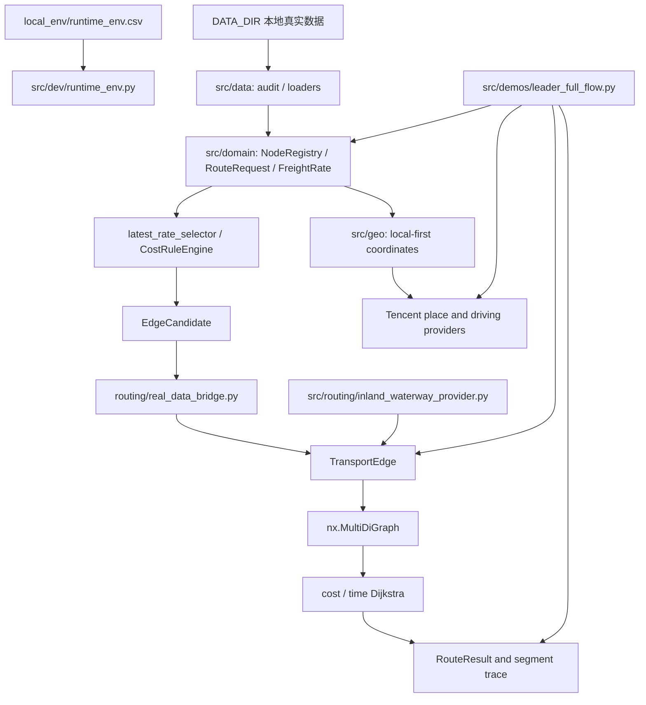

# PROJECT_STATE.md

Updated: 2026-07-23

本文件是新线程接手项目时的首要工程状态。内容依据当前代码、Git 工作树、最近提交和 2026-07-22 最近一次完整 smoke，以及 2026-07-23 用户 PyCharm 最新 full-flow 验收和 B1 业务口径确认整理，不以聊天记录或领导汇报代替工程事实。

## 1. 项目目标

项目名称：北港至客户工厂全链路运输路径推断原型。

目标是读取本地运输业务数据，统一节点、订单、计费单位、费用和时间结构，构造保留平行运输方案的有向图，并分别输出费用最低和时间最短路径及其分段依据。当前属于 Python 原型验证，不是生产调度系统、正式报价系统、数据库服务、前端产品或高并发 API。

## 2. 当前架构



代码按职责分为：

- `src/data`：真实数据审计、类型化加载和本地输出；
- `src/domain`：订单、单位、节点、运价、最新运价和费用规则；
- `src/geo`：坐标与道路距离 Provider，隔离 Tencent API；
- `src/routing`：客户画像、时间、运输边、图、搜索、结果解释和内河航运 Provider；
- `src/demos`：领导展示、真实数据开发运行和 Tencent 探针；
- `src/dev`：本地环境加载、功能总览和开发者 smoke；
- `tests`：单元与集成测试。

旧 `models.py`、`graph_builder.py`、`route_planner.py` 和重复费用 Demo 已从 `src` 剥离。真实业务主链不再依赖旧 CSV/`DiGraph` 原型。

## 3. 已完成功能

- JSON/JSONL 数据审计、质量统计及脱敏输出分离；
- 从 `DATA_DIR` 加载运价、地点坐标和 AdditionalFee；
- NodeRegistry、稳定节点 ID、别名和坐标冲突检查；
- 本地优先坐标解析，Tencent 地点搜索和普通驾车距离/时间；
- Tencent 多候选默认选择 top1，并保留置信等级和最多 top 5 候选追溯；
- RouteRequest、包装和 `吨/箱/柜` 精确单位校验；
- FreightRate、最新有效运价选择和空日期 `1970-01-01` 比较基线；
- CostRuleEngine：维护运价、散船模式、陌生散粮汽运和陌生集装箱汽运；
- ShippingTimeProvider 接口及人工时间实现；
- CustomerProfile、自有码头/候选中转港互斥分支；
- EdgeCandidate 到 TransportEdge 的保守真实数据桥接；
- `nx.MultiDiGraph` 正式图、cost/time 独立 Dijkstra 和 RouteResult 解释输出；
- 既有节点但无可用路线时返回 `no_path`，不补 0、不猜路线；
- 本地 `runtime_env.csv` 和 `python -B -m src.dev.smoke_test` 开发测试入口；
- 第一版全流程领导 Demo：输入北港 A 和客户工厂 B，输出费用最低和时间最短路线。

## 4. 当前正在处理的问题

阶段 17 第一版全流程领导 Demo 的 PyCharm 真实 A/B 预演与展示收束已经完成。用户在本地 Tencent Key 环境运行最新版 `leader full-flow` 成功，输出包含候选南港、正式搜索图边数、费用最低/时间最短路线、总费用组成、AdditionalFee 未计入声明和测试版数据边界说明，符合阶段 17 验收口径。

2026-07-21 已完成一次真实 A/B 本地预演：正式图构建、费用最低和时间最短双路径、分段来源和最小伪造声明均已输出。地点搜索可能把宽泛地名解析为非货运实体；展示前必须使用精确港口名称或由业务确认该解析实体可用。全流程输出现展示 `source_confidence`，用于现场核对 Tencent top1 的可靠性。

2026-07-23 已完成 B1 业务口径签认：散船运价表为元/吨单位报价，费用为报价乘以订单吨数；报价表示从本项目任一北港出发至南港的散装粮食散船运价，不含港口作业费；税务问题当前不考虑；不属于广东、广西、福建、海南的目的地列不读取、不修改；南港作业费第一版采用“码头作业费”汇总类型、元/吨单位，并通过独立 Provider 预留后续 CSV 明细接入。

2026-07-23 已完成 W2/W4 最小工程闭环：新增真实散船运价 Provider，`leader_full_flow` 已从固定 `demo_placeholder` 干线费用/时间切换为读取本地 `散船运价表.xlsx` 最新行、按订单吨数选船并计算干线费用；纯航行时间按已确认分区天数换算为小时，时间范围固定为 `pure_sailing`。当前自动模式会排除无法匹配真实散船目的组或时效分区的候选南港，并保留提示；这用于防止内河港、铁路站、工厂或仓库被误当作海运散船干线目的地。

2026-07-23 已确认新增五条长期业务规则：内河航运只在福建闽江和珠三角场景考虑；港口连通性必须由运输阶段、包装/品种和港口作业能力共同决定；内河驳船航费/航时作为未来正式数据源预留接口，未接入前只能显式 `demo_placeholder`；北港至南港散船费用和纯航行时间继续通过可追溯区域映射匹配；当前模型中客户工厂等价于客户码头。此前讨论过的 300 公里汽运规则已被用户取消，不进入长期决策或筛选逻辑。

2026-07-23 已新增 `src/routing/inland_waterway_provider.py`：定义港口能力表、区域映射表、内河航运航费/航时表的 Python 接口，并提供最小 `DemoInlandWaterwayBargeProvider`。该 Provider 只在福建闽江或珠三角同区域、散粮/吨订单、起终点能力匹配时生成 `transport_stage=barge_last_mile` 的明确 `demo_placeholder` 驳船边；其他区域、跨区域、能力不明或包装不支持时不生成边。该 Provider 尚未自动接入 `leader_full_flow` 默认主链。

## 5. 已知缺陷

- 北港至候选南港的散船干线费用和纯航行时间已在当前 Demo 中替换为真实散船运价表和已确认分区时效；但南港作业费、正式节点画像文件、客户自有码头字段和人工指定南港模式尚未完成；
- 船运时效数据仍存在重大缺口：当前只有北港至南港散船干线纯航行时间；驳船、港口作业、等待、装船、卸船、堆存、短倒和铁路时间均未接入正式数据源。含船运路径的总时间只能作为当前原型内的可比时间，不代表完整门到门 ETA；
- 内河驳船当前只有最小 Demo Provider，可在福建闽江/珠三角生成明确 `demo_placeholder` 航费和纯航行时间；正式港口能力、正式区域映射和正式驳船航费/航时表尚未接入；
- Demo 当前固定 500 吨、散粮、玉米和客户无自有码头画像，尚不是通用订单输入界面；
- 客户自有码头字段、码头节点和正式分支数据源尚未接入；
- AdditionalFee 已加载但尚未完成面向路线段的适配、去重和归属校验；B1 已确认南港作业费第一版汇总口径为“码头作业费”，正式接入前仍不计入总费用；
- 当前运价表中的 295 个不同地点名称已全部匹配标准节点，312 条已计费候选均具备两端节点 ID；
- 已提供本地去重和候选坐标复核工具；三批人工确认后，本地标准坐标达到 292 条，去重缺失地点由 32 个降至 0 个；名称字典只接纳明确全称/简称对；
- 北港至南港纯航行时效已在散船干线 Provider 中按分区天数乘以 24 转为小时；`REAL_DATA_DEMO_MANUAL_TIME_HOURS` 仍仅用于旧真实数据 smoke/开发验证，不再作为 `leader_full_flow` 干线时效来源；
- 南港至客户工厂当前只接入汽运道路时间；若未来路径涉及驳船、铁路或客户自有码头水运交付，必须先补充对应时效 Provider 或给出人工复核提示；
- Tencent 多候选默认信任 top1，低置信结果存在误选风险；抽检、缓存和正式回写机制未实现；
- Tencent 网络实测依赖用户本地 PyCharm 环境，Codex 沙箱网络失败不代表 Provider 代码失败；
- 当前没有数据库、Web/GUI、权限体系、任务调度、监控或生产部署能力。

## 6. 关键文件及作用

| 文件 | 作用 |
|---|---|
| `AGENTS.md` | 长期开发规范、隐私、Git SOP 和不可违反的业务约束 |
| `PLAN.md` | 当前里程碑及已完成/进行中/未开始状态 |
| `docs/DECISIONS.md` | 已确认技术和业务决策及理由 |
| `docs/ARCHITECTURE.md` | 模块边界和正式模型结构 |
| `src/data/loaders.py` | 真实数据类型化加载、候选和复核项构建 |
| `src/data/name_dictionary.py` | 本地名称字典的显式全称/简称对加载 |
| `src/data/node_coordinate_backfill.py` | 缺失端点去重、Tencent 候选查询和人工复核行输出 |
| `src/domain/cost_rules.py` | 费用规则；只消费距离，不调用地图 API |
| `src/routing/bulk_shipping_provider.py` | 真实散船运价表读取、目的组/船型匹配、干线费用和纯航行时效结果生成 |
| `src/routing/inland_waterway_provider.py` | 港口能力、区域映射、内河驳船航费/航时接口及福建/珠三角最小 `demo_placeholder` 驳船 Provider |
| `src/domain/latest_rate_selector.py` | 最新有效运价、空日期和冲突处理 |
| `src/geo/coordinate_provider.py` | 本地优先坐标解析契约 |
| `src/geo/tencent_map_provider.py` | Tencent 地点、多候选和道路路线适配 |
| `src/routing/real_data_bridge.py` | EdgeCandidate 到 TransportEdge 的保守桥接 |
| `src/routing/transport_graph.py` | 正式 `nx.MultiDiGraph` 构建 |
| `src/routing/route_search.py` | cost/time 独立路径搜索 |
| `src/routing/route_result.py` | 分段结果、追溯和总值校验 |
| `src/demos/leader.py` | 领导 Demo 统一入口 |
| `src/demos/leader_full_flow.py` | 第一版 A/B 全流程领导 Demo |
| `src/demos/real_data_run.py` | 真实数据 smoke、CSV 和正式链本地验证 |
| `src/demos/tencent_map_probe.py` | 用户本地 Tencent API 诊断入口 |
| `src/dev/runtime_env.py` | 从本地 CSV 安全注入运行环境 |
| `src/dev/smoke_test.py` | 开发者测试和真实数据 smoke 总入口 |
| `tests/test_leader_full_flow.py` | 全流程 Demo 正式图和最小占位边界测试 |
| `tests/test_bulk_shipping.py` | 散船真实费率读取、选船、时效和人工复核边界测试 |

## 7. 环境配置

- Python：3.12；依赖见 `requirements.txt`；
- 本地真实配置：`local_env/runtime_env.csv`，必须被 Git 忽略；
- 可提交模板：`config/runtime_env.example.csv`；
- `DATA_DIR`：真实业务数据目录；
- `TENCENT_MAP_API_KEY`：Tencent Key，只允许本地注入，不打印、不提交；
- `REAL_DATA_DEMO_MANUAL_TIME_HOURS` / `REAL_DATA_DEMO_MANUAL_TIME_UNIT`：真实候选正式链验证用人工时效，不代表业务真实值；
- `PYTHONPATH`：可指向项目本地 `.python_packages`；
- `data_REAL/`、`local_env/`、`output/`、`.python_packages/`、`.pytest_tmp/` 均已配置为忽略。

## 8. 启动、测试和验证命令

```powershell
# 开发者全量 smoke：pytest、真实数据链和可选 Tencent 诊断
python -B -m src.dev.smoke_test

# 纯全量 pytest；项目内 basetemp 避免 Windows 默认临时目录权限问题
python -B -m pytest -q --basetemp=.pytest_tmp

# 第一版全流程领导 Demo
python -B -m src.demos.leader full-flow

# 直接传入展示地点（名称必须替换为腾讯地图可检索的真实业务地点）
python -B -m src.demos.leader full-flow --origin "北港实际名称" --destination "客户工厂实际名称" --region "全国"

# Tencent 地点和道路路线本地探针
python -B -m src.demos.tencent_map_probe

# 真实数据链
python -B -m src.demos.real_data_run

# Git 和文本完整性
git status --short --branch
git diff --check
```

最近一次全量验证为 `259 passed in 1.06s`。此后节点坐标复核工具改为保留原始名称及字典全称的并行查询结果，并为 Tencent 单候选补齐地址、类别、行政区和 POI ID 追溯；工具专项测试为 `15 passed in 0.19s`。最终一批人工确认数据补录后，名称字典、数据加载和补齐清单专项测试为 `24 passed in 0.79s`，剩余 17 个坐标地点和 9 组别名逐一通过 NodeRegistry 核验，坐标冲突为 0。本次未修改计费、建图或路径搜索，按最小必要验证原则未重复全量 smoke。当前本地真实数据链为 292 条标准坐标，运价表 295 个不同地点名称全部匹配；312 条已计费候选全部具备两端节点 ID，缺节点候选和去重待补地点均为 0，另有 29 条与节点 ID 无关的人工复核记录。Tencent 网络实测仍由用户 PyCharm 环境完成。

## 9. 最近修改内容

2026-07-22 阶段 18 W1 已完成并纳入提交 `b79db3e`：

- 新增 `src/domain/node_profile.py`，为标准节点提供基础设施类型、标准所在地、纯航行时效分区、作业能力和来源契约；
- 新增 `src/routing/transport_contracts.py`，定义运输阶段、时间范围、费用组成和统一人工复核结果；
- 扩展 `ShippingTimeRequest`/`ShippingTimeResult`，显式保留 `time_scope`，缺失时不默认解释为完整分段；
- 扩展 `TransportEdge`，保留运输阶段、时间范围、费用组成和人工复核结果；费用组成必须等于运输段总费用；
- 新增运输语义进入 `edge_id`，避免同节点、同金额但阶段、时间口径或费用来源不同的平行边发生键冲突；
- 新增节点画像和运输契约专项测试，并补充时效、运输边、正式图、搜索、RouteResult 和 full-flow 回归覆盖；
- 本地形成阶段 17 交付报告与阶段 18 计划；公开 GitHub Issue #1 仅使用脱敏摘要，内部计划不纳入公开提交。

2026-07-23 阶段 17 最新 PyCharm 验收和阶段 18 B1 业务确认：

- 用户使用 `python -B -m src.demos.leader full-flow --origin "北良港" --destination "宾阳通威饲料有限公司" --region "全国"` 完成最新版全流程实跑，退出正常；
- 输出已展示地点来源、候选南港、搜索图运输边、费用最低/时间最短路线、总费用组成、AdditionalFee 未计入项和测试版数据边界；
- 确认散船运价表为元/吨单位报价，散船费用为报价乘以订单吨数；
- 确认散船运价表只表示北港至南港散装粮食运价，不含南港码头作业费，税务当前不处理；
- 确认散船运价表适用于本项目全部北港，其他北港与北良港具有一致适用性；
- 确认本阶段只读取广东、广西、福建、海南相关南港目的地，不读取、不修改其他目的地列；
- 确认南港作业费第一版采用“码头作业费”汇总类型、元/吨单位，并预留 Provider/CSV 以便未来细分卸船费、堆存费、短倒费等。

2026-07-23 阶段 18 内河航运接口起步：

- 新增并记录内河航运五条规则：福建闽江/珠三角限定、港口能力决定连通性、内河航费/航时未来正式接入、散船区域映射继续可追溯、客户工厂等价客户码头；
- 明确不实施 300 公里强制汽运预筛；
- 新增港口能力表、区域映射表、内河航运航费/航时表的代码接口；
- 新增最小 `DemoInlandWaterwayBargeProvider`，只在福建闽江或珠三角同区域场景生成 `demo_placeholder` 驳船边；
- 该能力尚未改变最新 `leader_full_flow` 默认路径结构，默认 Demo 仍锚定“北港散船干线 + 南港至客户汽运”主链。

2026-07-22 验证结果：相关专项与受影响链路测试 `78 passed in 0.42s`；统一开发者 smoke 为 `284 passed in 1.39s`，real-data smoke 通过。Tencent probe 命令按诊断口径完成，但当前 Codex 网络请求返回 `ConnectionError` 并转为 `manual_review`，不应解释为真实 Tencent API 调用成功。

提交 `882c828` 完成的阶段 17 工程改动包括：

- 将 Tencent 多候选策略从阻塞式人工复核调整为默认 top1，并记录名称匹配、近邻聚类或低置信未聚类等级；
- 为 Tencent probe 增加中文输出、候选追溯和本地环境诊断；
- 完善 `runtime_env.csv` 模板、开发者 smoke 和功能展示入口；
- 增强真实数据运行输出和正式搜索链验证；
- 新增 `leader_full_flow.py`，用真实数据优先和最小显式占位贯通 A/B 双目标推荐；
- 新增全流程 Demo、Tencent Provider 和 probe 回归测试；
- 同步 README、架构、变更日志、计划、决策和验收记录。

## 10. Git 与本地未提交材料

当前分支为 `feat/bulk-shipping-contracts...origin/feat/bulk-shipping-contracts`，本地与远端分支计数为 `0 / 0`。阶段 17 展示收束、坐标治理和阶段 18 W1 已提交并推送。最近提交：

```text
b79db3e  2026-07-22  feat(routing): strengthen full-flow traceability
882c828  2026-07-22  feat(demo): complete leader full-flow rehearsal
aac16a5  2026-07-20  feat(geo): review Tencent coordinate candidates conservatively
5ef0beb  2026-07-17  chore(dev): add developer demo and map probe diagnostics
2a1ded6  2026-07-17  fix(dev): support local env csv encodings
a4847c3  2026-07-17  chore(dev): add local smoke test entry
22c4441  2026-07-17  feat(cost-rules): enable unknown container truck pricing
```

阶段 17 主流程工程文件已纳入 `882c828`；坐标复核、展示费用组成、阶段 18 W1 契约及测试已纳入并推送为 `b79db3e`。完整内部计划、每日开发日志和领导报告继续保留在本地，不纳入公开仓库。

当前剩余的已跟踪未提交代码仅包括用户原有的 `src/domain/cost_rules.py` 修改；另有两份已跟踪 DOCX/PDF 处于删除状态。Codex 未修改、恢复、暂存或提交这些内容。

工作树还存在多份未跟踪的 DOCX、PDF、PPTX、PNG、每日计划/报告。它们是用户办公材料，不应被 `git add .` 一并提交；`.pytest_tmp/` 已在本次交接加入忽略规则。未来提交必须使用文件白名单并先做敏感信息检查。

## 11. 下一步建议

1. 推进 W3 全量南港画像、费率目的组映射和候选资格过滤：本项目可能测试范围内的全部南港都应进入只读审计和映射治理，不再只按 3—5 个样例港口收束；
2. 将港口能力表、区域映射表、内河航运航费/航时表从当前 Python 契约推进为可加载的 CSV/XLSX/JSON 数据源；
3. 实施 W5 南港作业费 Provider：首版支持“码头作业费”元/吨汇总项，正式缺失或归属不明仍不计入、不视为 0；
4. 设计人工指定南港模式，再由用户 PyCharm 执行真实 Tencent 全流程验收；
5. 判断何时把 `DemoInlandWaterwayBargeProvider` 接入 full-flow 的客户自有码头/客户码头分支；接入前必须确认展示口径，避免把默认汽运 Demo 悄悄改成水运 Demo；
6. 未来提交必须使用工程文件白名单并执行敏感信息扫描；未经用户明确授权不提交或推送。

### 已落实的缺节点治理起步工具

运行 `python -B -m src.demos.node_coordinate_backfill` 可针对当前订单生成去重清单；加 `--query-tencent` 才会在用户本地查询候选坐标。每个地点先查询原始业务名称，若名称字典存在明确全称/简称对，再把字典全称作为并列查询词；JSONL 的 `query_names` 和 `coordinate_resolutions` 保留全部结果供人工比较。工具不修改 `地点经纬度.json`，也不自动认定别名；若两边已有不同节点 ID，则继续保留人工复核。

## 12. 明确禁止重新实施或推翻的已确认事项

- 不恢复旧 CSV/`DiGraph` 主链；正式图继续使用 `nx.MultiDiGraph` 和 edge key；
- cost 与 time 是两套独立权重，没有业务系数前不得合成综合权重；
- 搜索费用必须是当前订单当前运输段总费用，缺费用或时间不得默认 0；
- `吨`、`箱`、`柜` 及对应价格单位不得自动互换；
- 运输方式来自运价记录，不能由包装方式推断；
- 空维护日期保留原始空值，仅在最新运价比较时使用 `1970-01-01`；
- 已维护熟悉汽运路线优先；陌生路线费用由 `domain/cost_rules.py` 消费 geo 层提供的 `distance_km`；
- Tencent 普通驾车距离是当前原型最后一公里正式计费距离，未来货车距离通过已预留 Provider 接入；
- 陌生集装箱汽运保持元/箱：20 公里内 500 元/箱，超过 20 公里为 `500 + (X - 20) * 30 * 0.55` 元/箱；
- 客户自有码头与候选中转港加短途汽运是互斥分支，未知字段不得猜测；
- 多候选地点在当前原型默认选择 Tencent top1，但必须保留 `source_confidence` 和候选追溯；
- 第一版领导 Demo 只能对北港至南港费用/时间和明确展示的无自有码头画像使用占位，且必须标注；
- 阶段 18 B1 已确认散船运价表单位为元/吨，费用为报价乘以订单吨数；报价适用于本项目全部北港，只表示北港至南港散装粮食运价，不含港口作业费，税务当前不处理；
- 阶段 18 B1 已确认不属于广东、广西、福建、海南的散船目的地列不读取、不修改；南港作业费首版以“码头作业费”汇总类型、元/吨单位接入，并预留后续明细 Provider；
- 内河航运只在福建闽江和珠三角场景生成候选；其他区域不得自动生成驳船边；
- 港口连通性由图边表达，边是否存在必须基于运输阶段、包装/品种和节点作业能力，不能只看地理邻近；
- 当前模型中客户工厂等价于客户码头；如未来拆分客户自有码头节点，必须由正式客户节点表提供；
- 300 公里汽运规则已取消，不得作为硬筛选条件；
- AdditionalFee 归属未确认前不得任意计入，也不得解释为 0；
- API Key、真实业务数据、本地配置和可还原业务明细不得进入 Git；
- 领导汇报必须基于工程事实，不能把原型、占位数据或未开始能力描述成生产功能。
