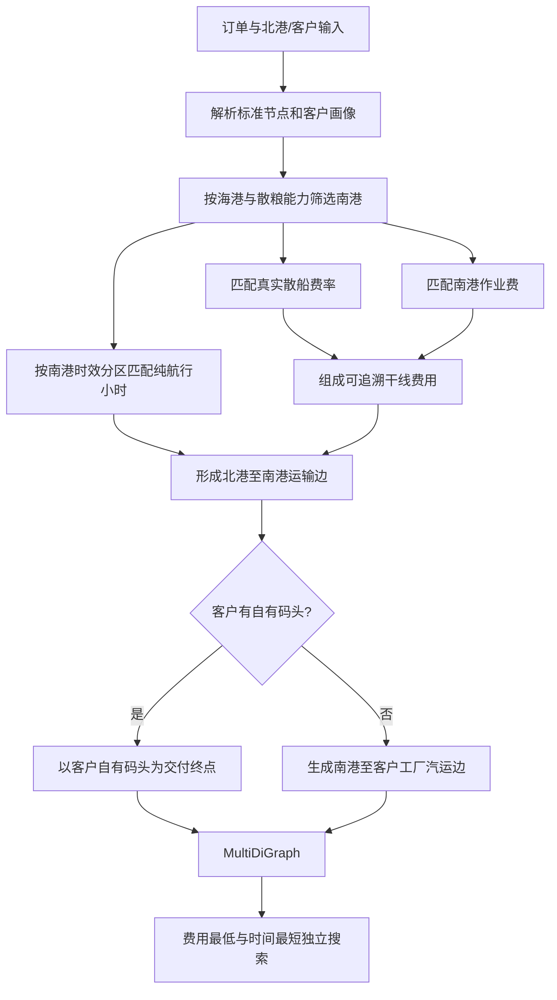
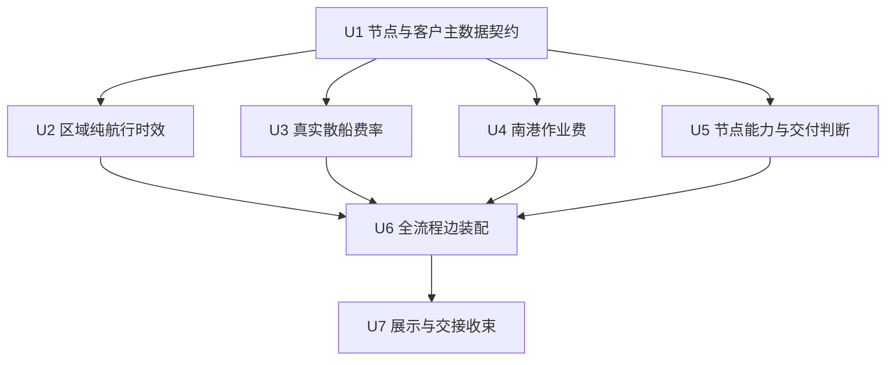
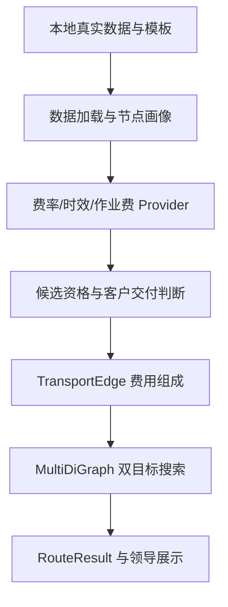

# feat: 上线散粮海运真实费率、纯航行时效与南港作业费

## Summary

下一阶段以散粮海运为纵向主线：使用真实北港—南港散船费率，按南港维护的时效分区匹配纯航行时间，并把南港作业费作为可追溯费用组成接入正式图。同步建立节点类型、港口作业能力和客户交付条件底座，确保客户有自有码头时以该码头为交付终点，同时为后续集装箱、铁路和驳船链路保留扩展空间。

---

## Problem Frame

当前全流程 Demo 已贯通地点解析、候选南港、最后一公里道路距离和时效、费用/时间独立寻路与分段解释，但北港—南港干线费用和时间仍由 `demo_placeholder` 提供，客户画像也尚未接入真实主数据。领导的新要求进一步明确：运输方式只能连接匹配的基础设施节点；南港所在地决定散船纯航行时效；抵达南港后产生按港口维护的作业费；客户有自有码头时水运到达该码头即完成交付。

这意味着下一阶段不能只把占位数字替换成另一张表，而要补齐“节点能力 -> 费率/时效/作业费匹配 -> 客户交付分支 -> 可解释运输边”的数据契约和判断链。

---

## 领导需求与当前功能对照表

| 功能域 | 领导需求 | 当前项目能力 | 当前缺口 | 下一阶段处理 |
|---|---|---|---|---|
| 北—南港散船费率 | 读取本地 `散船运价表.xlsx` 最新日期；第 2 行是目的区域，第 3 行是船型 | `CostRuleEngine` 已支持散船人工单价、人工总价和指数模式；真实工作簿已存在 | 领导 Demo 仍使用固定 `demo_placeholder`；尚无三层表头、日期和船型容量解析器 | 建立专用 XLSX 加载器，使用“目的区域 + 船型 + 最新日期”业务键，复用现有费用规则 |
| 多重量订单演示 | 使用多档订单重量验证自动选船、区间边界和不足载向上选择 | full-flow 当前固定为 500 吨订单 | 不能集中证明不同重量会选择正确船型；逐档跑真实全流程会重复调用腾讯地图 | 增加不调用地图的船型选择 Demo；full-flow 接受单次订单重量参数，用选定重量完成真实线路展示 |
| 北—南港纯航行时效 | 按南港所在地匹配：福建 4 天、珠三角 6 天、粤西/海南/广西 7 天 | `ShippingTimeProvider` 契约、小时归一化和人工输入 Provider 已存在 | JSON/CSV 类正式来源未启用；请求中缺少可用于区域匹配的南港元数据 | 增加区域时效 Provider；分别换算为 96、144、168 小时；无法确定分区时转人工复核 |
| 附加作业时间 | 当前只计算纯航行时间；未来可能增加等待、装船、卸船 | 时间内部单位为小时，可保留来源 | 现有结果没有明确的时间范围字段，也没有分项扩展契约 | 为时效结果增加 `pure_sailing` 范围标识；预留可选分项，但本阶段不计入且不以 0 代替 |
| 南港作业费 | 每个码头费率不同，后续由 CSV 等数据源维护 | `AdditionalFee` 已能从真实数据目录加载节点、包装、费用类型、单价和单位 | 当前只加载不计算；没有匹配、去重、费用归属、来源解释和正式图接入 | 建立南港作业费 Provider 与计算结果；真实模式读取正式数据，Demo 模式允许显式 `demo_placeholder` |
| 节点别名 | 名称字典用于把别名定位到唯一节点 | `NodeRegistry` 已支持标准名、别名、外部别名和冲突复核；当前运价地点均已匹配 | 别名不是节点业务属性；名称字典中的节点类型尚未形成正式能力标签 | 保持“一个物理节点一个 ID”；别名只负责定位，类型和能力由独立节点画像维护 |
| 海港/内河港分类 | 散粮海运必须使用海港；集装箱可使用合规海港或内河码头 | 节点目前只有名称、坐标和别名；Demo 主要用名称包含“港/码头”的启发式筛选 | 没有结构化 `海港/内河港/铁路站/工厂` 类型 | 增加可追溯节点类型；本阶段对散粮海运强制海港条件 |
| 港口作业能力 | 港口须标记散粮、散船、集装箱等能力，运输方式必须匹配 | 运价记录能保存运输方式和包装方式；`TransportEdge` 能检查边数据一致性 | 没有节点能力集合，也没有建边前的能力校验 | 增加多值作业能力并建立兼容性判断；同一港口可同时拥有多种能力 |
| 船舶靠泊条件 | 部分船舶不能停靠内河港，后续启用可用性判断 | `TransportEdge.status` 可阻止不可用边入图 | 当前 `is_available` 只代表边数据完整性，不代表船舶—泊位兼容；没有船型/吨级数据 | 本阶段不猜测船舶兼容规则；预留约束字段，缺少船舶主数据时不自动判定 |
| 客户自有码头 | 客户有自有码头时，运输终点就是自有码头，不再增加最终段汽运 | `CustomerProfile` 和 `resolve_customer_route()` 已有自有码头/中转港互斥分支 | 真实客户字段未接入，领导 full-flow 仍固定为“无自有码头” | 接入可追溯客户画像；自有码头分支在码头节点结束，不创建人为的 0 元汽运边 |
| 铁路专用线 | 客户有铁路专用线时铁路到站即交付 | 仅保留旧版铁路费用函数；尚未接入统一运输边和正式图链路 | 缺铁路节点画像、专用线字段、统一铁路费用/时效和链路生成 | 画像字段纳入通用数据契约，正式铁路链路延后实施 |
| 海运集装箱 | 北港到合规海港/内河集装箱码头，再汽运到客户 | 已有集装箱数量/价格单位严格校验和最后一公里汽运规则 | 没有集装箱干线、节点能力筛选和链路生成 | 仅定义可扩展的数据结构和 Provider 边界，具体链路延后实施 |
| 驳船运输 | 港口/中转码头到客户码头，必要时继续汽运 | 真实运价加载可识别驳船记录 | 没有客户码头交付判断与完整驳船链路装配 | 复用客户交付标签，完整链路延后实施 |
| 候选节点选择 | 在合规候选中使用道路距离、时间或费用选择，不只看直线距离 | 已支持 Tencent 普通驾车距离/时间、候选前 K 预筛及最终费用/时间独立比较 | 当前 full-flow 候选港仍包含名称启发式和直线距离排序 | 先按类型/能力排除不合规节点，再用确认距离预筛，最终仍分别比较总费用和总时间 |
| 图与路径搜索 | 计算完整路线、总费用和总时间 | `TransportEdge`、`nx.MultiDiGraph`、费用/时间独立 Dijkstra、`RouteResult` 均已完成 | 新费用组成和客户终点尚未接入全流程 | 保留正式图与双目标搜索，不引入未经确认的综合权重 |

---

## 下一阶段数据结构表

| 数据对象 | 建议字段 | 数据类型/单位 | 作用与校验 |
|---|---|---|---|
| 节点画像 | `node_id`、标准名、基础设施类型、作业能力集合、省/市、时效分区、来源、维护日期 | ID/文本/枚举集合/日期 | 绑定唯一物理节点；散粮干线只接受“海港 + 散粮/散船能力”；行政所在地用于匹配可承接船型和时效规则；缺失或冲突进入人工复核 |
| 客户画像 | `customer_id`、工厂节点 ID、是否有自有码头、自有码头节点 ID、字段来源、允许包装/品种 | ID/布尔/枚举集合/文本 | 决定交付终点；有自有码头时以码头完成交付，无自有码头时才生成最后一公里汽运 |
| 费率目的组映射 | 目的组标签、标准南港节点 ID 集合、适用范围、来源、维护日期 | 文本/ID 集合/日期 | 把“珠三角”“茂名/阳江”等共同报价标签映射到多个独立节点，不将其当作别名合并 |
| 南港可承接船型规则 | 业务区域、标准所在地标签（城市/港区）、允许船型/吨级区间、规则来源、版本、生效日期、启用状态 | 枚举/文本/吨/日期/布尔 | 先按节点画像中的标准所在地过滤船型，再按订单重量自动选船；坐标仅用于补齐或核验所在地，不在正式运行时临时猜测 |
| 散船日报价标准记录 | 报价日期、适用北港、目的组、船型原文、名义/最小/最大吨级、价格、价格单位、价格类型、来源单元格 | 日期/ID/吨/Decimal/枚举 | 由 XLSX 三层结构展开；以“日期 + 北港范围 + 目的组 + 船型”为业务键，输出可追溯 `FreightRate` |
| 自动选船请求 | 订单吨数、目的组、策略、可选用户指定船型、基准日期 | 吨/枚举/日期 | 本阶段按载重上限升序选择第一个能够覆盖订单的船型；订单小于最小船型时向上选择该区域最小船型；未来可启用用户选择或返回全部合规船型生成平行边 |
| 区域纯航行时效 | 时效分区、原始天数、标准小时、时间范围、来源、版本/生效日期 | 天/小时/枚举/日期 | 福建 4 天=96 小时；珠三角 6 天=144 小时；粤西/海南/广西 7 天=168 小时；范围固定为 `pure_sailing` |
| 南港作业费 | 南港节点 ID、包装方式、费用类型、费用阶段、价格类型、数值、单位、来源、维护/生效日期、启用状态 | ID/枚举/Decimal/日期/布尔 | 按具体南港匹配并作为干线费用组成；Demo 占位和真实数据使用同一接口但严格隔离 |
| 费用组成 | 组成类型、原始价格、标准订单段费用、来源、规则 ID/版本、说明 | 枚举/Decimal/文本 | 分别保留船运费和南港作业费，图权重使用合计，展示仍能解释每个分项 |

---

## Requirements

- R1. 北港—南港散船费率必须读取本地 `散船运价表.xlsx`；以标题年份和日期列确定完整日期，并按运行基准日选择不晚于该日的最大有效日期。该数据契约还必须满足：
  - 第 2 行目的区域与第 3 行船型共同定义费率列，重复区域名称不得覆盖不同船型费率；
  - 船型中的单值或区间万吨数标准化为名义吨级/吨级区间；自动选择“载重上限能够覆盖订单”的最小船型，订单小于最小船型时向上选择该区域最小可用船型；
  - 价格单位、价格类型和适用北港由业务配置明确提供，工作簿没有写明的口径不得由加载器猜测；
  - 第 2 行值是费率目的标签，不是纯航行时效分区，须先映射到标准节点再读取节点画像；
  - `珠三角`、`茂名/阳江`、`马村/海口` 等组合标签按费率目的组建模，可映射多个标准节点，不得当作同一物理节点的别名合并。
- R2. 散粮海运时效按南港节点维护的时效分区匹配，不得根据名称文本猜测行政区域。
- R3. 福建时效为 96 小时，珠三角为 144 小时，粤西、海南、广西均为 168 小时；内部与展示均以小时参与正式搜索。
- R4. 上述时效仅代表纯航行时间，输出必须明确口径；等待、装船、卸船等未维护分项不得按 0 计入。
- R5. 南港所在地或时效分区缺失、冲突、不属于已确认分区时，干线边进入 `manual_review`，不得使用默认时效。
- R6. 南港作业费必须通过独立 Provider 接入，至少支持节点、包装方式、费用类型、价格类型、数值、单位、来源、维护/生效信息和启用状态。
- R7. 真实作业费尚未接入时，仅 Demo 模式可使用显式 `demo_placeholder` 记录；正式模式缺失时必须人工复核，不能默认为 0。
- R8. 多项码头费用合计前必须完成单位匹配、业务键去重和运输段归属校验，避免与干线报价或其他费用重复计费。
- R9. 节点必须具有可追溯的基础设施类型、行政区域/时效分区和多值作业能力；别名不复制节点，所有别名仍指向同一标准节点 ID。
- R10. 散粮/散船干线的起点和终点必须同时满足“海港 + 散粮或散船作业能力”，否则不得形成可搜索边。
- R11. 客户画像明确有自有码头时，运输终点为客户自有码头并在该节点完成交付，不生成最终段汽运边，也不通过人为 0 元边模拟。
- R12. 客户没有自有码头时，才生成合规南港/中转港至客户工厂的最后一公里汽运段。
- R13. 候选节点先按运输方式、节点类型和作业能力过滤，再使用确认的道路距离进行预筛；最终费用最低和时间最短必须独立搜索。
- R14. 新增费用和时效均须保留原始值、原始单位、标准化结果、数据来源、规则编号/版本和计算说明。
- R15. 真实数据、客户画像、坐标、费率、API Key 和可还原业务明细继续只保存在本地，不进入 Git；仓库只保存结构模板和合成测试数据。
- R16. 节点画像和 Provider 契约应能表达集装箱码头、铁路站、铁路专用线、客户码头交付属性以及未来船型选择策略，但本阶段不承诺完整实现铁路集装箱、海运集装箱和驳船路径。
- R17. 工作簿中的“重庆驳船”列不得作为本阶段散船海运费率启用；日照、潍坊、长三角等尚无已确认航行时效分区的目的区域不得形成完整可搜索边。
- R18. 演示必须覆盖多档订单重量、船型区间端点、小于最小船型的向上选择和超过最大船型的人工复核；真实 full-flow 应允许用户传入单次订单重量。
- R19. 南港散船可承接船型必须先按节点画像中已维护的标准所在地标签（城市/港区）过滤，再执行订单重量选船；坐标/Tencent 结果只用于补齐或人工核验行政所在地并保留来源，港区标签由业务维护，正式计算不得每次根据坐标临时猜测。当前确认规则如下：
  - 珠三角的深圳、广州、东莞：允许 `2-3万吨`、`5-6万吨`；
  - 珠三角的揭阳：允许 `0.5万吨`、`1万吨`；
  - 粤西的阳江、茂名、湛江：允许 `1.5-1.6万吨`；
  - 广西的钦州：允许 `2.5-3万吨`；
  - 广西的防城港、铁山：允许 `1.5-1.6万吨`；
  - 福建的漳州：允许 `1.5-1.6万吨`；
  - 福建的马尾：允许 `1万吨`；
  - 海南的马村、海口：允许 `1.5-1.6万吨`。

---

## Scope Boundaries

- 本阶段不计算等待、装船、卸船、天气、潮汐、排队等附加时间，也不把未维护分项解释为 0。
- 本阶段不根据坐标相同自动推导“客户码头等于工厂/仓库”；是否在码头完成交付必须来自客户画像。
- 本阶段不实现船型、吨级、吃水与泊位条件的自动兼容判断；缺少船舶和泊位主数据时不得伪造 `is_available`。
- 本阶段只实现按订单重量自动匹配船型；用户手选船型和把多个可用船型同时生成为平行边仅预留策略接口。
- 本阶段不推翻 `nx.MultiDiGraph`、费用/时间独立搜索、Tencent top1 留痕和现有陌生汽运计费规则。
- 本阶段不建设数据库、后端 API、前端或生产级调度服务。

### Deferred to Follow-Up Work

- 海运集装箱完整链路：在节点能力底座稳定后，增加海港/内河集装箱码头筛选与集装箱干线。
- 铁路集装箱完整链路：统一铁路费用/时效并接入正式运输边，再实现铁路专用线交付分支。
- 驳船完整链路：增加客户码头与客户仓库/工厂交付关系后，装配驳船和可选汽运段。
- 船舶—港口靠泊兼容：获得船型、载重/吨级、吃水、泊位等级和航道限制后另行设计。
- 作业时间分项：获得可靠来源后，扩展等待、装船、卸船等可选时间组成，并明确是否纳入总时效。

---

## Context & Research

### Relevant Code and Patterns

- `src/domain/cost_rules.py`：散船人工单价/总价、单位口径和费用追溯模式。
- `data_REAL/fee_switch/散船运价表.xlsx`：当前真实散船日报价来源，包含标题年份、日期行、目的区域和船型两级列头；真实文件不进入 Git。
- 工作簿当前只有 `散船运价表` 一个工作表，费率区为 `A1:S190`；当前最大有效日期为 2026-07-06。该观察只用于验证解析设计，运行时必须动态选择最大有效日期。
- `src/routing/shipping_time_provider.py`：运输时间 Provider、小时归一化及缺失值人工复核模式。
- `src/domain/node_registry.py`：唯一节点 ID、别名定位、冲突复核模式。
- `src/routing/customer_profile.py`：自有码头与中转港互斥路线、候选港预筛模式。
- `src/routing/transport_edge.py`：费用、时间、来源齐全才形成正式运输边。
- `src/routing/transport_graph.py`、`src/routing/route_search.py`、`src/routing/route_result.py`：多重有向图、独立双目标搜索和分段解释。
- `src/demos/leader_full_flow.py`：当前端到端入口及需替换的干线占位和客户画像占位。

### Institutional Learnings

- 缺失费用、时间、节点 ID 或来源时必须显式人工复核，不能以 0 兜底。
- 单位价格先换算为当前订单当前运输段的总费用后才能进入图。
- 地图距离属于 geo 层；费用规则只消费已确认的距离，不直接调用 Tencent。
- 真实业务数据与仓库代码严格隔离，提交时使用文件白名单。

### External References

- 本计划不依赖外部资料；业务口径来自 `0721-22comment.docx`、用户确认和仓库现行决策。

---

## Key Technical Decisions

| 决策 | 采用方案 | 理由 |
|---|---|---|
| 南港区域判断 | 在节点画像中维护明确的行政区域和 `shipping_time_region`，Provider 按标准字段匹配 | 名称解析和经纬度猜测不可审计，且珠三角/粤西属于业务分区而非简单省级行政区 |
| 坐标与所在地的边界 | Tencent/坐标用于补齐或核验行政所在地并保留来源；正式选船读取节点画像中已维护的标准所在地标签（城市/港区） | 避免运行时反向地理编码结果变化影响业务规则，也为后续港口和客户标签规范化提供稳定主数据 |
| 费率目的标签与时效分区 | 先把日报表第 2 行标签映射到标准节点，再由节点画像取得时效分区 | `马尾/揭阳/茂名/阳江` 等费率标签与福建/珠三角/粤西等时效分区不是同一层级 |
| 纯航行时效 | 使用区域规则转换后的小时值，附带 `pure_sailing` 范围和来源 | 满足当前领导口径，同时避免被误解为端到端总时效 |
| 附加时间扩展 | 可选分项为空，不计入当前边；未来由明确规则汇总 | 预留扩展但不扩散占位或制造 0 值 |
| 南港作业费 | 作为干线边的可追溯费用组成参与总成本，而不是创建港口自环边 | 自环边难以被最短路正确选择；费用组成既影响最优性又能保留明细 |
| 作业费占位 | 仅显式 Demo 配置启用，逐条标记 `demo_placeholder`；正式模式不回退 | 满足当前演示要求，同时保持最小伪造边界 |
| 客户自有码头 | 以客户自有码头作为交付终点，不添加 0 元汽运边 | 直接表达业务事实，避免虚构不存在的运输段 |
| 节点角色与别名 | 一个物理节点一个 ID；别名、类型、能力分别建模 | 防止为同一地点创建重复节点或用 0 距离边补救数据建模问题 |
| 多模式实施顺序 | 先完成散粮海运纵向版本，其他模式复用底座后分期接入 | 降低一次引入四套链路导致的业务规则和测试爆炸风险 |
| 散船日报价选择 | 解析标题年份和日期列，使用不晚于运行基准日的最大有效日期整行；具体列由目的区域和船型共同确定 | 避免把同一区域的不同船型互相覆盖，也避免按文件行号误判最新日期 |
| 费率生效基准 | Provider 接收 `as_of_date`，选择不晚于基准日的最大有效日期 | 防止工作簿出现未来报价时错误提前启用 |
| 当前船型策略 | `auto` 模式按船型载重上限升序，选择第一个能够覆盖订单的船型；订单低于所有船型下限时自然选中最小船型，超过所有船型上限时进入人工复核 | 落实已确认的“向上选取”口径，同时避免把名义船型理解为必须等重或允许超载 |
| 南港船型资格顺序 | 先按标准所在地标签取得该南港允许承接的船型集合，再与最新日报价中同区域独立保留的船型列求交集，最后按订单重量选择 | 防止仅因工作簿存在某船型列，就错误认定所有同区域港口都可承接该船型 |
| 未来船型策略 | Provider 请求预留 `auto/user_selected/all_eligible` 策略概念，但本阶段只启用 `auto` | 后续可由用户确认船型，或将多个船型作为 `MultiDiGraph` 平行边，而无需重做费率模型 |
| 组合目的标签 | 建立费率目的组到标准节点 ID 的一对多映射 | 斜杠组合和广域标签代表共同报价范围，不代表节点别名或一个物理地点 |

---

## Open Questions

### Resolved During Planning

- 北—南港时效范围：纯航行时间，不包含等待、装船、卸船。
- 区域时效换算：领导给出的天数直接乘 24，转换为小时。
- 客户自有码头：自有码头就是水运交付终点，不需要最终段汽运。
- 码头作业费：先设计正式接口，Demo 可使用显式虚拟数据，后续切换真实 CSV 等来源。
- 自动选船：选择载重上限能够覆盖订单的最小船型；低于最小船型时向上选择最小船型，同一区域的多个船型列全部独立保留。
- 南港船型资格：珠三角的深圳/广州/东莞允许 2-3、5-6 万吨，揭阳允许 0.5、1 万吨；粤西、广西、福建、海南按 R19 的所在地标签—船型规则维护。
- 坐标使用边界：坐标/Tencent 只负责补齐或核验节点所在地，正式匹配读取已维护的节点画像；后续继续规范港口属性与客户属性标签。

### Deferred to Implementation

- 真实散船费率和南港作业费文件的最终列名、存放位置和维护责任人：实现前依据用户提供的真实样表映射，不在代码中猜测。
- `散船运价表.xlsx` 数值的价格单位、价格类型，以及该表适用的北港范围：当前表头未明确写出，必须由用户/业务负责人确认后才能形成正式费用边。
- `珠三角`、`茂名/阳江`、`马村/海口` 等费率目的组具体覆盖哪些标准南港节点：需要业务维护映射和来源，不能按名称拆分后自动认定。
- 南港作业费具体费用类型、计价单位和是否含税：Provider 支持严格单位和多费用项，样表到位后确认启用组合。
- 珠三角与粤西港口的实际分区清单：由节点画像显式维护，不把城市名单硬编码为不可追溯推断。
- 是否为附加时间提供独立配置文件：等首批真实时效表结构确定后决定；当前只保留可选字段。

---

## High-Level Technical Design

> *This illustrates the intended approach and is directional guidance for review, not implementation specification. The implementing agent should treat it as context, not code to reproduce.*

---

## Implementation Units

### U1. 建立节点、港口能力和客户交付主数据契约

**Goal:** 为行政区域、时效分区、基础设施类型、作业能力和客户交付条件建立独立、可追溯的数据模型，并与现有唯一节点 ID/别名注册体系绑定。

**Requirements:** R2, R5, R9, R10, R11, R12, R15, R16, R19

**Dependencies:** 用户提供或确认首批南港分类与客户画像样表

**Files:**
- Create: `src/domain/node_profile.py`
- Create: `src/data/node_profile_loader.py`
- Create: `config/node_profile.example.csv`
- Modify: `src/data/loaders.py`
- Modify: `src/domain/node_registry.py`
- Modify: `src/routing/customer_profile.py`
- Test: `tests/test_node_profile.py`
- Test: `tests/test_data_loaders.py`
- Test: `tests/test_node_registry.py`
- Test: `tests/test_customer_profile.py`

**Approach:**
- 将节点别名与节点业务画像分离：别名只参与查找，画像通过标准节点 ID 绑定。
- 节点类型和作业能力使用多值结构，同一港口可同时具备散粮、散船和集装箱能力。
- 时效分区、行政所在地和标准所在地标签使用明确维护值，不从港口名称推断；坐标检索结果只作为行政所在地补齐/核验来源，确认后写入节点画像。
- 港口可承接船型作为独立、多值、可追溯资格规则维护，不塞入节点别名，也不与日报价列混为一个字段。
- 客户画像明确区分自有码头、工厂节点和自有码头节点；自有码头分支以码头为交付终点。

**Execution note:** 先为旧节点记录缺少新增字段的兼容行为添加特征测试，再扩展加载器。

**Patterns to follow:**
- `src/domain/node_registry.py` 的别名、来源和冲突处理。
- `src/routing/customer_profile.py` 的缺失/矛盾字段人工复核。

**Test scenarios:**
- Happy path：同一标准节点加载多个别名、`海港` 类型、`散粮/散船` 能力和福建时效分区，查找任一别名均返回同一节点画像。
- Happy path：坐标核验得到的行政所在地和业务维护的标准所在地标签分别留痕；铁山、马村等港区标签不被错误强制解释为城市名。
- Happy path：客户标记有自有码头且来源齐全，路线决策以自有码头节点完成交付。
- Edge case：同一港口同时具有散粮和集装箱能力，两项能力均保留而不是复制节点。
- Error path：节点画像指向不存在的节点 ID、分区为空或同一节点存在冲突画像时进入人工复核。
- Error path：客户标记有自有码头但缺码头节点或字段来源时不得生成执行分支。
- Integration：名称字典别名解析出的节点 ID 能正确关联节点画像，而不改变坐标节点 ID。

**Verification:**
- 现有坐标和别名数据仍可加载；新增画像能按标准节点 ID 查询，冲突和缺失均有可追溯结果。

### U2. 实现按南港分区匹配的纯航行时效 Provider

**Goal:** 用领导确认的区域规则替换北—南港时间占位，并明确该时间只代表纯航行。

**Requirements:** R2, R3, R4, R5, R14

**Dependencies:** U1

**Files:**
- Modify: `src/routing/shipping_time_provider.py`
- Modify: `src/routing/real_data_bridge.py`
- Modify: `src/domain/route_request.py`
- Test: `tests/test_shipping_time_provider.py`
- Test: `tests/test_real_data_bridge.py`

**Approach:**
- 扩展运输时间请求以携带起终点节点和终点时效分区上下文。
- 新 Provider 读取可维护区域规则，将天数标准化为小时并保存原始数值、单位、范围和来源。
- 当前总时间只使用纯航行小时；附加时间分项可为空且不参与相加。

**Execution note:** 对五个分区、缺失分区和未知分区先建立测试矩阵。

**Patterns to follow:**
- `ManualShippingTimeProvider` 的严格正数、单位转换和 `manual_review` 语义。

**Test scenarios:**
- Happy path：福建南港返回 96 小时，珠三角返回 144 小时，粤西/海南/广西分别返回 168 小时。
- Happy path：结果保留输入天数、原始单位、标准小时、`pure_sailing` 范围和领导确认来源。
- Edge case：等待/装船/卸船字段未提供时保持空值，结果仍只显示纯航行时间。
- Error path：南港缺少时效分区、分区未知、规则数值非正或单位非法时返回人工复核。
- Integration：时效结果能进入 `TransportEdge.time_hours`，同时在路线解释中标明“纯航行时间”。

**Verification:**
- 五个区域规则均得到确定小时值；任何未确认区域都不会形成带默认时间的正式边。

### U3. 解析散船运价日报表并按订单重量匹配船型

**Goal:** 从真实散船运价日报表选择最新日期、目的区域和订单适配船型，将费率加载为现有 `FreightRate`/费用结果并替换干线费用占位。

**Requirements:** R1, R10, R14, R15, R17, R18, R19

**Dependencies:** U1；用户确认价格单位、价格类型和适用北港

**Files:**
- Create: `src/data/bulk_shipping_rate_loader.py`
- Create: `docs/data_templates/bulk_shipping_rate_xlsx_schema.md`
- Modify: `src/data/loaders.py`
- Modify: `src/domain/freight_rate.py`
- Modify: `src/domain/cost_rules.py`
- Test: `tests/test_bulk_shipping_rate_loader.py`
- Test: `tests/test_cost_rules.py`
- Test: `tests/test_freight_rate.py`

**Approach:**
- 严格解析标题中的年份、A 列月/日和星期文本，按完整日期最大值选择最新有效行；不能假定最后一行永远最新。
- Provider 请求携带运行基准日，只选择不晚于基准日的最大有效日期；没有符合日期时人工复核。
- 将第 2 行目的区域和第 3 行船型组成复合列键；同一区域的不同船型分别保留。
- 对具体南港，先用标准所在地标签匹配 R19 的可承接船型集合，再与该目的区域最新报价行的船型列求交集；只有交集中的船型可以进入自动选船。
- 解析 `1万吨`、`0.5-0.7万吨` 等单值/区间为名义吨级或吨级上下限；选船策略按载重上限升序选择第一个能够覆盖订单的船型，低于最小船型时向上选择最小船型，超过最大船型时人工复核。
- 真实费率映射到既有 `FreightRate`，避免为散船重复建立平行费用模型；价格单位和 `unit_price/total_price` 由已确认配置提供，不从数值猜测。
- 起终点必须绑定标准节点 ID，且通过 U5 的能力校验后才可用于正式边。
- 费率目的组通过独立、可追溯映射绑定一个或多个标准南港节点；不得把组内港口 union 为同一节点。
- 数据文件位置继续由 `DATA_DIR` 解析，不在业务代码中硬编码本机绝对路径。
- 保留维护日期、生效信息、来源文件/行号和价格来源。
- `重庆驳船` 在本阶段显式排除；没有已确认时效分区的目的区域可以加载费率，但不能形成完整正式边。
- 请求结构预留未来船型策略和用户指定船型字段；当前只实现已确认的自动匹配，不生成多船型平行边。

**Execution note:** 使用合成费率夹具先覆盖单价/总价和单位错误，再接用户真实样表。

**Patterns to follow:**
- `src/data/loaders.py` 的显式字段异常。
- `src/data/name_dictionary.py` 的本地 XLSX 读取与空行处理方式。
- `src/domain/cost_rules.py` 的散船人工报价口径。
- `src/domain/latest_rate_selector.py` 的最新有效费率和同日冲突处理。

**Test scenarios:**
- Happy path：解析 2026 年日报表并选择 `7/6 周一` 作为当前文件的最大有效日期。
- Happy path：基准日早于工作簿最大日期时选择不晚于基准日的最新报价，不提前使用未来报价。
- Happy path：目的区域相同但船型不同的列保留为不同费率，例如长三角 2-3 万吨与 4-5 万吨不互相覆盖。
- Happy path：深圳、广州、东莞只从珠三角 2-3/5-6 万吨中选船，揭阳只从珠三角 0.5/1 万吨中选船，互不串用同区域其他船型列。
- Happy path：订单重量落入船型区间时，选择载重上限能够覆盖订单的最小船型，并在已确认元/吨口径下计算当前段总费用。
- Happy path：500 吨订单小于所有可用船型时，向上选择该目的区域的最小船型。
- Happy path：整段总价报价保持原值，不再次乘吨数。
- Edge case：单值万吨数与区间吨级均正确标准化；订单等于船型上限时保留当前船型，刚超过上限时选择下一可承载船型。
- Edge case：订单超过该目的区域全部船型的最大载重上限时进入人工复核，不允许超载匹配。
- Edge case：最新日期某个费率单元格为空时，该“区域 + 船型”返回人工复核，不自动回退到更早日期。
- Edge case：一个费率目的组映射多个标准节点时，为各节点保留相同报价来源，但节点 ID 彼此独立。
- Edge case：同一线路多期费率选择最新有效记录，完全重复记录确定性去重。
- Error path：自动选船策略未配置、订单无法匹配、同时匹配冲突船型、年份/日期无法解析、目的组未映射、吨与元/箱或元/柜不匹配、价格类型缺失时进入人工复核。
- Error path：`重庆驳船` 不进入散船海运候选；没有时效规则的区域不能形成完整运输边。
- Integration：真实干线费用结果可与 U2 时效共同形成正式运输边。

**Verification:**
- 已确认适用北港、价格口径且船型匹配的首批线路不再依赖干线费用 `demo_placeholder`；每条费用可追溯到工作簿日期、区域、船型和单元格。

### U4. 建立南港作业费 Provider 与最小占位策略

**Goal:** 把到港后产生的码头作业费纳入路线总成本，并允许未来无缝切换真实 CSV 费率。

**Requirements:** R6, R7, R8, R14, R15

**Dependencies:** U1；真实费率字段和归属后续由用户确认

**Files:**
- Create: `src/domain/port_operation_fee.py`
- Create: `src/routing/port_operation_fee_provider.py`
- Create: `config/port_operation_fee.example.csv`
- Modify: `src/data/loaders.py`
- Modify: `src/routing/transport_edge.py`
- Test: `tests/test_port_operation_fee_provider.py`
- Test: `tests/test_transport_edge.py`
- Test: `tests/test_data_loaders.py`

**Approach:**
- 请求参数至少包含南港节点、订单包装/数量单位、费用阶段和运行模式。
- 费率记录明确价格类型、数值、单位、费用类型、来源、维护/生效信息和启用状态。
- 多项费用分别计算后作为干线边的费用组成汇总，图权重使用汇总总额，路线结果保留分项解释。
- Demo Provider 只返回显式 `demo_placeholder` 合成数据；真实 Provider 无匹配记录时返回人工复核。

**Execution note:** 先对重复计费、单位不匹配和 Demo/正式模式隔离建立测试，再实现汇总。

**Patterns to follow:**
- 现有 `AdditionalFee` 加载字段。
- `CostCalculationResult` 和 `TransportEdge` 的来源、规则版本与计算说明。

**Test scenarios:**
- Happy path：南港匹配一项元/吨作业费，按订单吨数计算并加入干线总成本。
- Happy path：同一南港匹配多种确认费用类型，各分项可解释且汇总正确。
- Edge case：Demo 模式缺真实记录时使用明确占位，并在路线结果中显示 `demo_placeholder`。
- Error path：正式模式无费率、单位不匹配、同一业务键重复或费用归属不明时进入人工复核。
- Error path：禁用记录不参与计算；未识别单位不进行自动换算。
- Integration：作业费改变干线总成本后，费用最低路径可能变化，但时间最短搜索不受费用权重影响。

**Verification:**
- 每条入图干线边都能说明是否包含南港作业费、包含哪些分项及其来源；正式模式不使用隐式占位。

### U5. 增加运输方式—节点类型—作业能力与交付终点校验

**Goal:** 在生成候选边前排除物理上不合规的节点，并实现客户自有码头直接交付。

**Requirements:** R9, R10, R11, R12, R13, R16, R19

**Dependencies:** U1

**Files:**
- Create: `src/routing/route_eligibility.py`
- Modify: `src/routing/customer_profile.py`
- Modify: `src/routing/transport_edge.py`
- Modify: `src/demos/leader_full_flow.py`
- Test: `tests/test_route_eligibility.py`
- Test: `tests/test_customer_profile.py`
- Test: `tests/test_leader_full_flow.py`

**Approach:**
- 散粮海运候选必须同时满足起终点为海港且具备散粮或散船能力。
- 不合规候选保留排除原因，不进入正式图。
- 客户有自有码头时把目的节点切换为客户自有码头，并在该节点结束；无自有码头时才产生最后一公里汽运。
- 预留集装箱、铁路、驳船的兼容性枚举，但不在本阶段生成其完整链路。

**Execution note:** 先刻画当前候选港启发式行为，再用结构化能力规则替换。

**Patterns to follow:**
- `evaluate_customer_compatibility()` 的 `eligible/not_applicable/manual_review` 状态。
- `TransportEdge.status` 与正式图排除逻辑。

**Test scenarios:**
- Happy path：具备散粮能力的海港可形成散船候选边。
- Happy path：客户有自有码头时路径以自有码头结束，图中不存在自有码头至工厂的汽运边。
- Happy path：客户无自有码头时保留南港至工厂汽运段。
- Edge case：同时具备多种能力的港口按当前运输方式选择正确能力，不产生重复节点。
- Edge case：节点坐标存在但标准所在地标签或船型资格缺失时进入人工复核，不在运行时临时反查并直接启用。
- Error path：内河港、铁路站、普通工厂或不具备散粮能力的港口不得成为散粮干线终点。
- Error path：节点类型/能力或客户交付标签缺失时返回人工复核，不使用名称启发式兜底。
- Integration：能力过滤发生在道路距离请求和费用计算之前，避免为不合规候选浪费外部 API 调用。

**Verification:**
- 散粮干线只连接合规海港；两种客户分支生成的物理链路与领导口径一致。

### U6. 将真实费率、区域时效和南港作业费接入全流程双目标搜索

**Goal:** 替换 full-flow 的北—南港费用/时间占位，并保证新增费用组成、客户终点和来源进入正式搜索及解释结果。

**Requirements:** R1-R19

**Dependencies:** U2, U3, U4, U5

**Files:**
- Modify: `src/demos/leader_full_flow.py`
- Modify: `src/routing/real_data_bridge.py`
- Modify: `src/routing/transport_edge.py`
- Modify: `src/routing/route_result.py`
- Modify: `src/routing/transport_graph.py`
- Test: `tests/test_leader_full_flow.py`
- Test: `tests/test_real_data_bridge.py`
- Test: `tests/test_transport_edge.py`
- Test: `tests/test_route_result.py`

**Approach:**
- 以 U3 真实散船费用、U4 南港作业费组成和 U2 纯航行时效构造干线运输边。
- 移除干线固定 profile 的默认执行路径；仅端口作业费在显式 Demo 配置下允许占位。
- 扩展费用明细，使路线结果能分别展示船运费和南港作业费，同时图中仍使用订单段总费用权重。
- 客户终点由 U5 决定；源点到交付终点分别运行费用最低和时间最短搜索。

**Execution note:** 以端到端测试固定来源标签、路径节点和两套权重，再替换现有占位装配。

**Patterns to follow:**
- `build_transport_multidigraph()` 的 keyed multi-edge。
- `search_cost_and_time_paths()` 的独立搜索。
- `build_route_recommendations()` 的可解释结果。

**Test scenarios:**
- Happy path：真实费率、福建 96 小时和 Demo 港口作业费形成可搜索干线边，输出分别标记真实数据与占位来源。
- Happy path：两个合规南港因船运费、作业费和航行时间不同，费用最低与时间最短可选择不同路线。
- Happy path：自有码头客户的路径在客户码头结束；无自有码头客户包含最终汽运段。
- Edge case：某一候选港缺时效分区或正式作业费时只排除该候选并保留原因，其他完整候选仍可搜索。
- Error path：所有候选均不完整时演示明确失败并列出缺失项，不返回伪造推荐。
- Integration：每个推荐分段保留 edge key、费用组成、时间范围、数据来源和规则版本。

**Verification:**
- full-flow 中北—南港船运费用和时间均不再标记为占位；若启用作业费占位，最小伪造声明只列该费用组成和尚未接入的客户数据。

### U7. 更新领导展示、数据模板和工程交接

**Goal:** 让新口径在领导展示和后续维护中可理解、可录入、可复核，并同步里程碑事实。

**Requirements:** R3, R4, R7, R14, R15, R16, R18, R19

**Dependencies:** U6

**Files:**
- Create: `src/demos/leader_ship_selection.py`
- Modify: `README.md`
- Modify: `PLAN.md`
- Modify: `docs/PROJECT_STATE.md`
- Modify: `docs/ARCHITECTURE.md`
- Modify: `docs/DECISIONS.md`
- Modify: `CHANGELOG.md`
- Modify: `src/demos/leader_full_flow.py`
- Modify: `src/demos/leader.py`
- Test: `tests/test_leader_ship_selection.py`
- Test: `tests/test_leader_full_flow.py`

**Approach:**
- 展示中明确“纯航行时间”，避免称为完整门到门运输时效。
- 增加不调用 Tencent 的船型选择演示，一次运行多档订单重量，显示目的区域、订单吨数、可用船型、选中船型和选择原因。
- 展示可承接船型的判断链：标准节点 → 已维护所在地标签 → 地点允许船型 → 最新报价可用船型 → 重量选船，并显示规则来源。
- 让真实 full-flow 接受单次订单重量参数；每次只用选定重量运行完整线路，避免多重量边界测试重复触发地图 API。
- 分开标注真实散船费率、领导确认区域规则、真实/占位南港作业费和 Tencent 最后一公里数据。
- 提供不含真实值的 CSV 模板和字段说明；真实文件继续由本地配置注入。
- 正式修订原“AdditionalFee 不使用占位”的决策：仅允许显式 Demo 作业费占位，其他费用仍不得伪造。
- 在后续工作中列明集装箱、铁路、驳船和作业时间分项尚未完成。

**Patterns to follow:**
- 现有 full-flow 的分段来源说明和最小伪造声明。
- `docs/DECISIONS.md` 的决策、原因和影响结构。

**Test scenarios:**
- Happy path：离线演示同时覆盖小于最小船型、区间内、区间端点、跨入下一船型和超过最大船型五类重量。
- Happy path：领导输出显示区域纯航行小时、真实船运费、作业费组成和客户交付终点。
- Edge case：使用 Demo 作业费时仅该组成标记为占位，真实干线费率和时效不被误标。
- Error path：正式模式缺作业费或节点画像时输出明确人工复核信息。
- Integration：示例模板可被加载器读取，且不包含真实客户、费率、坐标或密钥。
- Integration：full-flow 传入不同订单吨数时复用同一选船策略，输出选定船型及其工作簿来源，不复制一套展示专用判断逻辑。

**Verification:**
- 工程文档、Demo 声明、数据模板和代码行为使用同一口径；未完成模式没有被描述为已上线。

---

## System-Wide Impact

- **Interaction graph:** 本地数据加载为节点画像、干线费率、区域时效和作业费提供输入；资格判断先于 Provider 调用；结果共同组成运输边并进入正式图。
- **Error propagation:** 数据缺失或冲突从加载/Provider 层转换为 `manual_review` 或候选排除原因；只有所有必需字段和来源齐全的边可以入图。
- **State lifecycle risks:** 当前仍是本地只读文件，无数据库迁移；主要风险是同一费率/费用记录重复、分区变更和数据文件版本不一致。
- **API surface parity:** 领导 Demo、开发 real-data run 和独立模块 Demo 应使用同一 Provider/资格判断，不允许各自复制区域或费用逻辑。
- **Integration coverage:** 必须覆盖“真实费率 + 区域时效 + 作业费 + 客户分支 + 图搜索 + 解释输出”的端到端合成场景。
- **Unchanged invariants:** `nx.MultiDiGraph`、edge key、费用/时间独立搜索、缺失值不为 0、单位不自动互换、Tencent geo 与 cost 分层均保持不变。

---

## Phased Delivery

### 阶段 18A：数据契约与样表确认

- 完成节点画像、客户画像、散船费率、区域时效和南港作业费的数据字典。
- 用不含真实值的模板验证字段、单位、业务键和来源要求。
- 用户提供首批真实散船费率和港口分类；作业费可先使用 Demo 数据。

### 阶段 18B：真实干线费用与纯航行时效

- 接入真实散船费率和区域时效 Provider。
- 建立节点能力资格判断，确保散粮干线只连接合规海港。
- 通过专项测试后，用首批真实线路进行本地 smoke。

### 阶段 18C：南港作业费与客户交付分支

- 接入作业费 Provider、费用组成和 Demo 占位隔离。
- 接入真实客户自有码头字段；以客户码头作为交付终点。
- 验证作业费会影响费用最优路径，但不会污染时间权重。

### 阶段 18D：领导全流程收束

- 替换 full-flow 干线费用/时间占位。
- 核对来源标签、最小伪造声明、错误信息和真实 PyCharm 预演。
- 更新工程状态与后续多模式开发清单。

---

## Success Metrics

- 首批目标线路的北—南港散船费率均来自真实记录，干线费用占位为 0 条。
- 每条启用费率均能追溯到工作簿年份、最新日期、目的区域、船型和原始单元格；同一区域不同船型不被覆盖。
- 每个纳入计算的南港都能追溯其标准所在地标签及可承接船型规则；深圳/广州/东莞、揭阳等同属一个报价区域但船型资格不同的港口不会串用费率列。
- 多重量离线演示能证明 500 吨等小订单向上选择最小船型、边界重量选择确定、超过最大船型时进入人工复核；真实 full-flow 可接受单次订单重量。
- 已纳入五个确认时效分区的合规南港都能得到明确的 96/144/168 小时纯航行时间；其他或无法分区的节点全部进入人工复核。
- 散粮干线不存在连接内河港、铁路站、工厂或无散粮能力港口的正式边。
- 南港作业费在 Demo/正式模式中的来源边界清晰，正式模式不存在隐式占位或默认 0。
- 自有码头客户的推荐路径在客户码头结束，不产生虚构汽运段。
- 每条推荐边继续提供 edge key、费用/时间、来源、规则版本和计算说明。
- 相关专项测试通过；只在受影响业务链稳定后执行必要的真实数据 smoke，不做无关全量验证。

---

## Risk Analysis & Mitigation

| 风险 | 可能性 | 影响 | 缓解措施 |
|---|---|---|---|
| 珠三角/粤西边界不明确导致时效误配 | 中 | 高 | 在节点画像中人工维护业务分区和来源；缺失/冲突转人工复核 |
| 把纯航行时间误称为完整运输时效 | 中 | 高 | 在领域结果、RouteResult 和中文展示中固定范围标签；附加时间保持未提供 |
| 南港作业费与船运报价重复包含 | 中 | 高 | 记录费用类型、阶段、包含/排除项和业务键；归属不明时不入图 |
| Demo 作业费占位泄漏到正式模式 | 中 | 高 | 通过显式运行模式隔离；真实 Provider 不回退；测试来源标签与失败路径 |
| 真实费率单位或价格类型误读 | 中 | 高 | 单价/总价必填，吨/箱/柜严格匹配，使用真实样表做字段映射复核 |
| 小订单向上选船可能被误解为装载率最优 | 中 | 中 | 输出订单重量、船型载重区间和选择原因；明确当前只落实费率匹配口径，不宣称实际配载或装载率最优 |
| 日报表最新行存在空单元格 | 中 | 中 | 以最大有效日期为准；单列空值人工复核，不静默使用旧价 |
| 将“重庆驳船”或无时效区域误纳入散船链路 | 中 | 高 | 运输方式和时效完整性双重校验；不合规列保留排除原因 |
| 将组合目的标签误当节点别名 | 中 | 高 | 使用独立目的组映射；多个标准节点共享报价但不共享 node ID |
| 节点能力数据不完整导致候选过少 | 高 | 中 | 提供缺失画像清单；不使用名称启发式悄悄补全；分批补录高频港口 |
| 坐标识别结果变化或所在地标签缺失导致船型误配 | 中 | 高 | 坐标仅作行政所在地补齐/核验；确认后的标准所在地标签持久化到节点画像并保留来源；缺失或冲突时人工复核 |
| 客户自有码头字段错误改变交付终点 | 中 | 高 | 要求字段和码头节点来源；矛盾记录人工复核；不从同坐标自动推断 |
| 新增主数据被误提交到 Git | 低 | 高 | 真实数据继续放在被忽略目录；模板只含合成值；提交使用白名单和敏感信息扫描 |

---

## Alternative Approaches Considered

- 从港口名称判断福建、珠三角或粤西：实现快但不可审计，名称缩写和跨区域港区会产生误配，因此不采用。
- 通过经纬度实时推断业务分区：行政归属与业务分区不完全一致，也增加外部 API 依赖，因此只用于人工辅助，不作为正式规则。
- 为南港作业费创建港口自环边：正权重自环不会自然成为最短路必经边，容易漏计，因此改为干线边的独立费用组成。
- 用 0 元汽运边表示客户自有码头：会虚构不存在的运输段并增加图噪声，因此直接把客户码头作为交付终点。
- 一次性实现散粮、集装箱、铁路和驳船：业务规则和数据缺口同时扩张，难以验证；先建立通用底座并完成散粮纵向版本。

---

## Documentation / Operational Notes

- 真实数据样表到位前，只实现模板和合成测试数据；不得将 `data_REAL/` 内容复制进仓库。
- 新增本地配置须延续 `DATA_DIR` 或明确本地运行配置注入，不硬编码个人绝对路径。
- 首批上线建议选择当前领导 Demo 已验证的北港和 3-5 个南港，先完成字段映射、人工抽查和可解释输出，再扩大覆盖面。
- 测试遵循最小必要原则：每个实现单元运行相关专项测试；干线、作业费或图装配发生变化后运行受影响链路 smoke；不因文档或模板变更重复无关全量测试。
- 真实 Tencent API 仍由用户在 PyCharm 环境执行；API Key 不打印、不写入仓库。

---

## Sources & References

- 领导需求来源：工作区外部文件 `0721-22comment.docx`（不纳入 Git）。
- 用户确认：区域天数直接乘 24；时效范围为纯航行；客户自有码头即交付终点；南港作业费先提供正式接口并允许显式 Demo 虚拟数据。
- 用户补充：散船费率读取本地 `散船运价表.xlsx` 最新日期；第 2 行为目的区域，第 3 行为船型；当前按订单重量自动匹配，未来可用户确认或多船型平行边。
- `PLAN.md`
- `docs/PROJECT_STATE.md`
- `docs/ARCHITECTURE.md`
- `docs/DECISIONS.md`
- `src/domain/cost_rules.py`
- `src/domain/node_registry.py`
- `src/routing/shipping_time_provider.py`
- `src/routing/customer_profile.py`
- `src/routing/transport_edge.py`
- `src/demos/leader_full_flow.py`
