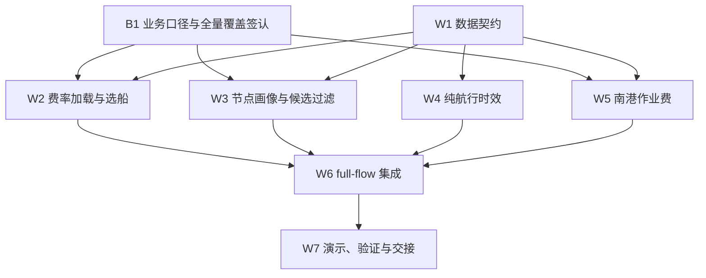

# 阶段 17 交付报告与阶段 18 真实散船数据接入开发计划

## 1. 执行摘要

阶段 17 已完成第一版领导全流程 Demo 的核心工程交付和展示口径收束：系统能够从北港与客户地点输入开始，完成坐标解析、候选南港生成、南港至客户道路距离/时间与费用计算、正式 `nx.MultiDiGraph` 建图，以及费用最低和时间最短两套独立搜索，并输出逐段数据来源、规则依据和总费用组成。

当前运价候选的缺节点问题已经完成本批治理：运价表中的 295 个不同地点名称均已匹配标准节点，面向 500 吨、散粮、玉米订单的 312 条已计费候选全部具备两端节点 ID，缺节点候选为 0。此前的 170 条缺节点候选不再是当前主链阻塞项。

阶段 17 最新展示验收已完成：用户在 PyCharm 与本地 Tencent Key 环境中运行最新版 `leader full-flow`，真实 A/B 全流程正常退出，并确认最新中文文本、候选南港列表、费用组成和边界声明符合展示收束口径。

阶段 18 将以“真实散船干线纵向接通”为唯一主线：读取 `散船运价表.xlsx` 最新有效报价，按南港标准所在地过滤可承接船型并按订单重量选船，按已确认区域规则生成纯航行时效，再通过独立 Provider 接入南港作业费。B1 业务口径已确认，下一步从全量目的组/南港画像只读审计开始，再分批接入真实边。集装箱、铁路和驳船只定义可扩展契约，不在本阶段实现完整路线。

---

## 2. 本报告的范围与验收锚点

### 2.1 阶段 17 范围

- 领导全流程 Demo 的工程贯通、真实数据优先策略和最小伪造边界；
- 节点名称、别名和坐标治理，消除当前运价候选的缺节点阻塞；
- 领导展示中的中文口径、候选南港说明、费用组成和来源追溯；
- 不上线新的散船费率、船型选择、真实干线时效或南港作业费规则。

### 2.2 唯一领导展示锚点

后续所有领导 Demo 开发和验收均在现有全流程入口上演进，不另建与主链脱节的新 Demo：

```powershell
python -B -m src.demos.leader full-flow
```

也可在用户 PyCharm 环境传入真实地点：

```powershell
python -B -m src.demos.leader full-flow --origin "北港名称" --destination "客户名称" --region "全国"
```

直接运行 `src/demos/leader_full_flow.py` 可用于 PyCharm 交互展示；模块入口仍是标准验收命令。

---

## 3. 阶段 17 交付状态

| 交付项 | 状态 | 当前结果 | 验收证据或边界 |
|---|---|---|---|
| A/B 地点输入与解析 | 已交付 | 本地节点优先，Tencent 地点检索兜底；保留置信等级和候选追溯 | 临时运行节点可进入本次搜索图；不自动写回正式节点主数据 |
| 当前批节点治理 | 已交付 | 295 个运价地点名称全部匹配；312 条已计费候选全部具备两端节点 ID | 缺节点候选从历史 170 条降为 0 |
| 候选南港生成 | 已交付基础版 | 能生成、展示候选南港，并为每个候选构造可搜索的最后一公里段 | 当前仍含名称/距离启发式；业务能力筛选留待阶段 18 |
| 最后一公里汽运 | 已交付基础版 | 已维护真实运价优先；陌生路线使用已确认距离分段规则；距离和驾车时间由 geo 层提供 | Tencent 使用普通驾车口径，不宣称货车专用路线 |
| 正式图与路径搜索 | 已交付 | 使用带 edge key 的 `nx.MultiDiGraph`；费用和时间独立 Dijkstra | 不构造综合权重，不恢复旧 `DiGraph` 主链 |
| 可解释路径结果 | 已交付 | 展示路线、分段方式、费用、时间、来源、规则 ID/版本 | 缺失费用、距离、时间不默认为 0 |
| 总费用组成 | 已交付 | 每条推荐路线列出已计入的分段费用、来源、计费规则和小计 | AdditionalFee 作为未计入项单独提示 |
| 散船干线费用与时效 | 仅 Demo 占位 | 北港至候选南港费用、纯航行时间仍为 `demo_placeholder` | 阶段 18 用真实费率和区域时效替换 |
| 客户交付画像 | 仅 Demo 占位 | 当前领导 Demo 明示“无自有码头”演示画像 | 阶段 18 接入真实客户画像；有自有码头时直接在码头交付 |
| AdditionalFee | 仅原始加载 | 可读取 18 条原始记录，但未确认逐条适用条件、归属和去重规则 | 当前不计入总费用，也不解释为 0 |
| 最新展示实跑 | 已完成 | 用户 PyCharm 最新版真实 A/B 全流程正常退出；中文口径、候选说明、费用组成和边界声明符合验收口径 | 阶段 17 可标记完成 |

### 3.1 已交付主链


### 3.2 节点治理结论

历史统计中的三类候选含义为：

- 已计费候选：费用规则可为当前订单计算出结果；
- 正式图候选：已计费且两端均有标准节点 ID，可继续形成运输边；
- 缺节点候选：费用可算，但至少一端没有标准节点 ID，不能安全入图。

本批节点坐标补齐和别名确认完成后，当前 312 条已计费候选全部成为端点完整候选，缺节点候选为 0。因此，历史 170 条问题已解决，不应继续作为当前领导 Demo 的未完成项。后续新增业务地点仍需沿用“去重清单 -> Tencent 候选 -> 人工确认 -> 本地正式回写”的治理流程。

临时运行节点与正式节点治理需要区分：Tencent top1 可在一次 Demo 中生成带来源与置信等级的运行时节点，以保证链路继续；它不会自动成为正式主数据，也不会自动与已有节点合并。

---

## 4. 当前数据真实性与最小伪造边界

| 数据或规则 | 当前状态 | 是否计入搜索 | 后续处理 |
|---|---|---|---|
| 本地标准节点、坐标和别名 | 真实业务数据优先 | 是 | 持续人工治理新增地点 |
| Tencent 地点坐标 | 外部 API 真实返回，保留 top1 置信等级及候选追溯 | 是 | 建立抽检、缓存和正式回写协议 |
| 已维护最后一公里运价 | 真实业务数据 | 是 | 继续使用最新有效且无冲突的记录 |
| 陌生散粮汽运费用 | 已确认规则 + Tencent 道路距离 | 是 | 保持现有公式，不在本阶段改动 |
| 道路距离与驾车时间 | Tencent 普通驾车结果 | 是 | 明确不是货车专用路线 |
| 北港—南港散船费率 | `demo_placeholder` | 是，仅领导 Demo | 阶段 18 读取真实 XLSX 最新有效报价 |
| 北港—南港纯航行时效 | `demo_placeholder` | 是，仅领导 Demo | 阶段 18 按南港时效分区换算为小时 |
| 客户“无自有码头”画像 | `demo_placeholder` | 是，仅领导 Demo | 接入可追溯客户画像 |
| AdditionalFee / 南港作业费 | 原始记录已加载，归属未确认 | 否 | 阶段 18 经 Provider、匹配、去重和归属校验后接入 |
| 等待、装船、卸船、天气、潮汐等附加时间 | 暂无数据 | 否，且不视为 0 | 预留时间组成接口，后续另行维护 |

### 4.1 AdditionalFee 的当前定义

`AdditionalFee` 是真实数据目录中的“其他费用/附加费用原始记录”，用于表达某个节点、包装方式或业务场景可能产生的作业费用。现有原始类型包括直提作业、入库作业、装卸、装车、过闸及集装箱提箱等，但当前字段不足以证明每一条费用适用于哪一段路线、是否互斥、是否已经包含在主运价中，以及应按吨、箱、柜还是总价计费。

因此，“已加载 AdditionalFee=18 条”只表示文件读取成功，不表示 18 条费用均适用于当前路线，更不表示费用为 0。阶段 18 将把可确认的南港作业费转换为正式、可追溯的费用组成；归属不明或重复风险未解除的记录继续进入人工复核。

---

## 5. 阶段 17 验证与交付边界

### 5.1 已有验证证据

- 最近一次全量工程验证：`259 passed in 1.06s`；
- 节点治理完成后的相关专项测试：`24 passed in 0.79s`；
- 最新领导展示与总费用组成专项测试：`5 passed in 0.28s`；
- 最新展示变更后 `git diff --check` 已通过；
- 用户已在 PyCharm 真实 Tencent 环境完成最新版全流程运行并获得退出代码 0；本次输出已包含候选南港、费用组成、AdditionalFee 未计入说明和测试版数据边界。

### 5.2 未重复全量测试的理由

最新修改集中于领导展示文本、候选说明和费用分项输出，没有改变现有费用公式、图结构或路径搜索算法。按用户确认的最小必要验证原则，本次报告编写不重复运行全量测试和真实 API。阶段 18 一旦修改业务代码、费用权重或图装配，再运行受影响专项测试和统一 smoke。

### 5.3 阶段 17 最终验收动作

在用户 PyCharm 环境使用最新版代码执行一次：

```powershell
python -B -m src.demos.leader full-flow --origin "已确认北港" --destination "已确认客户" --region "全国"
```

人工核对以下内容：

1. 地点解析名称、来源和置信等级合理；
2. 候选南港均被列出，候选说明不宣称已使用尚未上线的业务能力规则；
3. 两条推荐分别来自费用和时间独立搜索；若相同，应有明确说明；
4. 每条路线的总费用组成之和等于总费用；
5. 散船干线和最后一公里汽运被清楚区分；
6. `demo_placeholder`、AdditionalFee 未计入和客户画像边界均明确展示；
7. 未打印 Tencent API Key 或本地敏感路径。

上述检查已经通过，阶段 17 可标记为完成。后续 Demo 开发均在阶段 18 的真实散船数据接入主线上推进。

---

## 6. 阶段 18 目标、范围与非目标

### 6.1 阶段目标

将北港—南港散船干线从固定占位升级为真实、可追溯、可按订单重量选择船型的运输段，并把纯航行时效与可确认的南港作业费纳入费用/时间独立搜索；同时用节点画像和客户画像替换名称启发式与固定客户画像。

### 6.2 本阶段范围

- 解析本地 `data_REAL/fee_switch/散船运价表.xlsx` 的最新有效报价；
- 散船报价单位固定为元/吨，散船干线费用为报价乘以订单吨数；
- 报价适用于本项目全部北港，其他北港与北良港具有一致适用性；
- 报价只表示北港至南港散装粮食运价，不含南港作业费，税务问题当前不处理；
- 不读取、不修改、不接入广东、广西、福建、海南以外的目的地列；
- 保留同一区域的多个船型列，禁止覆盖；
- 按南港标准所在地过滤允许船型，再按订单重量自动选船；
- 订单小于最小船型时向上选择最小可用船型；超过最大可用船型时人工复核；
- 按南港时效分区提供纯航行小时数；
- 建立南港作业费 Provider、正式数据适配器和显式 Demo 占位实现；
- 建立节点类型、行政所在地、作业能力和客户交付条件的最小主数据契约；
- 把真实散船费用、时效和费用组成接入现有 `leader_full_flow.py`；
- 增加多重量、边界、异常和真实数据无网络 smoke。

### 6.3 非目标

- 不实现集装箱干线、铁路干线或完整驳船路线；
- 不把南港—客户驳船与北港—南港散船混为同一运输阶段；
- 不实现等待、装船、卸船、天气、潮汐和排队时效；
- 不猜测船舶吃水、泊位等级或实际装载率；
- 不建设数据库、后端 API、前端、权限、监控或高并发服务；
- 不提交真实 Excel、客户画像、坐标、API Key 或可还原业务明细。

---

## 7. 继承需求与新增验收要求

阶段 18 完整继承源计划 `docs/plans/2026-07-22-001-feat-bulk-shipping-real-data-plan.md` 的 R1—R19，不擅自改写已确认口径。以下为本阶段交付时额外固定的验收要求：

- R20. `src/demos/leader_full_flow.py` 继续作为唯一领导全流程锚点，新增能力必须接入现有正式图和双目标搜索链，不创建另一套演示算法。
- R21. 北港—南港使用 `bulk_shipping_trunk`/散船干线语义；南港—客户如采用水路，应使用独立的 `barge_last_mile` 或等价运输阶段。两者规则、来源和费用组成不得复用或混淆。
- R22. 每个 RouteResult 必须展示已计入的费用组成；各组成合计必须等于边费用，分段费用合计必须等于路线总费用。
- R23. 真实散船费率或南港作业费缺失、单位不明、日期冲突、映射不唯一时进入 `manual_review`；正式模式不得回退到占位或 0。
- R24. 领导 Demo 使用占位时必须在数据源、规则 ID 和最终声明三处保持 `demo_placeholder` 可识别性。
- R25. 临时 Tencent 运行节点可参与一次搜索，但正式费率目的组、船型资格和时效分区必须来自维护后的标准节点画像，不得仅由一次 top1 名称或坐标即时猜测。
- R26. 散船运价表的正式费用口径为元/吨报价乘以订单吨数；不得把报价解释为总价，也不得加入税务逻辑。
- R27. 散船报价适用于本项目全部北港；北港差异未来如需维护，必须通过新的来源字段或映射表显式引入。
- R28. 南港作业费不是散船报价的一部分；第一版只接入汇总费用类型 `码头作业费`，单位元/吨，并预留后续 CSV 明细扩展。
- R29. 阶段 18 的南港覆盖目标为项目范围内全部相关南港；可以分批实现，但必须先输出全量映射/画像缺口审计，不得只把 3—5 个样例港口视为完成范围。

---

## 8. 目标数据结构

| 数据对象 | 核心字段 | 类型/单位 | 作用与失败处理 |
|---|---|---|---|
| `NodeProfile` | `node_id`、基础设施类型、省/市/港区、时效分区、作业能力、来源、维护日期 | ID、枚举、集合、日期 | 决定候选合法性、船型资格和时效；缺失或冲突人工复核 |
| `CustomerProfile` | 客户 ID、工厂节点 ID、是否有自有码头、自有码头节点 ID、来源 | ID、布尔、文本 | 有自有码头时直接以码头为交付终点，不造 0 元汽运边 |
| `RateDestinationGroup` | 目的组标签、标准南港节点 ID 集合、来源、有效期 | 文本、ID 集合、日期 | “珠三角”等报价组映射多个节点，不作为节点别名合并 |
| `VesselEligibilityRule` | 区域、标准所在地、允许船型、吨级区间、版本、有效期 | 文本、吨、日期 | 先按所在地过滤船型，再按订单重量选择 |
| `BulkShippingRateRecord` | 报价日期、北港范围、目的组、船型原文、吨级上下限、价格、单位、价格类型、来源单元格、是否项目范围内目的地 | 日期、吨、Decimal、枚举 | 展开 XLSX 多层表头；单位为元/吨，价格类型为单位运价；非目标省区目的地跳过 |
| `VesselSelectionRequest` | 订单吨数、目的组、候选船型、可选用户指定船型、基准日 | 吨、枚举、日期 | 自动选择最小可覆盖船型；超范围人工复核 |
| `ShippingTimeResult` 扩展 | 标准小时、`time_scope=pure_sailing`、原始天数、来源、版本 | 小时、天、文本 | 附加时间未维护时保持缺失，不填 0 |
| `PortOperationFeeRecord` | 南港节点、费用类型、费用阶段、适用场景、价格类型、数值、单位、来源、有效期 | ID、枚举、Decimal、日期 | 首版费用类型为 `码头作业费`，单位元/吨；匹配、单位、归属或去重不清时人工复核 |
| `CostComponent` | 组成类型、原始值、标准段费用、来源、规则 ID/版本、说明 | Decimal、文本 | 船运费与作业费分项留痕，合计作为图的 cost 权重 |
| `ManualReviewOutcome` | 状态、稳定原因码、来源记录引用、可展示说明、责任工作包 | 枚举、文本、引用 | 统一承接 W2—W5 的不可用结果；W6 排除对应候选并聚合展示原因，不用异常、`None` 或隐式丢弃表达业务复核 |

### 8.1 已确认纯航行时效

| 南港时效分区 | 原始天数 | 标准小时 | 时间范围 |
|---|---:|---:|---|
| 福建 | 4 | 96 | `pure_sailing` |
| 珠三角 | 6 | 144 | `pure_sailing` |
| 粤西 | 7 | 168 | `pure_sailing` |
| 海南 | 7 | 168 | `pure_sailing` |
| 广西 | 7 | 168 | `pure_sailing` |

### 8.2 已确认南港所在地—船型资格

| 业务区域 | 标准所在地标签 | 可用船型 |
|---|---|---|
| 珠三角 | 深圳、广州、东莞 | 2—3 万吨、5—6 万吨 |
| 珠三角 | 揭阳 | 0.5 万吨、1 万吨 |
| 粤西 | 阳江、茂名、湛江 | 1.5—1.6 万吨 |
| 广西 | 钦州 | 2.5—3 万吨 |
| 广西 | 防城港、铁山 | 1.5—1.6 万吨 |
| 福建 | 漳州 | 1.5—1.6 万吨 |
| 福建 | 马尾 | 1 万吨 |
| 海南 | 马村、海口 | 1.5—1.6 万吨 |

坐标与 Tencent 结果仅用于补齐或核验行政所在地；正式匹配使用节点画像中已维护的标准所在地标签。铁山、马村等港区标签按业务标签维护，不强制转换为城市名。

---

## 9. 关键技术决策

1. 保留 `nx.MultiDiGraph` 和 edge key，以支持同一南港、不同船型或不同运输方案的平行边。
2. cost 与 time 继续独立搜索，不引入未经确认的综合权重。
3. 散船报价按“有效日期 + 北港范围 + 目的组 + 船型”保留，重复目的区域的多个船型列不得覆盖。
4. 自动选船按吨级上限升序选择第一个能够覆盖订单的可用船型；小于最小船型时向上选择最小船型；大于最大船型时人工复核。
5. 南港作业费作为散船干线边的独立费用组成，不使用港口自环边，避免最短路漏计。
6. 客户自有码头时直接把客户码头作为交付终点，不人为添加 0 元汽运边。
7. Demo Provider 与正式 Provider 使用相同接口但显式隔离；正式数据缺失不得自动回退到 `demo_placeholder`。
8. 费率目的组不是节点别名。一个报价组可以映射多个标准南港节点，但每个物理节点保持独立 node ID。
9. 北港—南港散船干线与南港—客户驳船属于不同运输阶段；本阶段只实现前者。

---

## 10. 实施单元

本文件使用 W1—W7 作为阶段 18 的规范执行工作包，并与源计划 U1—U7 一一对应。源计划 U1—U7 尚未实施，不应因本文件改写而视为已完成；后续状态、提交和验收统一引用本文件的 W 编号。

### W1（对应源计划 U1）. 固化节点画像、运输阶段和费用组成契约

**目标**

建立阶段 18 所需的最小结构，不改变既有节点唯一性、费用单位和图搜索约束。

**涉及文件**

- `src/domain/node_registry.py`
- `src/routing/customer_profile.py`
- `src/routing/shipping_time_provider.py`
- `src/routing/transport_edge.py`
- 新增 `src/domain/node_profile.py` 或与现有边界一致的等价模块
- 新增 `src/domain/cost_component.py` 或等价结构
- `tests/` 下对应专项测试

**实现内容**

- 定义节点类型、标准所在地、时效分区和多值作业能力；
- 定义 `bulk_shipping_trunk` 与未来 `barge_last_mile` 等运输阶段；
- 为费用结果增加可追溯组成，保持 `cost` 为当前订单当前运输段总费用；
- 扩展纯航行时间范围字段，但不引入附加时间默认值。
- 定义统一 `ManualReviewOutcome` 契约和稳定原因码，规定 W2—W5 如何返回、W6 如何排除候选并展示原因；可复用现有结果对象的 `status/reason` 模式，不要求建立全局异常框架。

**验收**

- 别名仍只定位同一 node ID；
- 缺失画像不会被名称启发式静默补齐；
- 费用组成合计不一致时边不可用或明确报错。

### W2（对应源计划 U3）. 实现散船 XLSX 加载器和自动选船策略

**目标**

把三层结构的本地散船报价工作簿展开为类型化、可追溯记录。

**涉及文件**

- 新增 `src/data/bulk_shipping_rate_loader.py`
- 新增 `src/domain/vessel_selector.py`
- `src/domain/freight_rate.py`
- `src/domain/cost_rules.py`
- `tests/test_bulk_shipping_rate_loader.py`
- `tests/test_vessel_selector.py`

**实现内容**

- 读取日期、目的区域与船型列，保留来源 sheet/单元格；
- 按运行基准日选择不晚于该日的最新有效日期；
- 将价格解释为元/吨单位运价，并按订单吨数换算为当前订单散船干线段总费用；
- 将北港范围记录为本项目全部北港适用；
- 跳过广东、广西、福建、海南以外的目的地列，不读取、不修改、不进入候选；
- 解析单值和区间船型吨级；
- 保留同一区域多个船型的平行候选；
- 实现小订单向上选择、区间端点和超最大船型人工复核。

**验收**

- 多船型列不互相覆盖；
- 单位运价、订单吨数、换算总费用和来源单元格均可追溯；
- 空价格、无单位、价格类型不明、同业务键冲突均不产生正式费用；
- “重庆驳船”列不会进入本阶段散船海运主链。

### W3（对应源计划 U5）. 建立南港画像、费率目的组映射和候选资格过滤

**目标**

用维护后的节点属性替换领导 Demo 中的名称启发式候选判断。

**涉及文件**

- 新增 `config/node_profile.example.csv`
- 新增 `config/rate_destination_group.example.csv`
- 新增 `config/vessel_eligibility.example.csv`
- `src/domain/node_profile.py`
- `src/demos/leader_full_flow.py`
- `tests/test_node_profile.py`
- `tests/test_leader_full_flow.py`

**实现内容**

- 本地真实配置通过 `DATA_DIR` 或明确运行配置加载；
- 先输出项目范围内全部南港的目的组映射、节点画像和船型资格缺口审计，再分批接入正式边；
- 先校验海港与散粮/散船作业能力；
- 再按标准所在地过滤可承接船型；
- 将费率目的组映射至一个或多个独立南港节点；
- 输出候选排除原因和缺失画像清单。

**验收**

- 不合规节点不形成正式散船边；
- 只有样例南港完成映射时不得视为 W3 完成；
- 组合报价组不会把多个物理港口合并为一个节点；
- 临时 Tencent 节点缺少正式画像时明确人工复核。

### W4（对应源计划 U2）. 实现区域纯航行时效 Provider

**目标**

以标准节点画像中的时效分区提供 96/144/168 小时的纯航行时间。

**涉及文件**

- `src/routing/shipping_time_provider.py`
- 可选新增 `src/routing/region_shipping_time_provider.py`
- `tests/test_shipping_time_provider.py`

**实现内容**

- 按已确认分区把天数乘 24 转换为小时；
- 保存原始天数、标准小时、范围、来源和版本；
- 对未知分区、冲突分区和无来源画像返回 `manual_review`。

**验收**

- 福建、珠三角、粤西/海南/广西边界值正确；
- 日照、潍坊、长三角等未确认时效区域不会形成完整可搜索边；
- 展示明确为纯航行时效，不包含等待和装卸。

### W5（对应源计划 U4）. 建立南港作业费 Provider 和 AdditionalFee 适配层

**目标**

把“原始记录已加载”升级为“适用条件可判断、费用可计算、来源可解释”。

**涉及文件**

- 新增 `src/routing/port_operation_fee_provider.py`
- `src/data/loaders.py`
- `src/routing/transport_edge.py`
- 新增 `config/port_operation_fee.example.csv`
- `tests/test_port_operation_fee_provider.py`
- `tests/test_transport_edge.py`

**实现内容**

- 定义正式 CSV/本地数据 Provider、显式 Demo Provider 和禁用 Provider；
- 首版正式字段支持汇总费用类型 `码头作业费`，单位元/吨；未来 CSV 可扩展卸船费、堆存费、短倒费等明细类型；
- 校验节点、包装、费用类型、阶段、价格类型、单位、日期和启用状态；
- 识别互斥场景与重复业务键；
- 仅把确认属于南港散船链路的费用加入干线 `CostComponent`。

**验收**

- 正式模式缺费不回退到 0 或占位；
- `码头作业费` 与散船运价分项展示，二者不得合并成不可解释总价；
- Demo 占位始终标记 `demo_placeholder`；
- 多项费用合计可追溯，重复或归属不明时人工复核。

### W6（对应源计划 U6）. 接入现有 full-flow 与客户交付分支

**目标**

用真实散船费率、真实纯航行时效和可确认作业费替换现有干线占位，同时保持既有图搜索主链。

**涉及文件**

- `src/demos/leader_full_flow.py`
- `src/demos/leader.py`
- `src/routing/customer_profile.py`
- `src/routing/transport_edge.py`
- `src/routing/transport_graph.py`
- `src/routing/route_result.py`
- `tests/test_leader_full_flow.py`
- `tests/test_customer_profile.py`
- `tests/test_transport_graph.py`
- `tests/test_route_result.py`

**实现内容**

- full-flow 接受订单重量参数；
- 每个合规南港按自动选定船型形成一条干线候选边；多船型平行边仅保留接口，本阶段不启用；
- 客户无自有码头时才生成南港至工厂汽运；
- 客户有自有码头时在对应码头交付，不生成虚构汽运段；
- 展示船型、费率日期、纯航行时效、作业费和费用组成。

**验收**

- 费用最低与时间最短仍独立搜索；
- RouteResult 分项和总计严格相等；
- 已上线真实数据不再标记为 `demo_placeholder`；
- 未实现的驳船路径不会被误称为散船干线或汽运。
- 启用 Demo 作业费时，数据源、规则 ID 和最终声明三处均可识别 `demo_placeholder`。

### W7（对应源计划 U7）. 多重量演示、专项验证与交接更新

**目标**

用低成本、不重复调用 Tencent 的方式验证船型选择，再完成一次真实全流程验收。

**涉及文件**

- 新增或扩展 `src/dev/feature_demo.py`
- 可选新增 `src/demos/bulk_shipping_selection.py`
- `src/dev/smoke_test.py`
- `PLAN.md`
- `docs/PROJECT_STATE.md`
- `docs/DECISIONS.md`
- `CHANGELOG.md`
- 相关测试文件

**实现内容**

- 使用合成数据覆盖多档订单、最小船型以下、区间端点和最大船型以上；
- 真实数据 smoke 只读本地文件，不打印业务明细；
- 最终在用户 PyCharm 环境执行一次 Tencent 全流程；
- 更新工程状态和领导展示口径。

**验收**

- 自动选船边界行为均有测试；
- 真实数据 smoke 通过且不泄露真实明细；
- 文档、代码、Demo 输出和当前业务决策一致。

---

## 11. 依赖关系与推荐实施顺序



### 阶段 18A：契约与业务样表确认

- 完成 W1；
- 确认工作簿价格单位、价格类型和适用北港；
- 形成全量节点画像、目的组映射和作业费模板的审计清单；
- 完成 B1 业务签认：价格口径、北港范围、目标目的地范围、船型资格和可接入作业费类型均有明确来源；未签认部分只允许使用合成数据推进契约测试；
- 只有合成数据测试，不改领导主链权重。

**退出门槛：** 所有影响费用计算的字段已有明确类型、单位和失败策略；项目范围内全部相关南港已有全量映射/画像缺口审计，首批进入正式边的南港必须具备带来源的目的组映射、基础设施类型、标准所在地、散粮/散船能力及船型资格，未确认项不得进入真实边实现。

### 阶段 18B：真实散船费用与纯航行时效

- 完成 W2、W3、W4；
- 在全量映射/画像审计基础上分批接入高频南港；实现可以分批，审计范围必须覆盖项目全部相关南港；
- 完成多重量自动选船 Demo。

**退出门槛：** 至少一组真实费率能生成带船型、日期、来源和纯航行时间的正式干线候选；异常值均转人工复核。

### 阶段 18C：南港作业费与客户交付

- 完成 W5；
- 接入已确认作业费类型和适用场景；
- 接入首批真实客户画像，验证自有码头和无自有码头两条分支。

**退出门槛：** 费用组成可解释且无重复计费；客户交付终点不依赖固定演示画像。

### 阶段 18D：全流程收束

- 完成 W6、W7；
- 在现有 full-flow 上替换干线占位；
- 运行专项测试、统一 smoke 和用户 PyCharm 真实 API 验收；
- 更新长期状态文档。

**退出门槛：** 选定展示路线的散船费用与纯航行时间来自真实数据/已确认规则，作业费状态明确，最终输出可逐项复核。

---

## 12. 测试与验证策略

### 12.1 专项测试

每个实施单元只运行受影响测试，重点覆盖：

- XLSX 多层表头、重复区域多船型、日期选择和空值；
- 船型区间端点、小订单向上选择、超最大船型；
- 所在地资格过滤、组合目的组和缺失画像；
- 纯航行时间换算、未知区域和时间范围；
- 作业费单位、适用场景、去重、归属和 Demo/正式隔离；
- 客户自有码头交付、无自有码头最后一公里；
- cost/time 独立搜索、平行边和费用组成求和不变量。

### 12.2 集成验证

业务代码、费用权重或图装配发生变化后运行：

```powershell
python -B -m src.dev.smoke_test
```

不因纯文档、注释或不影响行为的展示文本修改重复全量测试。真实 Tencent API 只在用户 PyCharm 环境执行，Key 继续由 `local_env/runtime_env.csv` 注入。

### 12.3 验收场景

| 场景 | 预期结果 |
|---|---|
| 订单小于目的地最小船型 | 向上选择最小可用船型，并解释选择原因 |
| 订单等于船型区间端点 | 边界包含关系明确且测试固定 |
| 订单超过最大可用船型 | `manual_review`，不得硬套最大船型 |
| 同一区域存在多个船型列 | 全部保留，选择策略或平行边可追溯 |
| 南港所在地不在已确认规则中 | 不形成正式干线边，输出缺失原因 |
| 南港作业费归属不明 | 不计入总费用，不视为 0 |
| 客户有自有码头 | 路线在客户码头结束，无最终汽运边 |
| 客户无自有码头 | 生成南港至工厂最后一公里段 |
| 费用最低与时间最短相同 | 如实展示同一物理路线并说明 |
| 费用最低与时间最短不同 | 两条 RouteResult 均保留完整分段及费用组成 |

---

## 13. 风险与控制措施

| 风险 | 概率 | 影响 | 控制措施 |
|---|---|---|---|
| XLSX 未写明价格单位或价格类型 | 高 | 高 | 实现前业务确认；未确认不进入正式计算 |
| 报价目的组与标准南港映射错误 | 中 | 高 | 独立映射表、人工复核、多个节点不合并 |
| 名称或坐标被误当成正式所在地规则 | 中 | 高 | 标准所在地持久化至节点画像；Tencent 只辅助核验 |
| 小订单选船被误解为实际配载最优 | 中 | 中 | 输出选择依据；声明仅为费率匹配策略 |
| 作业费与主报价重复包含 | 中 | 高 | 保存费用阶段和包含关系；归属不明不入图 |
| Demo 占位泄漏到正式模式 | 低 | 高 | Provider 运行模式隔离，测试来源标签和失败路径 |
| 纯航行时间被误解为门到门时效 | 中 | 高 | 固定 `pure_sailing` 标签，附加时间保持未提供 |
| 客户自有码头字段错误改变路线终点 | 中 | 高 | 要求来源与码头 node ID；矛盾转人工复核 |
| 新主数据或真实报价被提交 Git | 低 | 高 | 真实数据留在忽略目录；白名单暂存与敏感信息检查 |
| 一次性扩大至集装箱、铁路、驳船 | 中 | 高 | 本阶段只做接口与字段预留，不实现完整链路 |

---

## 14. 实施前必须确认的业务输入

2026-07-23 B1 已确认：

1. `散船运价表.xlsx` 中价格单位为元/吨，价格类型为单位运价；
2. 散船费用等于报价乘以订单吨数；
3. 报价表示从北港至南港的散装粮食散船运价，不含任何港口作业费；
4. 税务问题当前不处理；
5. 报价适用于本项目全部北港，其他北港与北良港具有一致适用性；
6. 不属于广东、广西、福建、海南的目的地列不读取、不修改、不接入本阶段路线引擎；
7. 南港作业费第一版采用汇总费用类型 `码头作业费`，单位元/吨，未来通过 Provider/CSV 扩展卸船费、堆存费、短倒费等明细。

仍需在实现或数据维护时逐项落地的输入：

1. 报价目的组到全部相关标准南港节点的正式映射，尤其是组合标签；
2. 全部相关南港的基础设施类型、标准所在地和散粮/散船作业能力；
3. 客户是否有自有码头、自有码头 node ID 和字段来源；
4. 对最新日期某列为空时，是人工复核还是允许回看该列上一有效日；当前计划默认人工复核；
5. 多个合规船型同时满足订单时，阶段 18 首版是否只返回自动选定船型，还是同时生成平行边；当前计划默认先自动选择一个，接口保留多边模式。

---

## 15. 完成定义

阶段 18 只有同时满足以下条件才可标记完成：

- 真实散船费率加载、有效日期选择和船型匹配行为已有正常、异常和边界测试；
- 南港时效来自维护分区并明确为纯航行小时；
- 接入范围内的南港作业费已经明确计入或明确人工复核，不存在隐式 0；
- 客户有/无自有码头两条分支均由真实或可追溯画像驱动；
- full-flow 使用现有 `TransportEdge -> MultiDiGraph -> 独立双目标搜索` 主链；
- 总费用组成、分段费用和路线总费用严格一致；
- 专项测试和业务变更后的统一 smoke 通过；
- 用户 PyCharm 真实 Tencent 全流程验收通过；
- `PLAN.md`、`docs/PROJECT_STATE.md`、`docs/DECISIONS.md` 和 `CHANGELOG.md` 按实际变化更新；
- 真实数据、API Key、本地配置和用户办公材料未进入 Git。

---

## 16. 参考资料

- `docs/plans/2026-07-22-001-feat-bulk-shipping-real-data-plan.md`
- `AGENTS.md`
- `PLAN.md`
- `docs/PROJECT_STATE.md`
- `docs/ARCHITECTURE.md`
- `docs/DECISIONS.md`
- `CHANGELOG.md`
- `src/demos/leader_full_flow.py`
- `src/domain/cost_rules.py`
- `src/domain/node_registry.py`
- `src/routing/shipping_time_provider.py`
- `src/routing/customer_profile.py`
- `src/routing/transport_edge.py`
- `src/routing/transport_graph.py`
- `src/routing/route_search.py`
- `tests/test_leader_full_flow.py`

本文件只记录工程交付与开发计划。领导汇报材料应从本文件提取保守事实，不得把计划项写成已上线功能。
