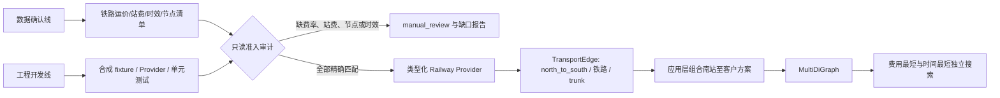

# feat: 铁路集装箱双轨开发 SOP 与准入门禁

## Summary

本计划将铁路—集装箱从当前的合成数据构边验证，逐步推进为可由真实站点、运价、时效和末端交付数据驱动的两阶段路线能力。数据确认与工程开发并行推进，但任何真实图边均须通过精确 OD、节点、费用、时效和单位的完整准入门禁。

---

## Problem Frame

散粮散船阶段已经证明：将不完整业务数据直接接入搜索图，会把数据缺口伪装为可执行运输方案。铁路集装箱当前已验证北站—南站费用组成与 `TransportEdge` 契约，但铁路运费、上/下站费和专用线数据未落地，因而尚不具备真实路线测算条件。

本计划要把这些缺口转化为可审计、可逐项确认的准入流程，同时保留既有两业务运输段、`MultiDiGraph` 平行边与费用/时间独立搜索的不变约束。

---

## Requirements

- R1. 铁路集装箱只支持 `集装箱/箱`；`柜` 不得换算为 `箱`。
- R2. 北站—南站为 `north_to_south / 铁路 / trunk`；铁路站是合法铁路端点，不得被当作南港海港。
- R3. 铁路干线费用须由铁路基础运价、下浮规则、上站费、下站费和适用的敞顶箱篷布费组成，并可逐项追溯。
- R4. 东北至福建、广东、广西的完整铁路运输段时效分别为 168、192、192 小时；区域不唯一或未维护时不构边。
- R5. 铁路运价、上/下站费与下浮条件必须精确匹配站点或 OD；不得使用区域代理、最近站点代理或散粮/水运/汽运报价替代。
- R6. 南站直达客户的铁路末端汽运使用独立规则：0—10km 为 450 元/箱，10—20km 为 500 元/箱，超过 20km 为 `500 + 30 × 0.6 × (X - 20)` 元/箱；该规则不覆盖既有通用集装箱汽运规则。
- R7. 客户自有专用线、第三方专用线站台与船铁联运，在缺少费用、时效、能力或连通性数据时仅审计为缺口，不构边。
- R8. 测试或演示占位记录必须明确标注 `demo_placeholder`，不得被真实数据链、full-flow 或 Web 默认加载。
- R9. 所有失败都必须输出具体缺口与责任数据域；不得将费用、距离或时效解释为 0。

---

## Scope Boundaries

- 本计划不实现铁路货运实际线路几何、班列排期、运力、到发站装卸排队或延误预测。
- 不改变散粮、散船、驳船、集装箱船的既有业务规则或数据源优先级。
- 不以铁路站点代替海港南港，且不对铁路费用使用港口作业费 Provider。
- 不自动假定客户具有自有铁路专用线。
- 不接入船铁联运、客户专用线或第三方专用线的正式路径，直至其独立数据齐备。

### Deferred to Follow-Up Work

- 专用线及第三方站台运输：取得专用线费用、时效、线路能力与客户关系数据后单独规划。
- 船铁联运：待海运集装箱干线与换装规则均完成独立验收后再设计。
- Web 铁路展示：只在真实应用服务已能返回铁路路线后接入，不能以测试记录驱动领导展示。

---

## Context & Research

### Relevant Code and Patterns

- `src/routing/rail_container_provider.py`：当前合成记录的北站—南站费用组成与 `TransportEdge` 验证原型。
- `src/routing/container_shipping_provider.py`：精确 OD、订单维度、最新唯一报价与可搜索边构建的成熟参照。
- `src/data/container_trunk_admission_audit.py`：只读准入审计、CSV/JSON/Markdown 输出的参照。
- `src/routing/transport_edge.py`、`src/routing/transport_contracts.py`：平行边语义、来源追溯、费用组成和人工复核契约。
- `src/application/route_planning.py`：界面无关的应用层入口；CLI 与 Web 均应经由此层。
- `docs/plans/2026-07-29-002-stage-demo-dual-track-plan.md`：散粮阶段“数据确认线 + 工程开发线”、审计与验证 SOP 的直接参照。

### Institutional Learnings

- 真实价格、时效、节点能力和费用归属是独立前提；其中任一缺失都不能用零值或相邻数据掩盖。
- 示例路径和展示页面只观察正式能力，不能成为领域规则或候选生成规则的来源。
- 全量 smoke 只在 Loader、候选准入、构图主链或应用编排发生变化时运行；独立 Provider 的局部修改先运行专项测试。

### External References

- 本计划沿用仓库内已有的 Provider、审计和图契约模式；不引入外部框架或服务，因此不需要外部技术依赖。

---

## Key Technical Decisions

- **双轨推进**：数据确认线与工程开发线独立推进；接口、审计和合成测试不等待真实费率，但真实构边必须等待数据确认。
- **精确费用门禁**：铁路运费、上/下站费与下浮条件只接受精确站点/OD匹配；区域映射只可用于已确认的铁路时效，不能用于价格代理。
- **站点费用独立维护**：上/下站费不作为代码默认常量。即使首批确认多个站点同价，也应保留站点、费用类型、单位、来源、日期和确认状态。
- **箱型独立于包装**：`集装箱` 是包装方式，`顶开门箱/敞顶箱` 是铁路箱型；两者分别参与准入与计费。
- **占位隔离**：`demo_placeholder` 只允许在测试夹具或显式演示 Provider 中出现，且来源、时间和每个费用组成均需标注。
- **应用接入后置**：先完成真实数据读取和只读审计，再连接 `RoutePlanningService`，最后才考虑 full-flow 与 Web。

---

## Open Questions

### Resolved During Planning

- 铁路价格代理：禁止区域代理与最近站点代理。
- 铁路干线时效口径：东北至福建 168 小时、至广东/广西 192 小时，均视为完整运输段总时间。
- 铁路末端直达汽运：使用铁路模式专属 `0.6` 系数，不修改通用集装箱汽运规则。

### Deferred to Implementation

- 铁路真实数据文件的最终文件名、字段中文别名和来源系统：实施前依据业务方交付样表确定，但不得降低本计划的数据字段要求。
- 站点费是否全部为 195 元/箱：等待业务确认；在此之前测试值不升级为默认规则。
- 铁路运价记录是否存在总价、单价或多种计价类型：由真实样表决定，Loader 必须显式保存 `price_type` 与原始单位。

---

## High-Level Technical Design

> *本图说明预期实现方向，用于审阅，不是要求逐行复现的实现代码。*

---

## Implementation Units

### U1. 铁路数据契约、模板与保守 Loader

**Goal:** 将当前内存测试记录收束为可由独立数据表维护的铁路运价、站点费用和区域时效契约。

**Requirements:** R1, R3, R4, R5, R8, R9

**Dependencies:** None

**Files:**
- Modify: `src/routing/rail_container_provider.py`
- Create: `src/data/rail_container_data.py`
- Create: `docs/data_templates/铁路集装箱运价时效.example.csv`
- Create: `docs/data_templates/铁路站点费用.example.csv`
- Create: `docs/data_templates/铁路区域时效.example.csv`
- Modify: `docs/data_templates/w3_w5_data_tables.md`
- Test: `tests/test_rail_container_provider.py`
- Create: `tests/test_rail_container_data.py`

**Approach:**
- 把铁路基础运价/下浮、上站费、下站费和区域时效拆为独立记录；各记录保留标准节点 ID、名称、订单维度、原始单位、来源、维护日期和确认状态。
- Loader 对文件缺失、空表、必填字段缺失、非法单位、重复的同一最新记录或不唯一节点映射明确失败关闭。
- 真实模式只加载 `confirmed` 记录；合成夹具保留在测试内或显式 `demo_placeholder` 样表中。

**Execution note:** 先补齐缺文件、单位错误、同日冲突和节点不唯一的失败测试，再实现 Loader。

**Patterns to follow:**
- `src/routing/container_shipping_provider.py`
- `src/data/container_trunk_admission_audit.py`

**Test scenarios:**
- Happy path：一组东北站—福建南站、集装箱/箱、玉米、内贸、敞顶箱的完整记录可解析，并保留基础价、下浮、执行价和各项来源。
- Edge case：顶开门箱不加载或计算篷布费；`柜` 订单不匹配任何铁路记录。
- Error path：站点费用为 0、铁路价格单位不是当前记录声明的精确单位、下浮比例不合法、区域时效重复或节点 ID 不唯一时不产生可用记录。
- Error path：铁路运价缺失时，不得用区域时效、相邻站点或散粮/水运运价补足费用。

**Verification:** Loader 能生成可审计的类型化记录，所有缺口均有明确状态和原因，且没有默认价格或默认站点费用。

### U2. 铁路订单—站点准入审计与数据确认清单

**Goal:** 在构边前按订单维度审计北站、南站、费率、站费、箱型和区域时效是否完整，输出业务方可确认的缺口清单。

**Requirements:** R1, R2, R4, R5, R7, R9

**Dependencies:** U1

**Files:**
- Create: `src/data/rail_container_admission_audit.py`
- Create: `src/demos/rail_container_admission_audit.py`
- Modify: `src/data/node_master_capabilities.py`
- Test: `tests/test_rail_container_data.py`
- Create: `tests/test_rail_container_admission_audit.py`

**Approach:**
- 审计以标准 node ID 为主键，分别检查铁路站角色、铁路运输能力、订单包装/品种/贸易类型、精确 OD 运价、两端站费和唯一的区域时效。
- 输出 CSV、JSON 和 Markdown；状态至少区分可申请真实构边、待费率、待站费、待节点/能力、待时效、订单不适用与冲突待复核。
- 审计不得调用 Tencent、不得写回真实数据、不得创建图边。

**Patterns to follow:**
- `src/data/container_trunk_admission_audit.py`
- `src/data/order_graph_admission_audit.py`

**Test scenarios:**
- Happy path：完整精确 OD 和两端站费的记录显示为可申请真实构边。
- Edge case：东北—福建、东北—广东、东北—广西分别命中确认时效；其他区域显示待确认而不是继承最近区域。
- Error path：铁路站名称被误用作海港候选、客户/仓库节点被误用作南站、或只有费用没有时效时均明确排除或复核。
- Integration：从真实节点注册表解析别名到唯一 node ID 后，审计结果保留维护来源和标准节点 ID。

**Verification:** 业务方可仅凭审计输出判断每个铁路 OD 缺少何种数据与是否满足正式构边条件。

### U3. 真实铁路干线 Provider 与费用组成门禁

**Goal:** 在 U2 仅显示完整、唯一、已确认数据后，生成可进入正式图的北站—南站铁路平行边。

**Requirements:** R1, R2, R3, R4, R5, R8, R9

**Dependencies:** U1, U2

**Files:**
- Modify: `src/routing/rail_container_provider.py`
- Modify: `src/domain/cost_rules.py`
- Modify: `src/routing/transport_edge.py`
- Test: `tests/test_rail_container_provider.py`
- Test: `tests/test_transport_edge.py`

**Approach:**
- 使用精确 OD 的已确认铁路运价和两端站费构造铁路执行价、上站费、下站费及箱型附加费等 `CostComponent`。
- 将区域时效作为独立、可追溯的完整运输段时间来源；费用和时间同时完整时才构造 `north_to_south/trunk` 边。
- 保留不同箱型、不同报价或不同执行条件的平行边；同一最新业务键无法唯一选择时全部阻断而非任取一条。

**Execution note:** 先用真实对象链写集成测试，验证 Provider 到 `TransportEdge` 的来源、费用合计和语义字段一致。

**Patterns to follow:**
- `src/routing/container_shipping_provider.py`
- `src/routing/bulk_shipping_provider.py`
- `src/routing/transport_edge.py`

**Test scenarios:**
- Happy path：精确 OD 记录生成铁路 `trunk` 边，费用组成合计等于边总费用，时间为确认的完整铁路时效。
- Edge case：敞顶箱与顶开门箱在同一 OD 中形成可区分的平行边；下浮比例为 0 时执行价等于基础价。
- Error path：未确认记录、缺上/下站费、重复最新报价、费率/订单单位不匹配或时间区域不唯一时不生成图边。
- Integration：已生成边进入 `MultiDiGraph` 后，与其他模式共存且费用/时间独立搜索仍保留 edge key。

**Verification:** 任何真实铁路边均能完整解释“为什么可入图、费用由什么组成、时效来自哪里”。

### U4. 南站直达客户的铁路末端汽运规则与接续准入

**Goal:** 为铁路模式建立独立的南站→客户直接汽运边，保持与通用集装箱汽运规则隔离。

**Requirements:** R6, R7, R9

**Dependencies:** U1, U2

**Files:**
- Modify: `src/domain/cost_rules.py`
- Create: `src/routing/rail_container_last_mile_provider.py`
- Test: `tests/test_cost_rules.py`
- Create: `tests/test_rail_container_last_mile_provider.py`

**Approach:**
- 只在铁路模式且起点为已确认南站时启用独立阶梯规则；道路距离仍只由 geo 层提供。
- 已维护的铁路站—客户真实拖车运价优先；没有维护运价时才使用已确认的铁路末端阶梯规则。
- 客户自有专用线和第三方专用线站台仅输出“数据缺口”，不以直接汽运规则替代其专用线费用。

**Patterns to follow:**
- `src/domain/cost_rules.py` 的已维护汽运优先与陌生集装箱汽运规则。
- `src/routing/inland_waterway_freight_provider.py` 的准入失败返回方式。

**Test scenarios:**
- Happy path：道路距离在 10km、20km 和超过 20km 时，铁路末端规则分别返回确认的元/箱费用。
- Edge case：已维护铁路站—客户拖车报价优先于距离公式。
- Error path：无道路距离、距离来源不可追溯、`柜` 订单或非铁路起点时不构边。
- Integration：铁路干线边与铁路末端汽运边可拼接为同一两阶段路线，而不覆盖通用集装箱汽运行为。

**Verification:** 铁路模式末端计费与既有通用集装箱汽运彼此隔离，缺专用线数据不会被静默改写为可行路线。

### U5. 应用层组合、全链路验收与展示适配

**Goal:** 只在 U3、U4 的真实数据准入通过后，将铁路方案作为集装箱订单的一类平行方案接入应用层、CLI 和 Web。

**Requirements:** R2, R3, R6, R7, R8, R9

**Dependencies:** U3, U4

**Files:**
- Modify: `src/application/route_planning.py`
- Modify: `src/demos/leader_full_flow.py`
- Modify: `src/web/server.py`
- Modify: `src/web/static/app.js`
- Test: `tests/test_route_planning_application.py`
- Test: `tests/test_leader_full_flow.py`
- Test: `tests/test_route_web_server.py`

**Approach:**
- 应用层先装配真实准入铁路边，再与其他已确认集装箱模式作为平行边进入相同的 `MultiDiGraph`；费用最低和时间最短继续独立搜索。
- CLI/Web 只消费应用响应，展示铁路费用组成、时效来源、箱型、准入警告与 `manual_review`；禁止硬编码测试 OD 或测试价格。
- 若当前订单没有完整铁路方案，响应应明确报告缺口，同时不影响其他已可用运输模式。

**Patterns to follow:**
- `src/application/route_planning.py`
- `src/demos/leader_full_flow.py`
- `src/web/server.py`

**Test scenarios:**
- Happy path：完整铁路干线和末端汽运数据形成从北站到客户的可搜索方案，并显示所有费用组成。
- Edge case：铁路方案与另一种集装箱方案费用最低/时间最短不同，双目标搜索选择各自正确路径。
- Error path：铁路数据缺口时，full-flow/Web 显示具体阻断原因，不显示测试占位价格，也不使总费用归零。
- Integration：CLI 和 Web 对同一应用请求获得相同的铁路路线、费用与时效字段。

**Verification:** 只有真实准入通过的铁路方案会出现在用户可见结果中；Demo 与 Web 不维护独立铁路逻辑。

### U6. 双轨 SOP、验收门禁与长期记录收束

**Goal:** 将每轮铁路数据确认、工程开发、测试和交付统一为可重复执行的 SOP。

**Requirements:** R5, R7, R8, R9

**Dependencies:** U1, U2, U3, U4, U5

**Files:**
- Modify: `PLAN.md`
- Modify: `docs/PROJECT_STATE.md`
- Modify: `docs/DECISIONS.md`
- Modify: `CHANGELOG.md`
- Create: `docs/data_templates/铁路集装箱数据确认清单.md`
- Test: `tests/test_data_templates.py`

**Approach:**
- 数据确认线按“收集样表→别名/节点预览→人工确认→只读审计→正式数据准入”执行；不得由 JSON/Excel 自动覆盖正式主数据。
- 工程开发线按“类型契约→专项测试→Provider→应用接入→场景验收”执行；出现单位、价格类型、费用归属、时效范围或节点角色冲突时停止并提交业务审核。
- 验收分为 Provider 专项、准入审计、应用集成、真实数据 smoke 和用户 PyCharm 实跑；仅在核心主链变动时运行全量 smoke。

**Test scenarios:**
- Happy path：模板说明与 Loader 要求的字段、单位、确认状态保持一致。
- Error path：模板缺少精确 OD、站点费用、来源或确认状态时，不得被说明为可正式构边。

**Verification:** 后续任一铁路数据批次均可依据 SOP 判断其处于“待确认、可审计、可申请准入、已入图”中的哪一状态。

---

## System-Wide Impact

- **Interaction graph:** 数据 Loader 和准入审计位于 Provider 之前；应用层只消费已构成的 `TransportEdge`，CLI/Web 不直接读取铁路表。
- **Error propagation:** 任何节点、费用、单位、时效或能力缺口向上保留为结构化 `manual_review`，不转换为零值或泛化为“无路线”。
- **State lifecycle risks:** 本阶段以只读本地数据为主；真实维护表的回写须经预览和人工确认，不自动修改 Excel 或节点注册表。
- **API surface parity:** CLI 与 Web 必须使用同一个 `RoutePlanningService` 响应；前端不能自行计算铁路费用或时效。
- **Integration coverage:** 测试应覆盖 Loader→审计→Provider→`TransportEdge`→`MultiDiGraph`→应用响应的真实对象链。
- **Unchanged invariants:** 散粮主链、`nx.MultiDiGraph`、费用/时间独立 Dijkstra、单位不换算、AdditionalFee 未确认不计入均保持不变。

---

## Risks & Dependencies

| 风险 | 缓解措施 |
|---|---|
| 铁路运价只有区域口径或无法唯一匹配 | 禁止费率代理；输出精确 OD 缺口并阻断构边。 |
| 上/下站费被错误当作统一 195 元/箱 | 站点费用独立维护；未确认时不得默认。 |
| `箱`、`柜` 或箱型被混用 | 在请求、Loader、Provider 和审计四层精确校验。 |
| 新铁路规则覆盖通用集装箱汽运 | 使用铁路模式专属末端 Provider 和独立规则编号。 |
| 测试占位数据进入领导展示 | `demo_placeholder` 来源门禁；应用层默认不加载测试数据。 |
| 专用线缺数据却被直接汽运掩盖 | 专用线候选单列审计；不把其替换为已确认直接汽运路线。 |

---

## Documentation / Operational Notes

- 真实铁路业务表、站点费用、客户关系和可还原 OD 明细仍保存在忽略的数据目录，不进入 Git。
- 每次业务方提供新表时，先运行只读 Loader/审计，再由用户确认节点别名、站点角色、费用含义和冲突处理。
- 真实 API 距离调用仍由用户在具备网络权限的 PyCharm 环境复验；本地网络失败只能作为 `manual_review` 证据。

---

## Sources & References

- 铁路业务输入：`docs/铁路运输模式分析_北南客户工厂.docx`
- 散粮双轨 SOP：`docs/plans/2026-07-29-002-stage-demo-dual-track-plan.md`
- 当前铁路构边原型：`src/routing/rail_container_provider.py`
- 集装箱精确 OD 契约参照：`src/routing/container_shipping_provider.py`
- 当前长期决策：`docs/DECISIONS.md` 的 D-060
